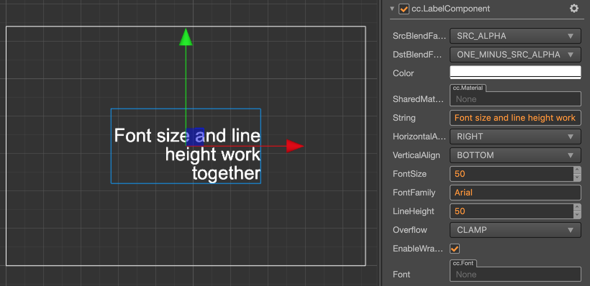
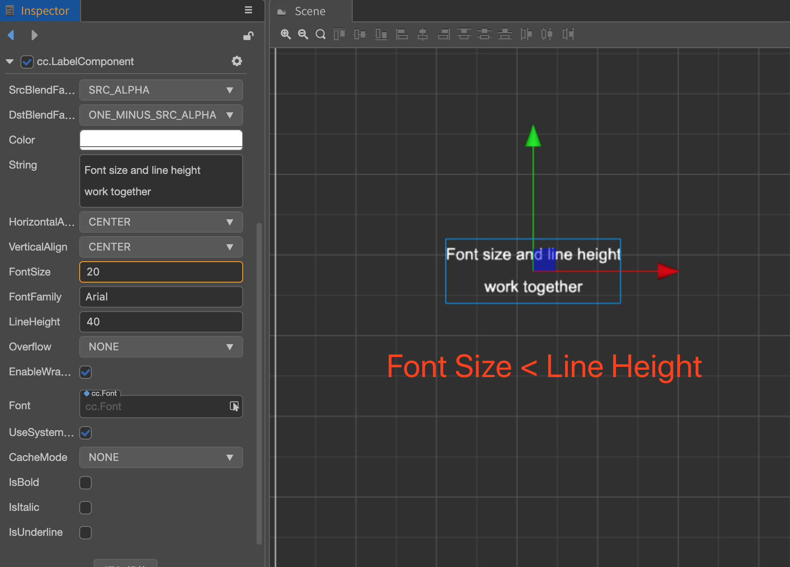
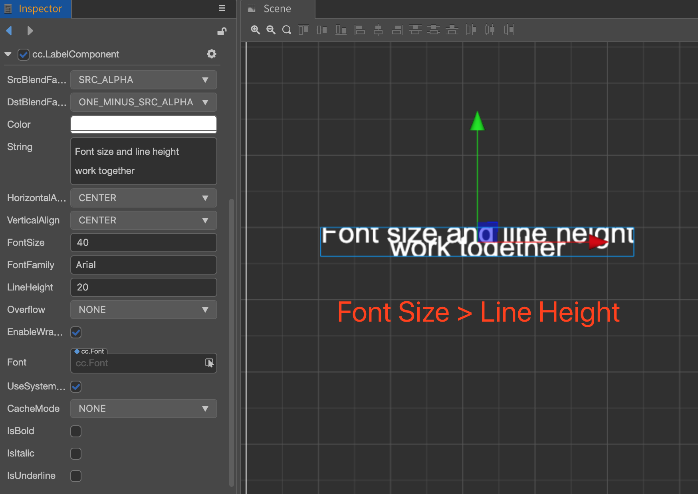
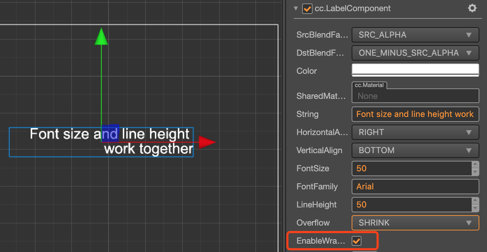
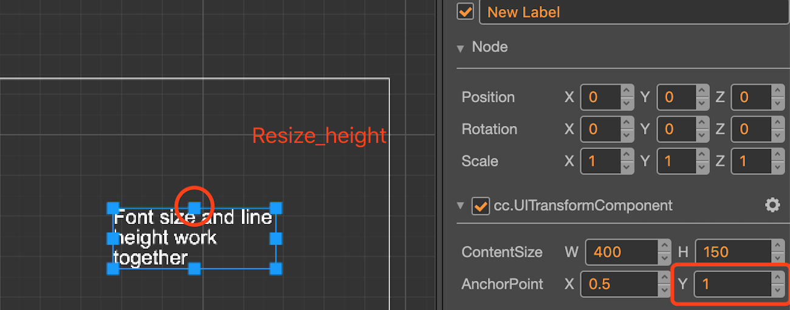

# Label Layout

The __Label__ component is one of the key renderable components. You need to learn about how to set up label layout in order to have a perfect display when the UI system adapts to various resolutions and sets up alignment.

## Alignment of labels in the bounding box

Like other renderer components, the layout of the Label component is also based on the size information (`contentSize`) possessed by the [UITransform](../editor/ui-transform.md) component, that is, the range specified by the Bounding Box.

What is shown in the picture above is the display effect of labels rendered by Label in the blue bounding box. The following properties in Label determines the position of labels in the bounding box:

- `Horizontal Align`: the horizontal alignment of labels in the bounding box, which can be chosen from 3 positions: Left, Right, Center.

- `Vertical Align`: the vertical alignment of labels in the bounding box, which can be chosen from 3 positions: Top, Bottom, Center.

  

In the figure above, the horizontal alignment position is set to `Right`, and the vertical alignment position is set to `Bottom`. It can be seen that the label appears at the bottom of the Bounding Box and is aligned to the right. The developer can modify the two properties above to make other combinations, labels will appear on the corresponding position of the blue bounding box according to the settings.

## Label Size and Line Height

`Font Size` determines the display size of labels. Its unit is Point (it can also be called 'pound'), which is the size unit for fonts commonly used in most image editing softwares and font editing softwares. For dynamic fonts, `Font Size` can be zoomed in losslessly. But the display of bitmap fonts will be more and more vague when the set value of `Font Size` exceeds the font size stipulated by the font.

`Line Height` determines the height occupied by each line when multiple lines of labels display, the unit of which is also Point. The displaying of multiple lines of labels can be carried out by using two methods:

- When inputting labels in the `String` property, manually input `\r` or `\n`
- Open the `Enable Wrap Text` property, which will be introduced in detail later

__Relation of label size and line height__:

- If the values of `Font Size` and `Line Height` are the same, labels will occupy the height of the most part of one line.

  

- If the value of `Font Size` is less than that of `Line Height`, space between multiple lines of labels will be enlarged

  

- If the value of `Font Size` is larger than that of `Line Height`, space between multiple lines of labels will be narrowed between multiple lines of labels. Overlapping of labels may appear.

  

## Overflow

The __Overflow__ property determines the array of labels in the bounding box when the content of labels is increased. There are four modes: __NONE__, __CLAMP__, __SHRINK__, and __RESIZE_HEIGHT__. Only in the latter three modes can the size of the bounding box be adjusted through the __Rectangle Transform Tool__ (or click the keyboard button **T**) in the upper left corner of the editor or modifying the __Size__ in the __Inspector__ panel or add the __Widget__ component.

__NONE__ mode will automatically fix the size of the bounding box according to the text size, line height, etc.

### Clamp

When in Clamp mode, labels will firstly be rendered according to the requirements of alignment type and size, but the parts exceeding the bounding box will be concealed (clamped).

### Auto Shrink

When in auto shrink mode, if labels exceed the bounding box when being rendered according to the original size, the size of the labels will be automatically shrink to display all the labels.

**Attention!** Auto shrink mode will not zoom in on labels to adapt to bounding box.

### Resize Height

Resize height mode will make sure the bounding box of the labels fits the height of the labels, no matter the quantity of the labels' lines. This mode is suitable for displaying paragraphs of labels that don't have the same amount of content. An infinite amount of label content can be displayed in the arbitrary UI field when using this mode together with the [ScrollView](../components/scrollview.md) component.

## Enable Wrap Text

The `Enable Wrap Text` property of the Label component can switch the auto wrap switch of labels. When `Enable Wrap Text` is opened, labels will automatically wrap acccording to the width of the bounding box without manual input of `\r` or `\n` when inputting labels.

> __Note__: the `Enable Wrap Text` property is only available in the __CLAMP__ and __SHRINK__ modes of the label layout mode. In __RESIZE_HEIGHT__ mode, the `Enable Wrap Text` property is compulsorily opened.

### Auto Wrap in Clamp Mode

When clamp mode opens auto wrap, labels will be wrapped in the allowable scale of the bounding box in priority. Only when not all the words can be displayed after being wrapped will clamp mode function.

The following two pictures are taken when `Clamp` + `Enable Wrap Text` are opened, the difference of which is the different width of the bounding boxes of the labels;

When the width of the bounding box is changing from the left picture to the right picture, labels will be continuously adjusted and wrapped. In the end, the clamped display will appear due to the insufficient height of the bounding box.

### Auto Wrap in Auto shrink mode

Similar to clamp mode, labels will be wrapped in priority when labels exceed the width of the bounding box in auto shrink mode. Only when the width and length of the bounding box are exceeded will the labels be automatically shrink to adapt to the bounding box.

### Enable Wrap Text of Chinese

The auto wrap behavior of Chinese is different from that of English. English is wrapped by the unit of words. Blank space is the smallest unit of wrap adjustment. Chinese is wrapped by the unit of characters. Every character can be wrapped alone.

## Anchor point of label node

The anchor point of a label node and the alignment mode of labels in the bounding box are two concepts that need to be differentiated. In a layout type that needs labels to enlarge the bounding box (e.g., `Resize Height`), only correct setting up of anchor points can make the bounding box be extended to the expected direction.

For example, if you want the bounding box to extend downward, you need to set the `y` property of `Anchor` as `1`. As shown below:

## Widget

Add a __Widget__ component to the node with the Label component, then you can make various layouts for label nodes relative to their parent nodes.

In the above picture, two Label child nodes are added to the background node. After respectively adding the Widget component to them, set the `Right` property of the Widget for the labels on the left side as `50%`, and set the `Left` property of the Widget for the labels on the right side as `60%`, then the multi-column layout of labels in the picture above can be realized.

And by setting margins on the Widget, plus the layout type of labels, a flexible and beautiful layout for labels can be easily realized without concrete and minor adjustments to the bounding box.

## Reference for checking components

For properties of the Label component, you can also check [Label Component](../editor/label.md) document.
