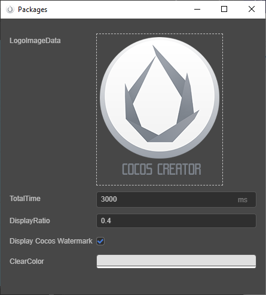

# 构建选项介绍

## 通用构建选项

**构建发布** 面板中的通用构建参数如下：


### 发布路径

发布路径中包含两个输入框：


- 第一个输入框用于指定项目的发布路径，可直接输入路径或者通过旁边的放大镜按钮选择路径。默认的发布路径为项目目录的 `build` 文件夹下，如果您使用 git、svn 等版本控制系统，可以将 `build` 文件夹在版本控制中忽略。

  > **注意**：发布路径中不允许包含空格、非法字符以及中文。

- 第二个输入框用于指定项目构建时的构建任务名称以及构建后生成的发布包名称。默认为当前构建平台名称，同个平台每多构建一次，便会在原来的基础上加上 **-001** 的后缀，以此类推。构建完成后可直接点击输入框后面的文件夹图标打开项目发布包所在目录。

### 初始场景

设置打开游戏后进入的第一个场景。可以在 **参与构建的场景** 列表中搜索所需的场景，将鼠标移动到所需场景栏，然后点击右侧出现的按钮，即可将其设置为初始场景。


### 参与构建场景

在构建过程中，除了项目目录下的 `resources` 文件夹以及 bundle 中的资源和脚本会全部打包外，其他资源都是根据参与构建的场景以及 bundle 中的资源引用情况来按需打包的。因而去除勾选不需要发布的场景，可以减少构建后生成的项目发布包包体体积。

### MD5 缓存

为构建后的所有资源文件名加上 MD5 信息，可以解决 CDN 或者浏览器资源缓存问题。

启用后，如果出现资源加载不了的情况，说明找不到重命名后的新文件。这通常是因为有些第三方资源没通过 `assetManager` 加载引起的。这时可以在加载前先用以下方法转换 URL，转换后的路径就能正确加载。

```typescript
const uuid = assetManager.utils.getUuidFromURL(url);
url = assetManager.utils.getUrlWithUuid(uuid);
```

> **注意**：原生平台启用 MD5 Cache 后，如果出现资源加载不了的情况，通常是因为有些 C++ 中用到的第三方资源没通过 `assetManager` 加载引起的。也可以通过以下代码转换 URL 来解决：
>
> ```cpp
> auto cx = ScriptingCore::getInstance()->getGlobalContext();
> JS::RootedValue returnParam(cx);
> ScriptingCore::getInstance()->evalString("cc.assetManager.utils.getUrlWithUuid(cc.assetManager.utils.getUuidFromURL('url'))", &returnParam);
>
> string url;
> jsval_to_string(cx, returnParam, &url);
> ```

### 主包压缩类型

设置主包的压缩类型，具体内容可参考文档 [Asset Bundle — 压缩类型](../../asset/bundle.md#%E5%8E%8B%E7%BC%A9%E7%B1%BB%E5%9E%8B)。

### 配置主包为远程包

该项为可选项，需要与 **资源服务器地址** 选项配合使用。
勾选后，主包会配置为远程包，并且与其相关依赖资源一起被构建到发布包目录 remote 下的 [内置 Asset Bundle — main](../../asset/bundle.md#%E5%86%85%E7%BD%AE-asset-bundle) 中。开发者需要将整个 remote 文件夹上传到远程服务器。

### 调试模式

若不勾选该项，则处于发布（release）模式，会对资源的 UUID、构建出来的引擎脚本和项目脚本进行压缩和混淆，并且对同类资源的 json 做分包处理，减少资源加载的次数。

若勾选该项，则处于调试模式，同时也可以配合勾选 Source Maps 选项，对项目进行调试，更方便定位问题。

### Source Maps

如果需要生成 sourcemap，请勾选该项。构建时便会默认压缩引擎文件和项目脚本。

由于 JavaScript 脚本正变得越来越复杂，大部分源码（开发代码）都要经过编译转换才能投入生产环境，这就使实际运行的代码不同于源码，导致调试时无法定位到源代码。而 Source Map 可以将已转换的代码映射到源码，也就是将转换后的代码对应到转换前的源码的位置。这样在出现问题时，便可以直接查看和调试源码，定位问题更容易。详情可参考 [使用 source map](https://developer.chrome.com/docs/devtools/javascript/source-maps/)。

### 替换插屏

鼠标移动到该选项时便会出现 **编辑图标** 的按钮，点击该按钮打开插屏设置面板，数据编辑后将会实时保存。



### 压缩纹理

若项目中的图片资源设置了 [压缩纹理](../../asset/compress-texture.md) 并勾选了该项，那么构建时便会根据压缩纹理设置生成对应的图像资源。如果不勾选该项，即便配置了压缩纹理也不会在构建时生效。

### 自动图集

若当前项目配置了 [自动图集资源](../../asset/auto-atlas.md) 并勾选了该项，那么构建时便会根据图集配置进行合图处理，生成图集到项目中。如果不勾选该项，即便配置了自动合图也不会在构建时生效。

> **注意**：如果在 `resources` 文件夹中配置了自动图集，将会同时打包出大图和小图的图片资源以及对应的序列化信息，将会增大包体，如非必要请不要这样使用。

### 擦除模块结构（实验性质）

若勾选该项，脚本导入速度更快，但无法使用模块特性，例如 `import.meta`、`import()` 等。

<!--
### 内联所有 SpriteFrame
自动合并资源时，将所有 SpriteFrame 与被依赖的资源合并到同一个包中。建议网页平台开启，启用后会略微增大总包体，多消耗一点点网络流量，但是能显著减少网络请求数量。建议原生平台关闭，因为会增大热更新时的体积。

### 合并初始场景依赖的所有 JSON

自动合并资源时，将初始场景依赖的所有 JSON 文件都合并到初始场景所在的包中。默认关闭，启用后不会增大总包体，但如果这些 JSON 也被其它场景公用，则后面再次加载它们时 CPU 开销可能会稍微增加。
-->

### Cocos Service 配置集

该项用于显示当前项目在 [服务](https://service.cocos.com/document/zh/) 面板所集成的所有服务。

## 各平台相关构建选项

由于目前构建机制上的调整，不同平台的处理均以插件的形式注入 **构建发布** 面板。在 **构建发布** 面板的 **发布平台** 中选择要构建的平台后，将会看到对应平台的展开选项，展开选项的名称便是平台插件名，在编辑器主菜单的 **扩展 -> 扩展管理器 -> 内置** 中可以看到各平台插件。

各平台相关构建选项，详情请参考：

- [发布到原生平台](native-options.md#%E6%9E%84%E5%BB%BA%E9%80%89%E9%A1%B9)
- [发布到小游戏平台](publish-mini-game.md)

Creator 支持自定义构建扩展插件，处理方式与平台插件一致，详情可参考 [扩展构建流程](custom-build-plugin.md)。

## 其他参与构建的参数配置

编辑器菜单栏 **项目 -> 项目设置** 中的配置都会影响到项目构建的结果，详情请参考 [项目设置](../project/index.md)。
