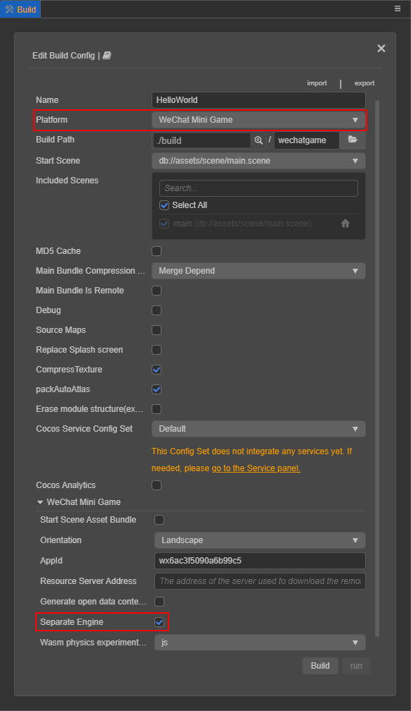

# 微信小游戏引擎插件使用说明

游戏引擎插件是微信 v7.0.7 新增的一项功能。此插件内置了 Cocos Creator 引擎的官方版本，若玩家首次体验的游戏中启用了此插件，则所有同样启用此插件的游戏，都无需再次下载 Cocos Creator 引擎，只需直接使用公共插件库中的相同版本引擎，或者增量更新引擎即可。

例如，当一个玩家玩过了由 Cocos Creator v2.2.0 开发的 A 游戏，里面已启用了此插件。然后他又玩了同样是 v2.2.0 开发的 B 游戏，如果 B 游戏也启用了此插件，那么就无需重新下载 Cocos Creator 引擎。即使 B 游戏使用的是 v2.2.1 的 Cocos Creator，微信也只需要增量更新引擎两个版本的差异部分。这样就可以大幅减少小游戏的下载量，提升小游戏启动速度 0.5 ~ 2s，获得更好的用户体验。

## 使用说明

Cocos Creator 只需在 **构建发布** 面板中，勾选 **分离引擎** 选项，然后正常构建发布即可，无需其它人工操作。（此功能仅在编辑器使用内置引擎并且构建时使用 **非调试模式** 时生效）

## Q&A

Q：引擎插件功能是否支持自定义引擎？ 
A：不支持，构建时如果版本不匹配或者启用了自定义引擎，虽然编辑器在出现报错后会继续构建，但是构建生成的包实际上无法正常使用引擎插件。

Q：项目开启了引擎的模块裁剪，要使用引擎插件的话需要还原为完整版引擎吗？ 
A：无需修改，项目可以按原来的方式继续裁剪引擎。引擎插件提供的是完整版引擎，能兼容所有的裁剪设置，不会影响原有项目的包体。

Q：启用引擎插件后，是否仍然会把引擎代码算入首包包体中？ 
A：根据微信的规则，目前仍然会计算在内。

Q：开启引擎插件后，是否可以在编辑器主菜单中的 **项目 -> 项目设置 -> 功能裁剪** 中移除所有模块，减小包体？ 
A：不可以，因为微信从 7.0.7 开始才支持引擎插件，如随意裁剪引擎可能导致游戏无法在低版本微信上运行。

Q：启用引擎插件后，在微信开发工具中提示 “代码包解包失败” 或者 “..., 登录用户不是该小程序的开发者”，但真机预览正常？ 
A：构建面板中默认的 appid 为通用测试 id。根据微信的规则，如需测试引擎分离功能，需要开发者在构建面板中填入自己开通的 appid。

Q：启用引擎插件后，在微信开发工具中提示 “插件未授权使用 `添加插件`”？  
A：点击提示中的 `添加插件`，选择添加 CocosCreator 插件后重新编译即可。若添加插件时出现“可添加的插件信息为空”的提示，可尝试在微信开发者工具中选择 **清缓存 -> 全部清除** 后重试。

## 参考链接

- [微信小游戏引擎插件官方说明](https://developers.weixin.qq.com/minigame/dev/guide/base-ability/game-engine-plugin.html)
