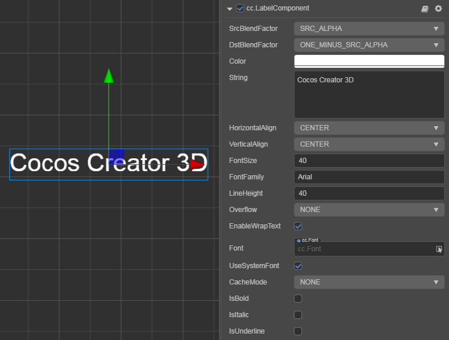

# Label 组件参考

Label 组件用来显示一段文字，文字可以是系统字体，TrueType 字体、BMFont 字体或艺术数字。另外，Label 还具有排版功能。

点击 **属性检查器** 下面的 **添加组件** 按钮，然后从 **UI/Render** 中选择 **Label**，即可添加 Label 组件到节点上。

Label 的组件接口请参考 [Label API](%__APIDOC__%/zh/classes/ui.label.html)。

具体使用方法可参考范例 **Label**（[GitHub](https://github.com/cocos/cocos-test-projects/tree/v3.0/assets/cases/ui/02.label) | [Gitee](https://gitee.com/mirrors_cocos-creator/test-cases-3d/tree/v3.0/assets/cases/ui/02.label)）。

## Label 属性

| 属性 |   功能说明
| :-------------- | :----------- |
| CustomMaterial | 自定义材质，使用方法参考 [自定义材质](../engine/ui-material.md)
| SrcBlendFactor | 当前渲染混合模式
| DstBlendFactor | 背景混合模式，和上面的属性共同作用，可以将前景和背景渲染的文本用不同的方式混合，效果预览可以参考 [glBlendFunc Tool](http://www.andersriggelsen.dk/glblendfunc.php)
| Color | 文字颜色。
| String | 文本内容字符串。
| HorizontalAlign | 文本的水平对齐方式。可选值有 LEFT、CENTER 和 RIGHT。
| VerticalAlign | 文本的垂直对齐方式。可选值有 TOP、CENTER 和 BOTTOM。
| FontSize | 文本字体大小。
| FontFamily | 文字字体名字。在使用系统字体时生效。
| LineHeight | 文本的行高。
| Overflow | 文本的排版方式，目前支持 CLAMP、SHRINK 和 RESIZE_HEIGHT。详情见下方的 [Label 排版](#label-%E6%8E%92%E7%89%88) 或者 [文字排版](../engine/label-layout.md)。
| EnableWrapText | 是否开启文本换行。（在排版方式设为 CLAMP、SHRINK 时生效）
| Font | 指定文本渲染需要的 [字体资源](../../../asset/font.md)。若要使用艺术数字字体，请参考 [艺术数字资源](../../../asset/label-atlas.md) 文档进行配置。 如果使用系统字体，则此属性可以为空。
| UseSystemFont | 布尔值，是否使用系统字体。
| CacheMode | 文本缓存类型，仅对 **系统字体** 或 **TTF** 字体有效，BMFont 字体无需进行这个优化。包括 **NONE**、**BITMAP**、**CHAR** 三种模式。详情见下方的 [文本缓存类型](#%E6%96%87%E6%9C%AC%E7%BC%93%E5%AD%98%E7%B1%BB%E5%9E%8B%EF%BC%88cache-mode%EF%BC%89)。
| IsBold | 文字是否加粗，支持系统字体以及部分 TTF 字体。
| IsItalic | 文字是否倾斜，支持系统字体以及 TTF 字体。
| IsUnderline | 文字是否加下划线，支持系统字以及 TTF 字体。

<!--| SpacingX | 文本字符之间的间距。（使用 BMFont 位图字体时生效）-->

## Label 排版

| 属性 |   功能说明
| :-------------- | :----------- |
| CLAMP | 文字尺寸不会根据 Content Size 的大小进行缩放。 Wrap Text 关闭的情况下，按照正常文字排列，超出 Content Size 的部分将不会显示。 Wrap Text 开启的情况下，会试图将本行超出范围的文字换行到下一行。如果纵向空间也不够时，也会隐藏无法完整显示的文字。
| SHRINK | 文字尺寸会根据 Content Size 大小进行自动缩放（不会自动放大，最大显示 Font Size 规定的尺寸）。 Wrap Text 开启时，当宽度不足时会优先将文字换到下一行，如果换行后还无法完整显示，则会将文字进行自动适配 Content Size 的大小。 Wrap Text 关闭时，则直接按照当前文字进行排版，如果超出边界则会进行自动缩放。
| RESIZE_HEIGHT | 文本的 Content Size 会根据文字排版进行适配，这个状态下用户无法手动修改文本的高度，文本的高度由内部算法自动计算出来。

## 文本缓存类型（Cache Mode）

| 类型 |   功能说明
| :-------------- | :----------- |
| NONE | 默认值，Label 中的整段文本将生成一张位图。
| BITMAP | 选择后，Label 中的整段文本仍将生成一张位图，但是会尽量参与 [动态合图](../../../advanced-topics/dynamic-atlas.md)。只要满足动态合图的要求，就会和动态合图中的其它 Sprite 或者 Label 合并 Draw Call。由于动态合图会占用更多内存，**该模式只能用于文本不常更新的 Label**。此模式在节点安排合理的情况下可大幅降低 Draw Call，请酌情选择使用
| CHAR | 原理类似 BMFont，Label 将以“字”为单位将文本缓存到全局共享的位图中，相同字体样式和字号的每个字符将在全局共享一份缓存。能支持文本的频繁修改，对性能和内存最友好。不过目前该模式还存在如下限制，我们将在后续的版本中进行优化： 1、**该模式只能用于字体样式和字号（通过记录字体的 fontSize、fontFamily、color、outline 为关键信息，以此进行字符的重复使用，其他有使用特殊自定义文本格式的需要注意）固定，并且不会频繁出现巨量未使用过的字符的 Label**。这是为了节约缓存，因为全局共享的位图尺寸为 2048*2048，只有场景切换时才会清除，一旦位图被占满后新出现的字符将无法渲染。 2、Overflow 不支持 SHRINK。 3、不能参与动态合图（同样启用 CHAR 模式的多个 Label 在渲染顺序不被打断的情况下仍然能合并 Draw Call）

> **注意**：Cache Mode 对所有平台都有优化效果。

<!-- ### BMFont 与 UI 合图自动批处理

 理论上，如果你的游戏 UI 没有使用系统字体或者 TTF 字体，并且所有的 UI 图片资源都可以合在一张图上，那么 UI 是可以只用一个 Draw Call 来完成的。
 更多关于 BMFont 与 UI 合图自动批处理的内容，请参考 [BMFont 与 UI 合图自动批处理](https://docs.cocos.com/creator/2.1/manual/zh/advanced-topics/ui-auto-batch.html) -->
