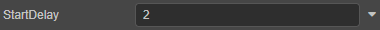
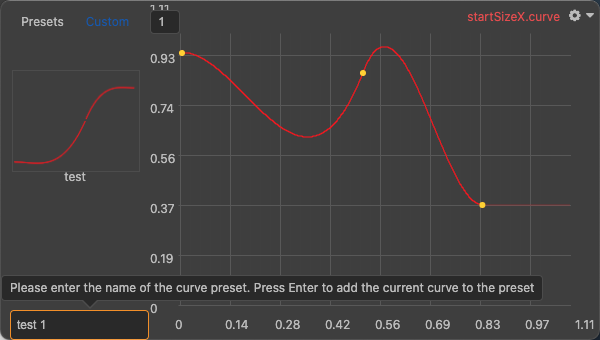

# 曲线编辑器

**曲线编辑器** 支持设置粒子系统中部分属性随时间变化的曲线。属性默认都是以常量（Constant）的形式显示，点击属性框右侧的  按钮，可以看到有以下几种编辑形式：

根据选择的编辑模式不同，属性框的显示也有一定的差异：

- **Constant**：设置属性的常量值，该值在粒子整个生命周期内不会发生变化；

    

- **Curve**：属性切换为曲线编辑形式，点击属性框即可打开曲线编辑器，编辑属性值随时间变化的曲线图；

    

- **TwoCurves**：通过两条曲线设定属性值随时间变化时，在生命周期内某一点的上、下限，取随机值。

    

- **TwoConstant**：通过两个常量值设定属性值的范围，实际值会随着时间推移在范围内随机变化。

    

## 曲线编辑面板

属性切换为曲线编辑后（**Curve**/**TwoCurve** 模式），属性框会显示当前曲线的预览图：

> **注意**：若属性的取值范围包括负值，则属性框中的预览图显示为：
>
> 

然后点击属性框即可打开曲线编辑器进行编辑：

曲线编辑器面板的相关功能说明如下：

- 当前进行曲线编辑的属性名称会显示在面板右上角。

- **横坐标** 表示粒子单位化的生命周期，由引擎定义，无法调整，一般为 `[0, 1]`。例如一个粒子的生命周期为 5s，则横坐标上的 0.5 代表 2.5s。

- **纵坐标** 表示当前编辑的属性的取值范围，可通过纵坐标上方的输入框调整纵坐标区间。

- 右上角齿轮图标按钮中的 **preWrapMode**/**postWrapMode** 用于设置粒子在生命周期范围内，曲线前后若有未定义部分时，粒子系统播放曲线的方式。详情请参考下文 **前后循环模式** 部分的内容。

- Creator 提供了一些预设的曲线数据模板，单击左侧 **Presets** 中某个模板便可直接将其应用到当前曲线中。同时也支持将设置好的曲线作为自定义曲线模板存储在 **Custom** 中，方便直接应用。

    

## 曲线编辑

在曲线编辑器窗口点击选中曲线，便可执行以下关键帧操作：

- 在窗口右侧空白处点击右键，然后选择 **添加关键帧**，便会添加一个新的关键帧并连接曲线；
- 在曲线上点击右键即可添加关键帧；
- 单击选中关键帧后，可拖动关键帧改变其坐标；
- 点击关键帧左右两侧出现的线段拉杆，转动拉杆即可调整该关键帧所在的点的曲线斜率；
- 右键点击关键帧，然后选择 **删除关键帧**，即可删除。

## 前后循环模式

**preWrapMode** 和 **postWrapMode** 用于设置在粒子生命周期范围内，曲线前后有未定义部分时，粒子系统播放曲线的方式。

例如下图中曲线只定义了横坐标为 `[0.2, 0.8]` 区间的部分，而 `[0, 0.2]` 和 `[0.8, 1]`部分曲线没有定义，便可分别通过 **preWrapMode** 和 **postWrapMode** 设置其循环模式，曲线编辑器便会根据循环模式和曲线定义部分决定未定义部分的曲线变化：

循环模式包括以下几种：

- **Loop**：将整条曲线（包括定义部分和未定义部分）当做是无限连续循环的。

    

- **Ping Pong**：与 Loop 类似，但循环方式是以与曲线定义部分反向再正向（“乒乓”），如此往复的形式。

    

- **Clamp**：曲线前/后未定义部分会使用曲线定义部分第一帧/最后一帧的值。

    

> **注意**：若曲线前后没有未定义部分，则设置 **preWrapMode** 和 **postWrapMode** 无效。
