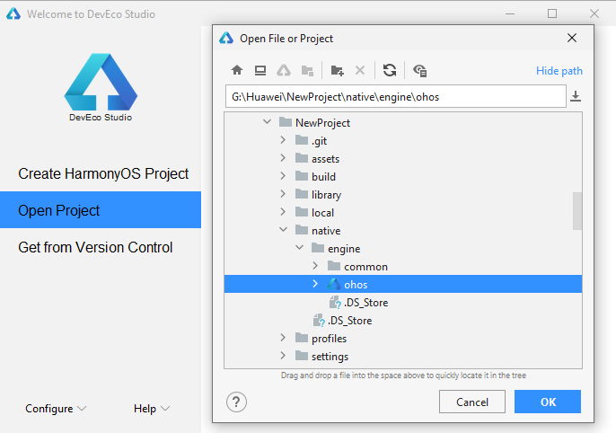

# 发布 Huawei HarmonyOS 应用

从 v3.2 开始，Cocos Creator 支持将游戏打包为 HarmonyOS 应用（`.hap`）。

## 准备工作

- 进入 [AppGallery Connect 网站](https://developer.huawei.com/consumer/cn/service/josp/agc/index.html) 注册 [华为开发者联盟帐号](https://developer.huawei.com/consumer/cn/doc/start/registration-and-verification-0000001053628148)。

- 登录后 [创建项目](https://developer.huawei.com/consumer/cn/doc/distribution/app/agc-harmonyapp-createproject) 并 [添加 HarmonyOS 应用](https://developer.huawei.com/consumer/cn/doc/distribution/app/agc-harmonyapp-createharmonyapp)，**选择平台** 为 **APP（HarmonyOS 应用）**。

  

  > **注意**：**应用包名** 需要与 Creator **构建发布** 面板中的 **应用 ID 名称** 保持一致。

- 下载并安装 [HUAWEI DevEco Studio](https://developer.harmonyos.com/cn/develop/deveco-studio#download)。安装完成后 [配置开发环境](https://developer.harmonyos.com/cn/docs/documentation/doc-guides/environment_config-0000001052902427)，下载 HarmonyOS SDK，SDK Platforms 中的 SDK 包请勾选 **Java** 和 **Native**。

    

    记住窗口上方所示的 **HarmonyOS SDK Location** 指示的目录，稍后需要在 Cocos Creator 的 **偏好设置** 面板中填写这个 SDK 所在路径。

## 发布流程

### 使用 Cocos Creator 构建

1. 使用 Cocos Creator 打开项目工程，点击上方菜单栏中的 **Cocos Creator -> 偏好设置 -> 外部程序**，配置 **HarmonyOS NDK** 和 **HarmonyOS SDK** 路径：

    

2. 从 **菜单栏 -> 项目** 中打开 **构建发布** 面板。在 **构建发布** 面板的 **发布平台** 中选择 **HarmonyOS**，根据需要配置 [构建选项](./native-options.md#%E6%9E%84%E5%BB%BA%E9%80%89%E9%A1%B9) 然后点击右下方的 **构建** 按钮。

    

    > **注意**：**HarmonyOS** 展开项中的 **应用 ID 名称** 需要与在 AppGallery Connect 后台添加 HarmonyOS 应用时的包名保持一致。

3. 构建完成后打开项目目录，可以看到在 `native\engine` 目录下生成了 `ohos` 文件夹，该文件夹就包含了构建生成的 HarmonyOS 工程。

    

    > **注意**：因为 HarmonyOS 暂时不支持多目录构建，所以生成的 HarmonyOS 工程在 `native\engine` 目录下，与其他平台生成在项目目录 `build` 目录下的不同。

    然后使用 HUAWEI DevEco Studio 打开 `ohos` 文件夹即可执行进一步的编译运行，详情请查看下文介绍。

### 通过 HUAWEI DevEco Studio 编译运行

1. 打开 HUAWEI DevEco Studio，点击 **打开项目**，选择上个步骤构建后生成的 HarmonyOS 工程（`ohos` 文件夹）。

    

2. 准备签名文件，签名文件的获取方式请参考下文 **签名文件** 部分的内容。

3. 配置签名文件。点击 DevEco Studio 菜单栏中的 **File -> Project Structure**，选择 **Modules -> entry**，在 **Signing Configs** 页面 [配置签名信息](https://developer.harmonyos.com/cn/docs/documentation/doc-guides/ide_debug_device-0000001053822404#ZH-CN_TOPIC_0000001154985555__section19238119191816)。

    

    然后继续在 **Project -> Signing Configs** 中配置签名信息。

    设置完成并保存后，配置的签名信息可以在项目目录下的 `native\engine\ohos\entry\build.gradle` 文件中查看。

    根据构建类型（Debug/Release）的不同以及是否带签名信息，开发者可根据需要自行组合配置，详情请参考 [编译构建生成 HAP](https://developer.harmonyos.com/cn/docs/documentation/doc-guides/build_hap-0000001053342418)。

    

4. 然后点击菜单栏中的 **Build -> Build Hap(s)/APP(s) -> Build Hap(s)** 项，即可执行编译流程，生成 `.hap` 文件。

    

    编译完成后可以在项目目录的 `native\engine\ohos\build\outputs\hap` 目录下看到生成了带有签名信息的 `.hap` 文件。

    

    所有带/不带签名信息的 `.hap` 文件则是全部生成在项目目录的 `native\engine\ohos\entry\build\outputs\hap` 目录下。

    

5. 使用 USB 连接 HarmonyOS 系统的华为设备，然后点击菜单栏中的 **Run -> Run ‘entry’**，或者点击上方的运行按钮，即可将 HarmonyOS 应用运行到设备上。详情可参考 [运行 HarmonyOS 应用](https://developer.harmonyos.com/cn/docs/documentation/doc-guides/run_phone_tablat-0000001064774652)。

    

    > **注意**：若运行到设备上时发现找不到图标，可检查一下项目目录下的 `native\engine\ohos\entry\src\main\config.json` 中是否有 `installationFree` 字段并为 `true`，将其改为 `false` 即可。

6. 若需要上传并发布 HarmonyOS 应用到华为应用市场，具体流程请参考官方文档 [发布 HarmonyOS 应用指南](https://developer.huawei.com/consumer/cn/doc/distribution/app/agc-harmonyapp-releaseharmonyapp)。

### 签名文件

HarmonyOS 应用是通过数字证书（`.cer` 文件）和 HarmonyAppProvision 文件（`.p7b` 文件）来保证应用的完整性。首先需要通过 **DevEco Studio** 生成密钥和证书请求文件，再通过证书请求文件在 AppGallery Connect 申请用于发布/调试的数字证书和 Profile 文件。

#### 生成密钥和证书请求文件

在 **DevEco Studio** 中点击上方菜单栏的 **Build -> Generate Key and CSR**，生成密钥（`.p12` 文件），然后再生成证书请求文件（`.csr`）。详情请参考 [生成密钥和证书请求文件](https://developer.harmonyos.com/cn/docs/documentation/doc-guides/publish_app-0000001053223745#ZH-CN_TOPIC_0000001154985553__section7209054153620)。

#### 生成并下载数字证书（`.cer` 文件）

- 进入 [AppGallery Connect 网站](https://developer.huawei.com/consumer/cn/service/josp/agc/index.html)，选择 **用户与访问 -> 证书管理**。

    

- 点击右上角的 **新增证书** 按钮填写信息，其中：

    - **证书类型**：根据需要选择 **发布证书**/**调试证书**。

    - **证书请求文件**：选择上一个步骤在 **DevEco Studio** 中生成的 `.csr` 文件。

- 信息填写完成后点击 **提交**，便会生成一个发布/调试证书（`.cer` 文件），点击证书后面的 **下载** 按钮将其下载到本地。

更多内容可参考 [申请数字证书](https://developer.huawei.com/consumer/cn/doc/distribution/app/agc-harmonyapp-debugharmonyapp#h1-1598336089667)。

#### 生成并下载 HarmonyAppProvision Profile 文件（`.p7b` 文件）

- 进入 [AppGallery Connect 网站](https://developer.huawei.com/consumer/cn/service/josp/agc/index.html)，选择 **我的项目**，选择之前创建的 HarmonyOS 项目和应用。

- 点击左侧的 **HarmonyOS 应用 -> HAP Provision Profile 管理** 项，然后点击页面右上方的 **添加** 按钮来创建 `.p7b` 文件。

    

    - **类型** 可根据需要选择 **发布**/**调试** 类型，但要与上一步骤中的证书类型保持一致。
    - **选择证书**：选择上一步骤生成的 `.cer` 文件。
    - **选择设备**：请参考 [注册调试设备](https://developer.huawei.com/consumer/cn/doc/distribution/app/agc-harmonyapp-debugharmonyapp#h1-1598336280693)。当选择 **发布** 类型时不需要配置该项。

- 设置完成后点击 **提交**，将生成的 `.p7b` 文件下载到本地。

更多内容可参考 [申请 Profile 文件](https://developer.huawei.com/consumer/cn/doc/distribution/app/agc-harmonyapp-debugharmonyapp#h1-1598336409517)。

## 已知问题

- WebView 不支持 `touch` 事件，触碰无响应。
- VideoPlayer 播放远程视频不可拖动。
- EditBox 全屏不可缩小，键盘收回后不重新布局。
- 重力/加速传感器延迟 500ms 左右，跟手性差。

## 相关参考链接

- [AppGallery Connect 网站](https://developer.huawei.com/consumer/cn/service/josp/agc/index.html)
- [HUAWEI DevEco Studio 使用指南](https://developer.harmonyos.com/cn/docs/documentation/doc-guides/tools_overview-0000001053582387)
- [HarmonyOS 应用调试](https://developer.harmonyos.com/cn/docs/documentation/doc-guides/ide_debug_device-0000001053822404)
- [HarmonyOS 应用发布](https://developer.harmonyos.com/cn/docs/documentation/doc-guides/publish_app-0000001053223745)
