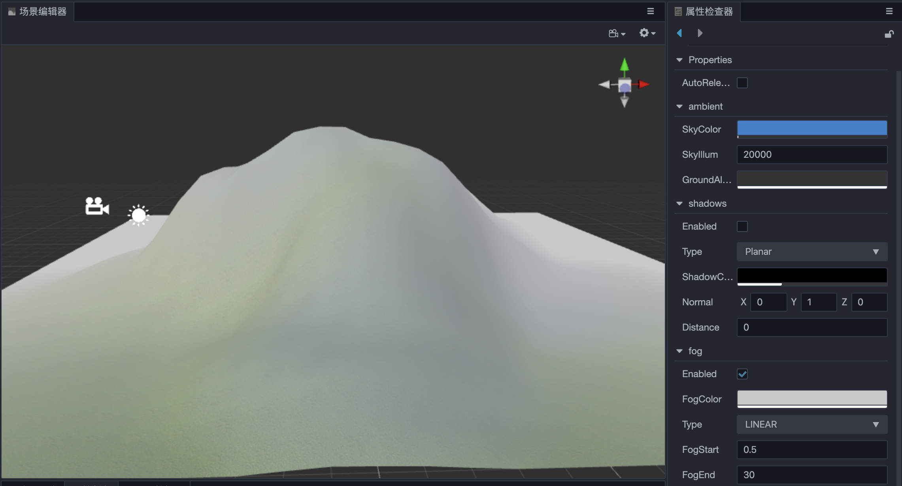

# 全局雾

全局雾用于在游戏中模拟室外环境中的雾效果。在游戏中除了用于雾效表现外，还可以用于隐藏摄像机远剪切平面外的模型来提高渲染的性能。

在 **层级管理器** 中选中 **Scene**，然后在 **属性检查器** 的 **fog** 组件中勾选 **Enabled** 属性即可开启全局雾。

## 全局雾类型

全局雾雾化类型取决于 **相机** 与 **模型顶点** 的计算结果，这个计算结果称为 **雾化混合因子**。雾化混合因子决定了雾化颜色和模型颜色的混合方式，最终展现出来的不同的全局雾效果。目前包括 **LINEAR**、**EXP**、**EXP_SQUARED**、**LAYERED** 四种雾化类型。

### Linear（线性雾）

| 属性 | 说明 |
| :---| :--- |
| **Enabled** | 是否开启全局雾 |
| **FogColor** | 设置全局雾的颜色 |
| **Type** | 全局雾的雾化类型 |
| **FogStart** | 雾效影响的起始位置 |
| **FogEnd** | 雾效影响的结束位置 |

Linear Fog 的雾化混合因子计算公式为：

**f = (FogEnd - Cam_dis) / (FogEnd - FogStart)**

- 当 `Cam_dis = FogEnd`，也就是相机与模型顶点的距离等于 FogEnd 时，混合因子的计算结果为 0，此时物体为全雾化。

- 当 `Cam_dis = FogStart`，也就是相机与模型顶点的距离等于 FogStart 时，混合因子的计算结果为 1，此时物体不受任何雾化的影响。

在相机与模型顶点的距离固定的情况下，若要增加 Linear Fog 的浓度，有以下两种方式：

1. 固定 `FogStart` 数值，减小 `FogEnd` 数值。
2. 减小 `FogStart` 数值，固定 `FogEnd` 数值。

如果要调整合适的雾效浓度，最好同时对 `FogStart` 和 `FogEnd` 属性进行适当的调整。Linear Fog 示例效果图如下：

### Exponential（指数雾）和 Exponential Squared（指数平方雾）

| 属性 | 说明 |
| :---| :--- |
| **Enabled**    | 是否开启全局雾   |
| **FogColor**   | 设置全局雾的颜色 |
| **Type**       | 全局雾的雾化类型 |
| **FogDensity** | 雾化浓度，取值范围为 0 ~ 1 |
| **FogAtten**   | 雾化衰减系数     |

Exponential Fog 的雾化混合因子计算公式为：

**f = e^(-distance * fogDensity)**

Exponential Squared Fog 的雾化混合因子计算公式为：

**f = e^(-distance * fogDensity)²**

开发者可以通过 `FogDensity` 和 `FogAtten` 来调整全局雾在不同位置的浓度。

Exponential Fog 的示例效果图如下：

### Layered（层雾）

Layered Fog（层雾）平行于水平面，具有一定的高度。可在场景世界坐标系垂直方向上的任一位置设定 Layered Fog 的顶部，以此来确定雾的高低。

| 属性 | 说明 |
| :---| :--- |
| **Enabled**    | 是否开启全局雾   |
| **FogColor**   | 设置全局雾的颜色 |
| **Type**       | 全局雾的雾化类型 |
| **FogAtten**   | 雾化衰减系数     |
| **FogTop**     | 模型顶点在世界坐标系垂直方向上的位置，小于该位置时所有的顶点都会受到雾化效果的影响   |
| **FogRange**   | 雾化效果影响的范围      |

Layered Fog 的雾化计算相比前面三种雾化类型稍显复杂，引入了 `FogTop` 的概念，同时还需要在 **x-z** 平面进行距离计算。

Layered Fog 在现实中还是比较常见的，高耸入云的山脉和建筑物都有它的身影，如果能合理利用，相信对场景展现效果有不错的提升，但与此同时计算量也会有一定的增大，开发者可根据需要来决定。

Layered Fog 的示例效果图如下：

