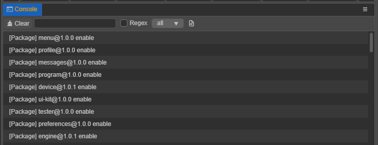

# 控制台



**控制台** 输出编辑器或引擎信息，信息类型包括 **log 日志**、**warn 警告** 和 **error 报错**。不同类型的信息会以不同颜色显示。

- `console.log()`：输出日志，<font color=#b6b6b6>灰色文字</font>，通常用来显示正在进行的操作。

  

- `console.warn()`：输出警告，<font color=#ebbe09>黄色文字</font>，用于提示开发者最好进行处理的异常情况，但不处理也不会影响运行。

  

- `console.error()`：输出错误，<font color=#dd3c43>红色文字</font>，表示出现了严重错误，必须解决才能进行下一步操作或者运行游戏。

  

## 面板操作

顶部工具栏功能依次是：

- 清空当前控制台内的所有日志
- 输入文本模糊搜索
- 是否将输入文本转为正则进行搜索
- 选择要显示的日志类型
- 打开备份在磁盘里的日志文件，每次编辑器启动时会重置该文件数据。

  

## 参数设置

控制台的一些参数可在 **偏好设置 -> 控制台** 中配置，包括是否显示日期，调整文字大小。


## 自定义输出信息

为了方便定位文件、节点或资源，或者提供跳转到帮助文档的链接等，Cocos Creator 支持在编辑器主菜单的 **开发者 -> 开发人员工具** 中自定义输出到 **控制台** 的日志，目前支持输出以下内容：

- 根据 URL 跳转链接
- 根据 URL 显示图片
- 根据 URL 或 UUID 定位到 Asset 资源
- 根据 UUID 定位到 Node 节点
- 根据磁盘文件路径 path 定位到脚本文件
- 输出对应语言的文案

### 数据格式

根据输出内容的不同，输入的数据格式包括以下两种：

- `{type[text](url)}`
- `{type(text | url | uuid | path)}`

数据格式说明如下：

- 整体匹配 `{}` 中的字符；
- `[text]`：跳转链接的显示文本，选填；
- `type`：输出的信息类型，包括以下几种。填写时不区分大小写；若不填写则直接输出输入的内容，不带有数据格式。

    - `link`：外部跳转链接
    - `image`：显示图片
    - `asset`：定位到资源
    - `node`：定位到节点
    - `i18n`：多语言翻译

### 示例

打开编辑器主菜单中的 **开发者 -> 开发人员工具**，然后输入：

```sh
console.log('Open {link[the help doc url](https://docs.cocos.com/creator/manual/en/editor/console/)}');
console.log('Locate {link[ the file in library](D:/cocos-creator/a/library/36/36b55a90-1547-4695-8105-abd89f8a0e5f.js)}');
console.log('Locate Node UUID {node(f6zHdGKiZDhqbDizUsp8mK)}');
console.warn('Locate Asset UUID {asset(17185449-5194-4d6c-83dc-1e785375acdb)}');
console.error('Locate Asset URL {asset(db://assets/animation.anim)}');
console.log('The URL is {asset[{asset(db://assets/animation.anim)}](db://assets/animation.anim)}');
console.log('Show image {image(https://forum.cocos.org/images/logo.png)}');
console.log('Translate: {i18n(console.description)}');
```

可以在 **控制台** 中看到输出的日志：


