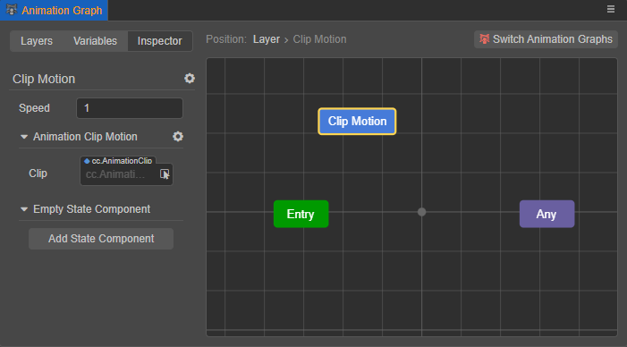

# Animation State Machine

The action that an object is in when it plays a particular animation, such as standby, move, run, attack, etc., is called its **state**. <br>
In general, an object has multiple states and switches between them in a certain logical order to perform different actions; such switches are called [transitions](state-transition.md) in the animation graph. The conditions that need to be satisfied when a transition occurs are called **transition conditions**.

The animation state machine, on the other hand, is used to manage and control each state and the transition between states on the object, similar to a flowchart, which can be edited visually directly in the [Animation Graph panel](animation-graph-panel.md). Currently, an animation graph contains a state machine, when the state machine is in a state in the animation graph, the animation corresponding to that state will be played. Then, according to the pre-built animation flow chart, the state machine can automatically control the playback and switching of the skeleton animation, etc.

## State Basics

The states in the state machine are not only used to control the animation, but also include **Entry**, **Exit**, **Any**, **Sub-State Machine**, which are special states, because they do not carry animation, but are only used to mark the start and end of the state machine. To distinguish them from other states, they are called "pseudo-states" for now.

The [sub-state machine](#sub-state-machine) is nested in the state machine and is used to degrade complex animation logic, see the **sub-state machine** section below for details. Generally, the topmost state machine of the animation graph is referred to as the **Top Level State Machine**, similar to the root node in the scene.

The **Entry**, **Exit**, and **Any** are fixed units that exist in the state machine by default and cannot be deleted. They can be seen in the grid layout area when the animation graph is opened to edit the state machine, and it should be noted that **Exit** only exists in **sub-state machines**.


- **Entry**: marks the entry of the state machine. **Entry** can only be the source where the state transition occurs, not the target of the transition.

- **Exit**: exits the state machine after the state transition to **Exit**. **Exit** can only be used as the target of a state transition, not as the source of the transition.

    **Exit exists only in the sub-state machine** because after exiting the sub-state machine, it is necessary to return to the parent state machine to continue executing the next transition. If the top-level state machine is exited, the animation flow terminates and the character is stationary, whereas in general, the character is continuously moving. <br>To make the character completely stationary, turn off the animation controller component where the current animation graph is located.

- **Any**: can refer to any other state in the state machine, but not "pseudo-state". **Any** can only be used as the source of a state transition, not as the target of a transition.

    A transition from **Any** is equivalent to a transition from all states, i.e., all states in the state machine will switch to another state when a condition is met, and **Any** can be used. For example, if a character triggers an attack condition in the state of walking, running, jumping, etc., they all need to switch to the attack state.

    > **Note**: **Any** is inheritable. If a state transition from **Any** is set in the parent state machine, all states in its sub-state machines will perform that transition if the condition is met.

## Creating states

The state machine consists of states and transitions between states, but first, the base unit, **State**, needs to be created.

Right-click on the grid layout area on the right side of [animation-graph-panel](animation-graph-panel.md) to add states by selecting from the menu.

- **Animation Clip**: for playing the specified animation clip, default name is `Clip Motion`.
- **Blend 1D/2D**: used to play the specified 1D/2D animation blending, the default name is `Blend 1D`/`Blend 2D`. An animation blending is a new animation obtained by blending multiple animations, please refer to **animation blending** below for details.
- **Sub-State Machine**: the default name is `State Machine`, it is used to play the animation content in the sub-state machine. Please refer to **Sub-State Machine** below for more details.

All but the sub-state machines are shown in the grid area as blue graphics.


### Setting state properties

Checking the created animation state displays a yellow highlight in the blue graph outer frame and the settable state properties are also displayed in the **Inspector** tab on the left side of the Animation Graph panel at:



> **Note**: the properties that can be set for animation blending and sub-state machines may differ, please refer to the corresponding content below.

- The name of the currently selected state will be displayed in the upper left corner of the **Inspector** tab, for example `Clip Motion` in the above picture, click the gear icon button on the right to rename it.

- **Speed**: used to set the playback speed of the animation clip attached on the current state, the default is 1, the smaller the value the slower the playback speed.

- **Animation Clip Motion**: used to specify the animation clip attached on the current state. Drag and drop the clip directly from the **Assets** panel into the **Clip** property box, or click the arrow button behind the **Clip** property box to select it directly. Once an animation clip is set, the current state will play the content of the specified animation clip, and the state name will be changed to the animation clip name.

  > **Note**: if no animation clip is specified, it will cause problems.

  Click the gear icon menu on the right to delete the current animation clip. Click **Add Motion** to re-add Animation Clip Motion / 1D Blend Motion / 2D Blend as needed.

  

- **Empty State Component**: used to add an animation state component. The base class of the animation state component provides some methods to represent some specific events of the state machine, which are used to add some business logic when the state enters and exits. Please refer to the **Animation State Component** section below for more details. Similarly, click the gear icon button on the right to delete the current animation state component and reselect it as needed; click the gear icon button on the top right to add multiple state components at the same time.

- Clicking the gear icon menu to the right of the state name supports **Remove This State**/**Add State Component**/**Rename**/**Replace with Animation Clip Motion**/**Replace with 1D Blend Motion**/**Replace with 2D Blend Motion**, where **Add State Component** and **Remove This State** can also be done directly in the grid layout area by right-clicking on the state.

  

## Animation Blending

Animation blending can be used to blend multiple animations according to the input parameters and some preset parameters to achieve a similar effect as blending walk and jump according to the speed, it is recommended to blend the animations as similar as possible to make the blended motion as reasonable as possible. According to the different input parameters the animation blending can be divided into the following blending methods:

- **Blend 1D**: blending multiple animations according to **one input parameter** by **linear interpolation algorithm**.

- **Blend 2D**: blending multiple animations based on **two input parameters** by **barycentric interpolation blending algorithm** of center of gravity coordinates.

Animation blending differs from [State Transition](state-transition.md):

- Transitions are smooth transitions from one state to other states within a given period.

- Blending is a smooth blend of multiple animations by combining them at different levels with the blend parameter.

### Adding animation blending

Right-click on the grid layout area of the Animation Graph panel to choose to add a **Blend 1D** or a **Blend 2D**. Once created, set the properties in the **Inspector** tab, except for the Animation Blending settings, which are the same as in **Setting state properties** above.


To set the parameters and the animations involved in the blend, enter the edit page of the animation blending, which can be accessed in the following three ways:

- Click **Edit** in the animation blending settings
- Double-click the blend state in the grid layout
- Right-click the blend state in the grid layout, and then select **Edit**.

Exit the edit page of the animation blending, including the following two ways:

- Right-click the grid layout area, then select **Return to Parent**
- The **Position** at the top left of the grid layout area indicates the current position, click the layer to return to the corresponding position


### 1D Animation Blending

**1D animation blending** is a blend of multiple animations based on **one input parameter** by a **linear interpolation algorithm**, each of which can be configured with a threshold value.

- When the input parameter lies exactly on a threshold, the animation on that threshold will be used.
- When the input parameter lies between two thresholds, the two animations are blended according to the ratio of the input parameter on the threshold interval **linearly**. The linear formula is **A * (1 - t) + B * t**, where A and B denote the threshold values and t denotes the ratio of the input parameter values on this threshold interval.

Enter the animation blending edit page, right-click in the grid layout area, add the animations involved in the blend as needed, support adding **Clip Motion**, **1D Blend Motion**, **2D Blend Motion**.


- **Parameter**: this item is used to select the input parameters for the animation blending. The Parameter and its value can be created in the **Variables** tab of the Animation Graph panel. Currently, **Float** variables are supported, see [Animation Graph Panel - Variables](animation-graph-panel.md) for details. <br>Input parameters can also be selected directly from the animation blending in the grid layout area.

- **Threshold**: this item is visible when an animation has been added to the animation blending. Each time an animation is added, a new threshold will be added to the lower panel, and you can set each threshold size manually as needed; you can also check **Automatic Threshold Adjustment** to automatically divide the thresholds evenly, either one of the two. All the thresholds are arranged from top to bottom in the order of smallest to largest.

- Animation clips can be attached directly to the animation in the grid layout area, or specify the animation clips in the **Inspector** tab on the left after selecting the animation.

  > **Note**: if no animation clip is specified, it will cause problems.

  

  To remove the animation, right-click the animation directly in the grid layout area to remove it, or select the animation and click the gear icon button in the **Inspector** tab on the left to remove it.

For example, to achieve an even blend of standby, walk, and run animations based on the character's rate, set up as the following image:


### 2D Animation Blending

**2D animation blending** is the blend of multiple animations based on **two input parameters** by **barycentric interpolation blending algorithm**, each of which can be configured with a threshold value.

The basic operation of 2D animation blending is basically the same as 1D animation blending, the differences are:
- 2D animation blending has two **parameters** on the **Inspector** tab.
- The thresholds are represented as `[x, y]` and are ordered top-down according to the order in which the animations are added. and there is no **Automatic Threshold Adjustment** option.
- The value of the first input parameter corresponds to the interval of the lower threshold `X`, and the value of the second input parameter corresponds to the interval of the lower threshold `Y`.

2D animation blending is often used to blend moving animations in different directions by interpolation, e.g.


The range of the first input parameter in the above figure is `[-1, 1]` and the range of the second input parameter is `[-1, 1]`.

## Sub-State Machine

Since objects will typically have complex combinations of actions in multiple stages, it is also possible to (recursively) nest **sub-state machines** within the state machine in order to degrade complex logic. This is generally referred to as the topmost state machine of the animation graph as the **top-level state machine**, similar to the root node in the scene.

It can be created by right-clicking on the grid layout area and selecting **Add Sub-State Machine**. Once created, a sub-state machine named `State Machine` will be created in the grid layout area by default:


- The ① button is used to enter the sub-state machine editing page; to enter the editing page, double-click on the sub-state machine or right-click on the sub-state machine and select **Edit**.
- The ② button is used to add state components; please refer to the **Animation State Components** section below for details.
- Click the gear icon button, the expanded menu includes **Remove This State**, **Add State Component**, **Rename**.

Most of the above function points can also be achieved by right-clicking on a sub-state machine in the grid layout area.

### Editing Sub-State Machine

After entering the sub-state machine editing page, the interface is shown in the following figure. The editing of the sub-state machine is basically the same as the top-level state machine, the main difference is that the sub-state machine contains **Exit** pseudo-state by default, when the state transitions to **Exit**, exit the sub-state machine and return to the parent state machine to continue executing the next transition until it returns to the top-level state machine to continue the next transition. See the **State Machine Basics** section above for more details.


Click on the **position** at the top of the screen to jump to any of the upper state machines as needed. Right-click on the grid layout area and select **Return to Parent** to return to the parent state machine.

Once the sub-state machine is edited, a thumbnail view of the specific structure in the sub-state machine will be displayed in the parent state machine:


## Animation State Component

Both state and sub-state machines can attach animation state components. Animation state components can be created directly in the **Assets** panel by right-clicking on the **+** button at the top left of the **Assets** panel and selecting **Animation State Component**:


Once created, a default component named `AnimationGraphComponent` will be generated.


The animation state component class inherits from `animation.StateMachineComponent` and its base class provides methods that represent some specific events of the state machine. Subclasses can override these methods in order to add some business logic when the state enters and leaves.

| Method Name | Description |
| :--- | :--- |
| `onMotionStateEnter` | Called when entering the state |
| `onMotionStateExit` | Called when fully exiting the state |
| `onMotionStateUpdate` | Called when the state is updated |
| `onStateMachineEnter` | Called when entering a sub-state machine |
| `onStateMachineExit` | Called when exiting a sub-state machine |

The methods in the above table may accept the following parameters:

- `controller: animation.AnimationController`: indicates the animation controller component that runs this animation graph. All the above methods will accept this parameter.

- `motionStateStatus: animation.MotionStateStatus`: indicates the operational state of the event body's motion state. Only state (except pseudo-state) related methods (`onMotionStateEnter`, `onMotionStateExit`) can accept this parameter.

After creating the animation state component, select the state in the Animation Graph panel, then click **Add State Component** in the **Inspector** tab on the left to attach the component to the current state:


### Example: Play effects when entering state

```ts
import { _decorator, animation, PhysicsSystem, ParticleSystem } from "cc";
const { ccclass, property } = _decorator;

@ccclass("AnimationGraphComponent")
export class AnimationGraphComponent extends animation.StateMachineComponent {
    /**
     * Called when a motion state right after it entered.
     * @param controller The animation controller it within.
     * @param stateStatus The status of the motion.
     */
    public onMotionStateEnter (controller: animation.AnimationController, stateStatus: Readonly<animation.MotionStateStatus>): void {
        // Play all example effects on the node where the animation controller is located
        for (const particleSystem of controller.node.getComponents(ParticleSystem)) {
            particleSystem.play();
        }
    }
}
```
