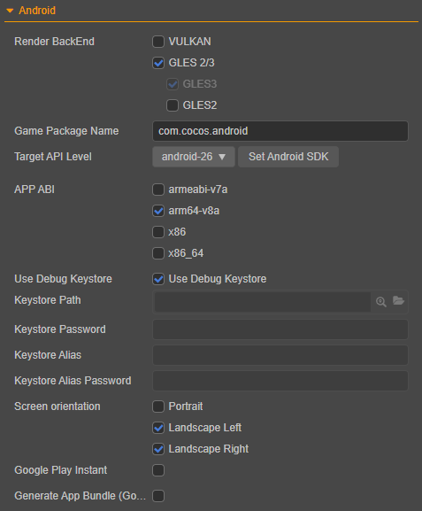

# Publish to Native Platforms

Click **Project -> Build** in the menu bar to open the **Build** panel.

The native platforms that can be selected currently include **Android**, **iOS**, **Mac**, and **Windows**. Among them, the options for publishing to **iOS**, **Mac**, and **Windows** only appear when using the corresponding operating system.

## Environment Configuration

Publishing to the native platform requires installation and configuration of some necessary environments. For details, please refer to the [Setup Native Development Environment](setup-native-development.md) documentation.

## Build Options

For the general build options of each platform, please refer to the [General Build Options](build-options.md) documentation.

### Generic Build Options for Native Platforms

Due to the adjustment of the current build mechanism, the processing of different platforms is built into the **Build** panel in the form of a plugin.

After selecting the native platform to be built in the **Platform** option of the **Build** panel, notice that in addition to the expanded options of the specific native platform, there is also an expanded option for **Native**. The build options in **Native** are the same on all native platforms.

#### Resource Server Address

When the package size is too large, the resource can be uploaded to the resource server and downloaded through the network. This option is used to fill in the address where the resource is stored on the remote server. Developers need to manually upload the `remote` folder in the release package directory to the filled resource server address after build. For details, please refer to the [Upload resources to remote server](../../asset/cache-manager.md) documentation.

#### Polyfills

This option is a polyfills option for some new features supported by the scripting system, and currently only supports **Async Functions**. After checking, the generated project will bring the corresponding polyfills, that is, the package body will be enlarged, and the developer can choose whether to use it according to actual needs.

#### Make Immediately After Build

If this option is checked, the **Make** step will be executed automatically after the build is completed, and no manual operation is required.

#### Job System

This option is currently used by the internal function module of the engine to manage the project's job flow and requires no further user attention. Should such need emerges, please take note:

1. TBB and TaskFlow performs verily depending on the execution environment and project specifications, thus should be selected accordingly.
2. TBB / TaskFlow is supported by specific versions when used to deploy to native platforms. For more information, please see the **Version Support** section below.

#### Encrypt JS

This option is used to encrypt the published script. The jsc file will be generated in the built-in `assets` directory, this file is encrypted. The js file will be backed up in the `script-backup` directory for debugging, and will not enter the APP during packaging.

**JS Encryption Key**: This value will be used as the key to encrypt the js file on the Native platform. It will be randomly generated when the project is created.

**Zip compression**: If checked, the script size can be reduced.

#### Native Engine

This option is used to show whether the built-in engine or a custom engine is currently being used. Click the **Edit** button behind it to go to the **Preferences -> [Engine Manager](../preferences/index.md#engine-manager)** panel for settings.

### Build Options for the Android Platform

Android platform build options:

#### Render BackEnd

Render Backend currently supports [VULKAN](https://www.vulkan.org/), [GLES3](https://www.khronos.org/registry/OpenGL-Refpages/es3/) and [GLES2](https://www.khronos.org/registry/OpenGL-Refpages/es2.0/), and requires at least one selection, with **GLES3** being used by default.

If **GLES 2/3** is selected, **GLES3** must be checked by default, and **GLES2** is not allowed to be selected separately.

In the case of multiple being selected at the same time, the runtime will select the rendering backend to be used according to the actual support of the device.

#### Game Package Name

**Game Package Name** is usually arranged in reverse order of the product website URL, such as `com.mycompany.myproduct`.

> **Note**: the package name can only contain numbers, letters and underscores. The last part of the package name must start with a letter, not an underscore or number.

#### Target API Level

Set the Target API Level required when compiling the Android platform. Click the **Set Android SDK** button next to it to quickly jump to the configuration page. For specific configuration rules, please refer to the [Configuring Native Development Environment](setup-native-development.md) documentation.

#### APP ABI

Set the CPU type that Android needs to support. It is possible to choose one or more options. Currently, there are four types: **armeabi-v7a**, **arm64-v8a**, **x86** and **x86_64**.

> **Notes**:
>
> 1. After selecting an ABI to build, build another ABI without cleaning. At this time, the so of both ABIs will be packaged into the apk. This is the default behavior of Android Studio. If using Android Studio to import the project, after selecting an ABI to build, first execute **Build -> Clean Project** and then build another ABI. At this time, only the latter ABI will be packaged into the apk.
>
> 2. After the project is imported with Android Studio, it is an independent existence and does not depend on the build release panel. To modify the ABI, just modify the **PROP_APP_ABI** property in the **gradle.properties** file.
>
>     

#### Use the Debug Keystore

Android requires that all APKs must be digitally signed with a certificate before they can be installed. Cocos Creator provides a default keystore. Check **Use debug keystore** to use the default keystore. If the developer needs to customize the keystore, uncheck the **Use debugging keystore** check. For details, please refer to the [Official Documentation](https://developer.android.com/studio/publish/app-signing).

#### Screen Orientation

The screen orientation currently includes **Portrait**, **Landscape Left**, and **Landscape Right**.

- **Portrait**: the screen is upright and the Home button is down.
- **Landscape Left**: the screen is placed horizontally, and the Home button is on the left side of the screen.
- **Landscape Right**: the screen is placed horizontally, and the Home button is on the right side of the screen.

#### Google Play Instant

Check this option to package and publish the game to Google Play Instant. Google Play Instant relies on Google Play and is not a new distribution channel, but closer to a game micro-end solution. It can realize that the game can be played immediately without installation, which is conducive to the trial play, sharing and conversion of the game.

> **The following notes are required when using**:
>
> 1. The Android Studio should be v4.0 and above.
> 2. The Android Phone should be v6.0 and above. Devices with Android SDK version between 6.0 and 7.0 need to install Google Service Framework, while those with SDK version 8.0 or higher do not need it and can install it directly.
> 3. For the first compilation, open the built project with Android Studio to download the **Google Play Instant Development SDK (windows)** or **Instant Apps Development SDK (Mac)** support package. If the download is unsuccessful, it is recommended to set up the HTTP proxy of Android Studio.
>
> 

#### Make App Bundle (Google Play)

Check this option to package the game into App Bundle format for uploading to the Google Play store. For details, please refer to the [Official Documentation](https://developer.android.com/guide/app-bundle/).

### Windows Platform Build Options

The build options for the Windows platform include **Render BackEnd** and **Target Platform**.

#### Render BackEnd

Currently, **VULKAN**, **GLES3** and **GLES2** are supported, and **GLES3** is checked by default. If more than one is checked at the same time, the rendering backend will be selected based on the actual support of the device at runtime.

#### Target Platform

Set the compilation architecture, both **x64** and **win32** are currently supported.

- If **x64** is selected, only **x64** architecture is supported to run on.

- If **win32** is selected, both architectures are supported to run on.

### Build Options for the iOS Platform

The build options for the iOS platform include **Bundle Identifier**, **Orientation**, **Skip the update of Xcode project**, **Render BackEnd**, **Developer Team** and **Target iOS Version**. The setting of **Orientation** is the same as the Android platform.

#### Bundle Identifier

Package name, usually in reverse order of product website URL, such as `com.mycompany.myproduct`.

> **Note**: the package name can only contain numbers (0~9), letters (A~Z, a~z), underscores (-) and dots (.). The last part of the package name must start with a letter, not an underscore or number.

#### Skip the update of Xcode project

If this option is checked, the CMake packaging tool will not update the Xcode project when rebuilding the project, so that the previous changes to the Xcode project files are retained. However, if changes are subsequently made to the CMake configuration file, the Xcode project will also not be updated.

#### Render BackEnd

Currently, only **METAL** is supported for the Render BackEnd. See the official documentation [Metal](https://developer.apple.com/metal/) for details.

#### Developer Team

This option is used to configure the Development Team signature information when building and compiling iOS projects. If the signature information is manually configured in Xcode when compiling with Xcode, the configuration in Xcode takes precedence. When a rebuild is performed, the value of this option will override the value configured in Xcode.

#### Target iOS Version

The option specifies the version of the iOS software when publishing to the iOS platform and defaults to **12.0**. The version number is recorded in the `TARGET_IOS_VERSION` field of the `proj/cfg.cmake` file in the release package directory after the build.

### Mac Platform Build Options

The build options for the Mac platform include **Bundle Identifier**, **Target macOS Version**, **Support Apple Silicon**, **Skip the update of Xcode project** and **Render BackEnd**.

#### Bundle Identifier

Package name, usage is consistent with the iOS platform.

#### Target macOS Version

This option specifies the macOS system version when publishing to the Mac platform and defaults to **10.14**. The version number is recorded in the `TARGET_OSX_VERSION` field of the `proj/cfg.cmake` file in the release package directory after the build.

#### Support Apple Silicon

This option is used to better flag support issues for some known engine modules on Apple M1 (Silicon) architecture devices.

#### Skip the update of Xcode project

If this option is checked, the CMake packaging tool will not update the Xcode project when rebuilding the project, so that the previous changes to the Xcode project files are retained. However, if changes are subsequently made to the CMake configuration file, the Xcode project will also not be updated.

#### Render BackEnd

This option currently uses the **METAL** rendering backend by default, see the official documentation [Metal](https://developer.apple.com/metal/) for details.

### Version Support

The minimum version of each functional module is supported in the native platform as follows:

| Function Module | Android | iOS |
| :-- | :--- | :-- |
| VULKAN Render BackEnd | API Level 24（7.0）| - |
| Google Play Instant | API Level 23（6.0）| - |
| TBB Job System | API Level 21（5.0）| 10.0 |
| TaskFlow Job System | API Level 18（4.3）| 12.0 |
| Forward Render Pipeline | API Level 21（5.0）| 10.0 |

Creator 3.0 supports C++14. v3.1 is upgraded to C++17 since v3.1 supports the TaskFlow Job System, which relies on C++17. 
However, since C++17 is only supported in iOS 12+, we dropped it back to C++14 in v3.3.2 in order to support iOS 10.0. Note that in v3.3.2, if TaskFlow Job System in used, C++17 will be automatically enabled to support compilation.

Correspondingly, the minimum version support for each version of Creator on native platforms is as follows:

| Native Platform | Creator 3.0 | Creator 3.1 ~ 3.3.1 | Creator 3.3.2 and above |
| :-- | :--- | :-- | :-- |
| Android | API Level 18（4.3）| API Level 21（5.0）| API Level 18（4.3）|
| iOS | 10.0 | 12.0 | 10.0 |

The highest version is supported as follows:

- Android: API Level 31（12.x）
- iOS: 15.x

## Build a Native Project

After the build options are set, start building. Click the **Build** button at the bottom right corner of the **Build** panel to start the build process.

When compiling scripts and packaging resources, a blue progress bar will be displayed on the **Build Tasks** page of the **Build** panel. If the build is successful, the progress bar will reach 100% and be displayed in green:

### Build Directory

After the build is over, what we get is a standard Cocos2d-x project, which has the same structure as the newly created project using Cocos Console. Taking the Windows platform as an example, the directory structure of the exported native project package `windows` is:

- `assets`: store project resources.
- `proj`: store the currently built native platform project, which can be used for the IDE of the corresponding platform to perform compilation tasks. For details, please refer to the introduction below.
- `cocos.compile.config.json`: compile options configuration for this build.

Because the underlying C++ code generated after the native platform (such as Android, Windows) is built is completely consistent, in v3.0, extract the underlying C++ code separately and place it in the shared `native/engine/common` folder in the project directory. In this way, when the native platform is built, if it is detected that the folder already exists, this part of the content will not be processed again, which speeds up the build.

For more instructions on the directory structure, please refer to the [Build Directory Differences - Native Platform](../../release-notes/upgrade-guide-v3.0.md#native) documentation.

### Secondary Development

v3.0 separates the code and configuration, put part of the code and configuration into the source code management, located in the `native\engine\currently built platform name` folder under the project directory (for example, `native\engine\win32`, `native\engine\android`).

Developers can integrate the SDK or do secondary development here. Deleting the release package directory (such as `build\windows`) generated after the build will not affect the integrated SDK, but the premise is that is needed to add a code reference in the directory:

- If the integrated SDK is common to all native platforms, it is necessary to add a reference in `native\engine\common\CMakeLists.txt` in the project directory.
- To do secondary development based on iOS, Mac, and Windows platforms, add a reference in `native\engine\currently built platform name\CMakeLists.txt` in the project directory (for example, `native\engine\ios\CMakeLists.txt)`)
- If the secondary development is based on the Android platform:
    - C++: need to add a reference in `native\engine\android\CMakeLists.txt` in the project directory.
    - Java: need to add a reference in `build\android\proj\build.gradle` in the project release package.

For more information about the use of CMake, please refer to the [CMake Introduction](../../advanced-topics/cmake-learning.md) documentation.

## Build and Run

Cocos Creator supports **Make** and **Run Preview** steps via the editor or the corresponding IDE for each platform (e.g.: Xcode, Android Studio, Visual Studio).

### Via the Editor

After the build is completed, continue to click the **Make** button next to it, and it will prompt:

`make package YourProjectBuildPath success!`

> **Note**: after the first generation of the Android platform or the version upgrade, it is recommended to open the project through Android Studio, download the missing tools according to the prompts, and then compile and run.

After the "Make" process is complete, continue to click the **Run** button next to it. Part of the compilation may continue. Please wait patiently or check the progress through the log file. The operating results of each platform are:

- Mac/Windows platform will run the preview directly on the desktop
- The Android platform must be connected to the physical device via USB, and the preview can be run after the USB debugging is turned on on the physical device.
- The iOS platform will call the simulator to run the preview, but it is recommended to connect to the physical device through Xcode to execute **Make** and **Run**, please refer to the introduction below.

### Via IDE

Click the **folder icon** button in the lower left corner of the **build task**, and the build path will be opened in the file manager of the operating system. In this path, the `proj` under the `build` directory contains the currently built native platform project.

Next, open these generated native projects using the IDE corresponding to the native platform (e.g.: Xcode, Android Studio, Visual Studio) and make further operations like compilation, preview and release.

- **Android**

  

- **Windows**

  

- **iOS** and **Mac**

  

> **Note**: do not perform secondary development in these native platform projects, otherwise it will be overwritten when rebuilding.

Please search for information about using the native platform IDE, here we won't go over it again. To learn how to debug on the native platform, please refer to the [Debugging JavaScript on Native Platforms](debug-jsb.md) documentation.

## Precautions

1. The project built in debug mode on MIUI 10 system may pop up the prompt box of "Detected problems with API compatibility". This is a problem introduced by MIUI 10 system itself, just use release mode to build.

2. When packaging the iOS platform, if the developer does not use WebView related functions in the project, please make sure to remove the WebView module in **Project -> Project Settings -> Feature Cropping** to improve the success of iOS App Store machine review rate. If the developer really needs to use WebView (or the added third-party SDK comes with WebView), and therefore the iOS App Store fails the machine review, they can still try to appeal via email.

3. There are some differences between the compiled results of the Android platform through the editor and Android Studio:

    - After executing the **Make** step through the editor, the `build` directory will be generated under the release path, and the `.apk` will be generated under the `app\build\outputs\apk` directory of the `build` directory.

    - After compiling with Android Studio, `.apk` will be generated in `proj\app\build\outputs\apk` directory.

4. Android and Android Instant use the same build template, and the generated projects are all in the `build\android\proj` directory. Please note for this directory:

    - If it is the code used solely by the Android platform, please put it in the `app\src` directory, and put the third-party library used separately in the `app\libs` directory (if these two directories do not exist, create them).

    - If the code and third-party libraries used by Android Instant are used separately, please put them in the `instantapp\src` and `instantapp\libs` directories respectively (if these two directories do not exist, create them).

    - For code and third-party libraries shared by Android and Android Instant, please put them in the `src` and `libs` directories respectively (if these two directories do not exist, create them).

    When compiling for Android by clicking the **Make** button in the **Build** panel, `assembleRelease/Debug` will be executed by default, and `instantapp:assembleRelease/Debug` will be executed by default when compiling for Android Instant.
