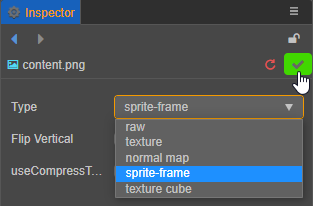

# 精灵帧资源（SpriteFrame）

Cocos Creator 的 SpriteFrame 是 UI 渲染基础图形的容器。其本身管理图像的裁剪和九宫格信息，默认持有一个与其同级的 Texture2D 资源引用。

## 导入精灵帧资源

使用默认的 [资源导入](asset-workflow.md) 方式将图像资源导入到项目中，然后在 **属性检查器** 中将图像资源的类型设置为 **sprite-frame**，并点击右上角的绿色打钩按钮保存：



Creator 便会自动在导入的图像资源下创建一个如下图所示的 **spriteFrame** 资源：


图像资源在 **资源管理器** 中会以自身图片的缩略图作为图标。在 **资源管理器** 中选中图像子资源后，**属性检查器** 下方会显示该图片的缩略图。

## 属性

spriteFrame 资源属性如下：

| 属性 | 功能说明 |
| :--- | :--- |
| Packable    | 是否参与动态合图以及自动图集的构建处理。详情请参考下文 **Packable** 部分的内容     |
| Rotated  | 只读属性，不可更改。用于查看 Texture Packer 资源中的子资源是否被旋转 |
| Offset X、Y | 只读属性，不可更改。用于查看 Texture Packer 资源中矩形框的偏移量 |
| Trim Type | 裁剪类型，包括：<br>1. Auto — 自动裁剪（默认），详情请参考 [图像资源的自动剪裁](../ui-system/components/engine/trim.md)<br>2. Custom — 自定义裁剪<br>3. None — 无裁剪，使用原图 |
| Trim Threshold | 透明度阈值，默认为 1，取值范围为 0~1，会将透明度在设定值以下的像素裁减掉。当 Trim Type 设置为 **Auto** 时生效 |
| Trim X、Y、Width、Height | 设置裁剪矩形框，当 Trim Type 设置为 **Custom** 时生效 |
| Border Top、Bottom、Left、Right | 设置九宫格图边距，可点击下方的 **编辑** 按钮进行可视化编辑  |

### Packable

如果引擎开启了 [动态合图](../advanced-topics/dynamic-atlas.md) 功能，动态合图会自动将合适的贴图在开始场景时动态合并到一张大图上来减少 Drawcall。但是将贴图合并到大图中会修改原始贴图的 UV 坐标，如果在自定义 `effect` 中使用了贴图的 UV 坐标，这时 `effect` 中的 UV 计算将会出错，需要将贴图的 **Packable** 属性设置为 **false** 来避免贴图被打包到动态合图中。

## 使用 SpriteFrame

### 使用 texture 渲染

将 SpriteFrame 资源拖拽到 [Sprite 组件](../ui-system/components/editor/sprite.md) 的 **SpriteFrame** 属性框中，即可切换 Sprite 显示的图像。


在运行时，以上图中导入的名为 **content** 的图片为例，整个资源分为三部分：

- **content**：图像源资源 ImageAsset
- **content** 的子资源 **spriteFrame**，即精灵帧资源 SpriteFrame
- **content** 的子资源 **texture**，即贴图资源 Texture2D

当资源存放在 `resources` 目录下时，我们可直接加载到 spriteFrame 资源，代码示例如下：

```typescript
const url = 'test_assets/test_atlas/content/spriteFrame';
resources.load(url, SpriteFrame, (err: any, spriteFrame) => {
  const sprite = this.getComponent(Sprite);
  sprite.spriteFrame = spriteFrame;
});
```

但在有些情况下只能加载到图像源资源 ImageAsset，因此我们提供了 [createWithImage](%__APIDOC__%/zh/#/docs/3.4/zh/asset/Class/SpriteFrame?id=createwithimage) 方法来帮助用户通过加载到的 ImageAsset 创建一个 SpriteFrame 资源。根据 ImageAsset 的来源不同，有以下两种创建方式：

1. 存放在服务器上的资源只能加载到图像源资源 ImageAsset，加载方法请参考 [动态加载资源](./dynamic-load-resources.md)。创建 SpriteFrame 资源的代码示例如下：

    ```typescript
    const self = this;
    const url = 'test_assets/test_atlas/content';
    resources.load(url, ImageAsset, (err: any, imageAsset) => {
      const sprite = this.getComponent(Sprite);
      sprite.spriteFrame = SpriteFrame.createWithImage(imageAsset);
    });
    ```

    或者用户也可以手动填充信息，代码示例如下：

    ```typescript
    const self = this;
    const url = 'test_assets/test_atlas/content';
    resources.load(url, ImageAsset, (err: any, imageAsset) => {
      const sprite = this.getComponent(Sprite);
      const spriteFrame = new SpriteFrame();
      const tex = new Texture2D();
      tex.image = imageAsset;
      spriteFrame.texture = tex;
      sprite.spriteFrame = spriteFrame;
    });
    ```

2. 通过 Canvas 绘制的 ImageAsset 创建，代码示例如下：

    ```typescript
    const sprite = this.getComponent(Sprite);
    sprite.spriteFrame = SpriteFrame.createWithImage(canvas);
    ```

    或者用户也可以手动填充信息，代码示例如下：

    ```typescript
    const sprite = this.getComponent(Sprite);
    const img = new ImageAsset(canvas);
    const tex = new Texture2D();
    tex.image = img;
    const sp = new SpriteFrame();
    sp.texture = tex;
    sprite.spriteFrame = sp;
    ```

### 使用 RenderTexture 渲染

RenderTexture 是一个渲染纹理，它可以将摄像机上的内容直接渲染到一张纹理上而不是屏幕上。SpriteFrame 通过管理 RenderTexture 可以轻松地将 3D 相机内容显示在 UI 上。具体的使用方法及代码示例可参考 [渲染纹理资源](render-texture.md)。

API 接口文档：[SpriteFrame 资源类型](%__APIDOC__%/zh/#/docs/3.4/zh/asset/Class/SpriteFrame)。
