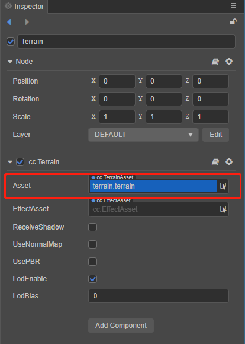
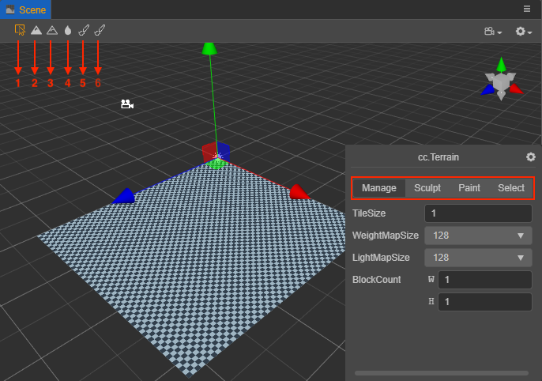
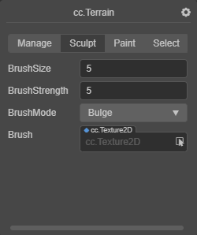

# 地形系统

地形系统以一种高效的方式来展示大自然的山川地貌。开发者可以很方便的使用画刷来雕刻出盆地、山脉、峡谷、平原等地貌。

## 创建地形

创建地形需要以下步骤：

1. 在 **层级管理器** 中点击鼠标右键，在弹出菜单中点击 **创建 -> 地形** 来创建地形节点（地形节点可移动，但不支持旋转与缩放）。

    

2. 在 **资源管理器** 中点击鼠标右键，在弹出菜单中点击 **创建 -> 地形** 来创建地形资源。

    

## 地形组件属性

| 属性 | 说明 |
|:-----|:----|
| Asset | 地形资源 |
| EffectAsset | 地形特效资源 |
| ReceiveShadow | 是否接受阴影 |
| UseNormalMap | 是否使用法线贴图 |
| UsePBR | 是否使用物理材质 |
| LodEnable | 是否启用地形 Lod。若启用可减少渲染面数，提升渲染性能 |
| LodBias | 设置 Lod 起始距离 |

## 使用

点击创建后的地形节点，此时在 **属性检查器** 中可以看到 `cc.Terrain` 地形组件，将已经创建好的地形资源拖拽到地形组件中的 `Asset` 属性框中。

## 编辑

地形资源设置完成后会在 **场景编辑器** 的右下角弹出 **cc.Terrain** 编辑面板，Cocos Creator 中的地形编辑主要包括 **管理**（Manage）、**雕塑**（Sculpt）、**涂料**（Paint）和 **选择**（Select）几部分。可以通过点击各自的 Tab 标签页来切换功能。

除了编辑面板，也可以通过 **场景编辑器** 左上角的工具来切换功能：

- 1 — 对应 **管理** 功能
- 2 — 对应 **雕塑** 功能中的 **Bulge**（隆起）画刷类型
- 3 — 对应 **雕塑** 功能中的 **Sunken**（凹陷）画刷类型
- 4 — 对应 **雕塑** 功能中的 **Smooth**（平滑）画刷类型
- 5 — 对应 **涂料** 功能
- 6 — 对应 **选择** 功能

### 管理（Manage）

用于调整地形的各种参数。Tile 是地形的最小单位，Tile 组成地形块（Block），目前一个 Block 由 **32x32** 个 Tile 组成，一个地形至少由 1 个 Block 组成。

| 参数 | 说明 |
| :--- | :-- |
| TileSize | 地形 Tile 的大小，目前一个地形块由 32 x 32 个 Tile 组成，所以一个地形块的边长是 **32 x TileSize** |
| WeightMapSize | 权重图大小 |
| LightmapSize | 光照贴图大小 |
| BlockCount | 地形块在两个维度上的数量（**注意**：若该值设置过大会造成顶点数过多，导致卡顿） |

### 雕塑（Sculpt）

用于改变地形的形状。

| 参数 | 说明 |
| :--- | :--- |
| BrushSize     | 画刷的大小 |
| BrushStrength | 画刷的力度  |
| BrushMode | 画刷类型，包括 **Bulge**、**Sunken** 和 **Smooth** |
| Brush | 自定义画刷样式，通过选取样式图片生成自定义画刷 |

可通过 **鼠标左键** 控制地形的 **隆起**，通过 **Shift + 鼠标左键** 控制地形的 **凹陷**。而隆起/凹陷的操作往往会使地形看上去很尖锐，此时就可以使用平滑功能进行过度。

### 涂料（Paint）

用于描绘地形的纹理

| 参数 | 说明 |
| :--- | :--- |
| Terrain Layer | 设置地形的 Layer。详情可参考下方的 **Layer 编辑** |
| BrushSize | 画刷的大小 |
| BrushStrength | 画刷的力度  |
| BrushFalloff | 画刷衰减度，决定了画刷边缘的锐利程度。 **0.0** 表示画刷在整个范围内都有完全效果（全部被当前层纹理覆盖），具有尖锐的边缘。 **1.0** 表示画刷仅在它中心具有完全效果，在到达边缘的过程中效果逐渐衰减 |
| Brush | 自定义画刷样式，通过选取样式图片生成自定义画刷 |

#### Layer 编辑

点击右上方的 **+/-** 按钮可以添加/删除 Layer（最多支持 4 层 layer）。选中某个 Layer 后就可以对 Layer 及其纹理进行编辑。

| 参数 | 说明 |
| :--- | :--- |
| Terrain Layer | 设置当前 Layer 的纹理 |
| NormalMap | 设置当前 Layer 的法线贴图，需要勾选地形组件的 **UseNormalMap** 属性 |
| Metallic | 设置当前 Layer 的金属特性 (主要指光滑程度) |
| Roughness | 设置当前 Layer 的粗糙程度 |
| TileSize   | 纹理的平铺大小，值越小会在同样大小的区域内进行更多次的平铺 |

### 选择（Select）

切换到 **选择** 分页后，在 **场景编辑器** 中选中地形块，便会显示当前地形块的相关信息。

| 参数 | 说明 |
| :--- | :--- |
| Index  | 当前选中地形块的索引    |
| Layers | 当前选中地形块的纹理列表 |
| Wight  | 当前选中地形块的权重图  |
