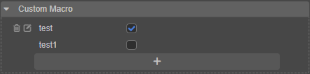

# Project Settings

The **Project Settings** panel can be opened by clicking on **Project -> Project Settings** in the editor's main menu bar and is mainly used to set project-specific configuration items. These settings are stored in the project's `settings/packages` folder. To synchronize project settings between developers, please add the `settings` directory to version control.

**Project Settings** consists of several different sub-pages, including **Project Data**, **Layers**, **Physics**, **Scripting**, **Macro Config**, **Feature Cropping** and **Texture Compression**. The **Project Settings** panel will automatically save the changes after modifying the settings.

## Project Data

The **Project Data** tab is mainly used to set the default Canvas, render pipeline, etc. and only works for the current project.


### Default Canvas Settings

The default Canvas settings include **Design Resolution** and **Fit Screen Width/Height**, which specify the default design resolution values in Canvas when a new scene or Canvas component is created, as well as `Fit Height` and `Fit Width`. For more details, please refer to the [Multi-Resolution Adaptation Solution](../../ui-system/components/engine/multi-resolution.md) documentation.

### Render Pipeline

The render pipeline is used to control the rendering process of the scene, currently supports **builtin-forward** (Forward Render Pipeline) and **builtin-deferred** (Deferred Render Pipeline), developers can also customize the render pipeline. Please refer to the [Render Pipeline Overview](../../render-pipeline/overview.md) documentations for details.

## Layers


- Layers allow the camera to render parts of the scene and lights to illuminate parts of the scene.
- Layers can be customized from 0 to 19, and clearing the input box removes the original settings.
- The last 12 Layers are built-in to the engine and cannot be modified.
- The locations where Layers are currently used include:

  1. The `Layer` property of the node `Node` in the **Inspector** panel, For more details, please refer to the [Node Component](../../concepts/scene/node-component.md#setting-the-visibility-of-nodes) documentation.

      

  2. The `Visibility` property of the Camera node in the **Inspector** panel, the `Layer` property of the node matches the `Visibility` property of the Camera. A node can only be seen by the Camera if the `Layer` property set by the node is checked in the `Visibility` of the Camera. For more details, please refer to the [Camera Component](./../components/camera-component.md#camera-component) documentation.

      

<!-- The native engine settings changes mainly affect the use of cocos2dx engine templates when building native projects, and the changes can take effect in real time. -->

## Physics


Used to configure various parameters of physics, please refer to the [Physics Config](physics-configs.md) documentation for details.

## Scripting


- **Conforming class fields**: if enabled, class fields are implemented using `Define` semantics; otherwise, class fields are implemented using `Set` semantics.

- **Allows declaration of class fields**: if enabled, the `declare` keyword may be used to declare class fields in TypeScript scripts. In such case, class fields without explicit initializer would be initialized to `undefined`, according to the specification.

- **Enable loose mode**: if enabled, the script will be compiled in non-strict mode.

- **Import Map**: used to control the import behavior of TypeScript/JavaScript, see the [Import Map](../../scripting/modules/import-map.md) documentation for details.

- **Browser list used for preview**: sets the browser list config file for TypeScript/JavaScript compilation at preview time.

- **Exports Conditions**: specify the parsing conditions for conditionalized export modules, see [Conditional exports](../../scripting/modules/spec.md) for details.

## Macro Config

**Macro Config** provides a shortcut to modify the macro configuration. The configured macros will take effect on preview and build, and will also follow the custom engine configuration to update the default values of the current macro configuration.


- **ENABLE_TILEDMAP_CULLING**: whether or not to enable TiledMap auto-culling. It's enabled by default. Note that if `skew` and `rotation` are set in the TiledMap, it's necessary to turn it off manually, otherwise it will cause rendering errors.

- **TOUCH_TIMEOUT**: the duration of the delay used to screen a contact object to see if it has failed and can be removed. This value can be modified to get the desired effect, the default value is 5000 ms. Please refer to the API [TOUCH_TIMEOUT](%__APIDOC__%/en/interface/Macro?id=TOUCH_TIMEOUT) for details.

- **ENABLE_TRANSPARENT_CANVAS**: used to set whether the Canvas background supports alpha channels.

    - If enabled, the Canvas background will be transparent and show the other DOM elements behind it.
    - If disabled, it will result in higher performance.

- **ENABLE_WEBGL_ANTIALIAS**: whether to activate WebGL antialias setting in the engine, it's enabled by default. This setting only affects WebGL graphics back-end, it indicates whether to turn on the anti-aliasing option when creating WebGL Context (for forward pipeline only).

- **ENABLE_ANTIALIAS_FXAA**: used to enable FXAA anti-aliasing (for deferred pipeline only).

- **ENABLE_BLOOM**: used to enable the BLOOM post-processing.

- **CLEANUP_IMAGE_CACHE**: whether to clear the image cache after uploading a texture to GPU. If the cache is cleared, [Dynamic Atlas](../../advanced-topics/dynamic-atlas.md) will not be supported. It's disabled by default.

- **ENABLE_MULTI_TOUCH**: whether to enable multi-touch.

- **MAX_LABEL_CANVAS_POOL_SIZE**: set the maximum number of Canvas object pools used by the Label, and adjust it according to the number of Labels in the same scene of the project.

- **ENABLE_WEBGL_HIGHP_STRUCT_VALUES** (new in v3.4.1): on the Android platform with WebGL backend, the internal variables of the structures defined in the fragment shader use **mediump** precision, which may lead to incorrect results for some data that requires high precision (such as position information). To avoid this problem, check this option and enable WebGL to calculate variables with **highp** precision.

    - If this option is enabled, use the `HIGHP_VALUE_STRUCT_DEFINE` macro in the fragment shader code to define structural variables, and use `HIGHP_VALUE_TO_STRUCT_DEFINED` and `HIGHP_VALUE_FROM_STRUCT_DEFINED` to assign values between structural and non-structural variables.

    - For specific information and code on the above macro calls, please refer to [packing.chunk](https://github.com/cocos/cocos-engine/blob/v3.6.0/editor/assets/chunks/common/data/packing.chunk#L40) for details.

- **BATCHER2D_MEM_INCREMENT** (new in v3.4.1): this option affects the maximum number of vertices in each MeshBuffer, the default value is 144KB, please refer to the [MeshBuffer Batch Description](../../ui-system/components/engine/ui-batch.md) documentation for the conversion relationship between the number and the value.

- **Custom Macro**: used to customize macro configurations, providing a macro tagging feature for current project scripts for easy visual configuration. Click the **+** button below to add a new macro configuration, hover over the added macro configuration and the **Delete** and **Modify** buttons will be displayed on the left side for deleting/renaming the current macro configuration respectively.

  

For more specific information and code about the engine macro module, please refer to the [Engine Macro source](https://github.com/cocos/cocos-engine/blob/3d/cocos/core/platform/macro.ts#L824).

## Feature Cropping

The **Feature Cropping** tab is mainly for modules used in the engine when releasing the game, to achieve the effect of reducing the package size of the released version of the engine. The unchecked modules in the list will be cropped out when packaging and previewing. It is recommended to do a complete test after packaging to avoid scenes and scripts that use modules that have been cropped out.


## Texture Compression

The preset configuration of texture compression is moved to **Project Settings**, and developers can select how the image asset is preset in the **Inspector** panel. The editor will automatically scan all the texture compression configurations in the project and sort out a few presets. Since it is automatically scanned, the preset names may not match the project and can be modified here by developers.

### Compress Presets


This panel is mainly used to add presets for texture compression. Each texture compression configuration allows to tailor the configuration for different platforms. Once added, developers can quickly add a texture compression preset in the **Inspector** panel by selecting the image asset in the **Hierarchy** panel. It is also possible to modify the preset directly in this panel to achieve the need to update the compression texture configuration in bulk.

The following platforms are currently supported for configuring texture compressions:

1. Web: both Web-Mobile and Web-Desktop platforms
2. iOS
3. Mini Game: including all mini game platforms currently supported by Creator, such as WeChat Mini Game, Huawei Quick Game, etc.
4. Android

Please refer to the [Texture Compression](../../asset/compress-texture.md) documentation for details of texture compression on each platform.

#### Adding/Removing Texture Compression Presets

Enter a texture compression preset name in the upper input box and click Enter or the "+" button on the right to add a preset. The other two buttons are for importing/exporting texture compression presets, please refer to the description below for details.


After adding a compressed texture, it can be deleted by hovering over the preset name and clicking the delete button on the right.


> **Note**: the two presets **default** and **transparent** built into the panel cannot be modified/deleted.

#### Adding/Deleting Texture Compression Format

Select the platform, then click the **Add Format** button, select the desired texture format, and then configure the corresponding quality level. Currently the same type of image format can only be added once.


To delete, move the mouse over the texture format and click the red delete button on the right.


#### Modifying the Texture Compression Preset Name

The name of the texture compression preset is for display purposes only. When a texture compression preset is added, a random UUID is generated as the ID of the preset, so changing the preset name directly does not affect the reference to the preset at the image asset.


#### Exporting/Importing Texture Compression Presets

The texture compression configuration page allows importing/exporting texture compression presets for better cross-project reuse of the configuration, or edit the texture compression presets externally and import them to the editor.

To write a custom texture compression configuration, please refer to the following interface definitions and examples:

**The interface is defined as follows**:

```ts
type IConfigGroups = Record<ITextureCompressPlatform, IConfigGroupsInfo>;
type ITextureCompressPlatform = 'miniGame' | 'web' | 'ios' | 'android' | 'pc';
type ITextureCompressType =
    | 'jpg'
    | 'png'
    | 'webp'
    | 'pvrtc_4bits_rgb'
    | 'pvrtc_4bits_rgba'
    | 'pvrtc_4bits_rgb_a'
    | 'pvrtc_2bits_rgb'
    | 'pvrtc_2bits_rgba'
    | 'pvrtc_2bits_rgb_a'
    | 'etc1_rgb'
    | 'etc1_rgb_a'
    | 'etc2_rgb'
    | 'etc2_rgba'
    | 'astc_4x4'
    | 'astc_5x5'
    | 'astc_6x6'
    | 'astc_8x8'
    | 'astc_10x5'
    | 'astc_10x10'
    | 'astc_12x12';
type IConfigGroupsInfo = Record<ITextureCompressType, IQuality>
interface ICompressPresetItem {
    name: string;
    options: IConfigGroups;
}
```

**Examples**:

```json
{
    "default": {
        "name": "default",
        "options": {
            "miniGame": {
                "etc1_rgb": "fast",
                "pvrtc_4bits_rgb": "fast"
            },
            "android": {
                "astc_8x8": "-medium",
                "etc1_rgb": "fast"
            },
            "ios": {
                "astc_8x8": "-medium",
                "pvrtc_4bits_rgb": "fast"
            },
            "web": {
                "astc_8x8": "-medium",
                "etc1_rgb": "fast",
                "pvrtc_4bits_rgb": "fast"
            },
        }
    },
    "transparent": {
        "name": "transparent",
        "options": {
            "miniGame": {
                "etc1_rgb_a": "fast",
                "pvrtc_4bits_rgb_a": "fast"
            },
            "android": {
                "astc_8x8": "-medium",
                "etc1_rgb_a": "fast"
            },
            "ios": {
                "astc_8x8": "-medium",
                "pvrtc_4bits_rgb_a": "fast"
            },
            "web": {
                "astc_8x8": "-medium",
                "etc1_rgb_a": "fast",
                "pvrtc_4bits_rgb_a": "fast"
            },
        }
    }
}
```

### Custom Compress Format

Since v3.5.0, custom texture compression pages have been supported in order to make it easy for users to customize the texture compression tool and some custom parameters, encryption, etc. Interface interaction is similar to texture compression presets.


### Configuration

- **Compress format**: Config the processing format. After selecting a different format, quality options will keep the same type. If the customized compression mode fails, the system will automatically revert to the original compression scheme of the editor.

    
    
- **Overwrite original format**: If this option is selected, the original compression format in the existing texture compression preset will be automatically overwritten. The name of the custom compression mode will appear next to the original configuration name. One format can only be overwritten by one custom compression mode.

  

- **Compression tool**:
    - **program**: compress tool path.
    - **Command line parameters**: Sets the parameters to be passed by the calling program. The names of the parameters to be passed by default to build texture compression can be added quickly through the control on the right of the parameter input box. Currently, the 'src, dest, quality' fields are passed by default.

#### Custom Compress Format In Build

After the custom texture format is configured, the word `custom-compress` and the command line parameter information will be printed to console when build the project.


## Slpash Setting

The splash setting allows developers to use the engine's built-in logo or display a custom logo when publishing a game.


- **LOGO Image**: Preview view
- **LOGO Path**: The address used for LOGO storage, developers can click on the **Magnifying Glass** button to select different image resources, you can also drag and drop image resources to the **LOGO Image** property to apply image resources, click on the drop down box on the left to select different path protocols:

    

    - **file://**: Addressing the file by absolute path
    - **project://**: Locate image resources by relative addresses addressed in the project

        To avoid invalidating absolute addresses across devices, we recommend that projects use the **project://** protocol to set LOGO.

- **TotalTime**: Total time to display splash screen. Unit: milliseconds
- **DisplayRatio**: The ratio of the LOGO to the screen, using the screen height for landscape and the screen width for portrait
- **Display Cocos Watermark**: Whether to display the engine's watermark
- **ClearColor**: Background color during splash screen

## Extending the Project Settings Panel

Creator supports adding custom feature pages on the right side of **Project Settings**, please refer to the [Extending the Project Settings Panel](../../editor/extension/contributions-project.md) documentation.
