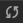
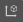

# 场景编辑器

**场景编辑器** 是内容创作的核心工作区域，用于选择和摆放场景图像、角色、特效、UI 等各类游戏元素。在这个工作区域内可以选中并通过 **变换工具** 修改节点的位置、旋转和缩放等属性，并可以获得所见即所得的场景效果预览。

## 菜单介绍

场景顶部为菜单栏，在切换 3D 和 2D 视图后会略有不同，请参考下文。

- 3D：

    

- 2D：

    

## 视图介绍

**场景编辑器** 包括 **3D** 和 **2D** 两种视图，3D 视图用于 3D 场景编辑，2D 视图则主要用于 UI 节点等 2D 元素的编辑。

-  表明当前是 **3D** 视图模式，此时视图的相机为透视类型。点击后可以进入 **2D** 视图。
-  表明当前为 **2D** 视图模式，此时的视图相机为正交类型，再次点击后会回到 **3D** 视图。

### 3D 视图

在 3D 视图下，可以通过以下操作来移动和定位 **场景编辑器** 的视图：
- 鼠标左键 + Alt：以视图中心点为中心旋转。
- 鼠标中键：平移视图。
- 空格键 + 鼠标/触摸板拖拽：平移视图。
- 鼠标滚轮：以视图中心点为中心缩放视图。
- 鼠标右键 + WASD：摄像机漫游。
- **F** 快捷键：摄像机聚焦到当前选中节点。

### 2D 视图

在 2D 视图下，可以通过以下操作来移动和定位 **场景编辑器** 的视图：
- 鼠标中键：平移视图。
- 鼠标滚轮：以当前鼠标悬停位置为中心缩放视图。
- 鼠标右键：平移视图。
- **F** 快捷键：摄像机聚焦到当前选中节点。

## 变换工具

上述工具为变换工具组，负责节点的 **平移、缩放、旋转、吸附、锚点/中心、本地/世界坐标系** 等功能。

-  切换当前场景内变换工具为 **位移变换工具**，快捷键为 <kbd>W</kbd>

    **移动变换工具** 是打开编辑器时默认处于激活状态的变换工具。

    选中任意节点，便能在 **场景编辑器** 中看到节点中心出现了由红绿蓝三个箭头和红绿蓝三个方块组成的移动控制手柄。

    **控制手柄** 是指在特定编辑状态下，**场景编辑器** 中显示的可用鼠标进行交互操作的控制器。这些控制器只用来辅助编辑，不会在游戏运行时显示。

    

    移动变换工具激活时：
    - 按住红色/绿色/蓝色箭头拖拽鼠标，将分别在 X、Y、Z 轴方向上移动节点；
    - 按住红色/绿色/蓝色方块拖拽鼠标，将分别在 Y-Z 平面、X-Z 平面、X-Y 平面上移动节点。

-  切换当前场景内变换工具为 **旋转变换工具**，快捷键为 <kbd>E</kbd>

    旋转变换工具的手柄由三个相互正交的红绿蓝圆环组成（2D 视图下由一个箭头和一个圆环组成）。按住红色/绿色/蓝色圆环任意一点拖拽鼠标时，节点将分别绕着 X、Y、Z 轴旋转。

    

    当鼠标悬浮在任意圆环上时，圆环显示为黄色，点击即可选中圆环，同时还会显示一个黄色的箭头，表示当前节点是以哪个轴为中心进行旋转。拖拽圆环上任意一点即可旋转节点，放开鼠标之前，可以在控制手柄上看到旋转的角度大小。

    

-  切换当前场景内变换工具为 **缩放变换工具**，快捷键为 <kbd>R</kbd>

    缩放变换工具由三个头部是红绿蓝正方体的坐标轴以及中心一个灰色正方体组成。当鼠标悬浮在任一正方体上时，显示为黄色，点击即可选中并拖动：

    - 按住红色/绿色/蓝色正方体拖拽鼠标，将分别在 X、Y、Z 轴方向上缩放节点；
    - 按住灰色正方体拖拽鼠标，将同时在 X、Y、Z 轴方向上缩放节点。

    

-  切换当前场景内变换工具为 **矩形变换工具**，快捷键为 <kbd>T</kbd>

    需要注意的是，矩形变换工具只适用于 UI 节点。

    矩形变换工具由四个顶点控制点、四个边控制点、一个中心控制点组成。

    

    矩形变换工具激活时：
    - 拖拽控制手柄的任一顶点控制点，可以在保持对角顶点位置不变的情况下，同时修改 UI 节点的 `Position` 属性和 UITransform 组件中的 `ContentSize` 属性。
    - 拖拽控制手柄的任一边控制点，可以在保持对边位置不变的情况下，修改 UI 节点的 `Position`（`X` 或 `Y` 属性）和 UITransform 组件中的 `ContentSize` 属性（`width` 或 `height` 属性）。
    - 拖拽控制手柄的中心控制点，可以在 UI 节点的尺寸大小不变的情况下，同时修改 UI 节点的 `Position` 属性和 UITransform 组件中的 `AnchorPoint`（锚点）属性。

    在 UI 元素的排版中，经常会需要使用 **矩形变换工具** 直接精确控制节点四条边的位置和长度。而对于必须保持原始图片宽高比的图像元素，通常不会使用矩形变换工具来调整尺寸。

-  **增量吸附工具**，点击该按钮后会出现 **增量吸附配置**，详情请参考下方 **增量吸附工具** 部分
-  **变换工具位置**，用于修改变换是来源于对象的 **锚点** 还是 **中心**

    -  Pivot：变换工具将显示在 2D 对象 **锚点**（`AnchorPoint`）所在位置或 3D 对象的 **世界坐标系** 中
    -   Center：变换工具将显示在节点的中心点位置。若同时选择多个节点，则显示在所有节点的中心位置

-  **变换工具的控制手柄方向**，切换变换工具手柄是 **本地** 坐标系或 **世界** 坐标系

    -  Local：变换工具的控制手柄以节点的旋转方向为准，如下图：

        

    -  Global：变换工具中控制手柄的方向以世界坐标系为准，不受节点旋转的影响，如下图：

        

## 增量吸附工具

 增量吸附工具主要包含 **增量吸附配置** 和 **矩形工具吸附配置**。

### 增量吸附配置

增量吸附功能可用于在 **场景编辑器** 中使用移动/旋转/缩放变换工具时按照 **设定的步长** 对节点进行操作。可通过以下两种方式触发变换吸附功能：

1. 在使用变换工具的同时按住 <kbd>Ctrl/Command</kbd> 键即可触发变换吸附功能。
2. 在变换吸附配置面板通过按钮开启对应变换工具的自动吸附功能，详情请参考下文介绍。

该功能仅在 3D 视图下生效。

| 按钮 | 功能说明 |
| :-- | :-- |
|   | 用于设置是否在使用 **移动变换工具** 时开启自动吸附功能。X、Y、Z 分别用于设置 X、Y、Z 轴上的移动步长，默认 X、Y、Z 统一使用 X 的值，也可以点击  按钮分别设置各个轴的步长。   |
|   | 用于设置是否在使用 **旋转变换工具** 时开启自动吸附功能。右侧的方框用于设置旋转步长，默认为 1。 |
|         | 用于设置是否在使用 **缩放变换工具** 时开启自动吸附功能。右侧的方框用于设置缩放步长，默认为 1。  同时缩放时，会影响缩放的倍数而非绝对值 |

如下图所示，启用旋转吸附后，每次节点只能旋转固定的值：

### 矩形工具吸附配置

使用 **矩形变换工具** 时，默认会开启智能参考线对齐功能。在场景中拖动 UI 元素移动时，遇到可以对齐的元素，会显示对齐参考线并自动吸附到参考线位置上。

| 选项 | 说明 |
| :-- | :-- |
| 是否启用智能对齐 | 勾选该项即可开启智能对齐，默认开启
| 吸附检测阈值 | 设置吸附检测的阈值（世界空间单位）

## 对齐和分布

该工具为在 2D 视图独有工具，用于 2D/UI 多节点的对齐和分布功能。

- 对齐：以首个被选中的节点作为基准，对齐剩余选中的节点，至少选中需要两个节点才会生效

    

    从左往右依次为：

    - 顶对齐
    - 垂直居中
    - 底对齐
    - 左对齐
    - 水平居中对齐
    - 右对齐

- 分布：用于均匀分布多个选中的节点，至少需要三个节点才会生效

    

    从左往右依次为：

    - 按顶分布
    - 按垂直居中分布
    - 按底分布
    - 按左分布
    - 按水平居中分布
    - 按右分布

## 吸附操作

在 3D 视图中，通过吸附可以更准确的对场景内的物体进行编辑，目前引擎新增两种吸附模式 **顶点吸附** 和 **表面吸附**。

- **顶点吸附**：顶点吸附的主要作用是更精准的通过一个物体上的顶点，对齐到另一物体的某顶点。快捷键 <kbd>v</kbd>
- **表面吸附**：对于有碰撞体的物体，表面吸附会吸附在碰撞体的表面；而对于没有碰撞体的物体，会吸附在物体表面；快捷键 <kbd>Ctrl/Command</kbd> + <kbd>Shift</kbd>

操作流程：
- 在 **层级管理器** 中选中要移动的模型模型
- 在场景内按下相应的快捷键，模型下方会出现白色控制块
- 按住鼠标左键拖动控制块移动模型
- 移动鼠标，移动过程中，物体会根据吸附操作的类型不同而移动
- 松开鼠标左键确定物体位置

## 绘制模式

 主要用于对场景的绘制方式进行配置。点击后会显示着色配置窗口。

支持基础绘制模式（Shaded）和 **渲染调试** 两种模式。

在默认情况下，采用基础绘制模式模式。如需对场景进行调试，可以将鼠标滑到 **渲染调试** 菜单（目前只支持 [表面着色器（Surface Shader）](../../shader/surface-shader.md)）选择不同的调试模式。

以 **世界空间顶点法线** 为例，演示 **渲染调试** 的用法：

- 在材质 **属性检查器** 的 **着色器** 属性中选择引擎内置的 Surfaces/standard 着色器
- 在 **渲染调试** 下拉菜单内选择需要调试的项目
- 观察视图内的渲染结果是否符合预期

## 渲染输出目标分辨率设置

 可以根据需要选择场景相机的渲染输出目标分辨率，会影响场景相机的可视范围，方便跟最终预览时选择的分辨率有相似的显示效果：

可在顶部菜单栏的 **偏好设置** 的 [设备管理器](../preferences/index.md#%E8%AE%BE%E5%A4%87%E7%AE%A1%E7%90%86%E5%99%A8) 中添加/修改/删除分辨率。

下拉到最下方也可以编辑分辨率：

## 场景灯光设置

 按钮主要用于设置在进行场景编辑时是否使用场景灯光，默认使用。

若按钮显示为蓝色，表示使用场景灯光，将使用场景中添加的灯光照亮场景，如下所示：

当场景中没有任何添加的灯光时，场景为全黑的状态，不方便进行编辑：

此时便可以将按钮切换为黑色状态，表示不使用场景灯光，编辑器会自动创建一个与场景相机视角对齐的隐藏的平行光来照亮场景，如下图所示：

## 视图相机

点击 **场景编辑器** 右上角的  按钮即可设置场景相机（非用户创建的相机）的属性：

| 选项 | 功能说明 |
| :-- | :-- |
| Fov | 设置场景相机的视角大小 |
| Far | 设置场景相机的远裁剪面距离 |
| Near  | 设置场景相机的近裁剪面距离 |
| Color | 设置场景背景色 |
| Wheel Speed  | 设置当滚动鼠标滚轮时，场景相机前后移动的速度 |
| Wander Speed | 设置场景相机漫游时的移动速度 |
| Wander Acceleration | 设置相机漫游时是否开启加速（v3.3 新增） 若勾选该项则开启加速，相机移动将会越来越快 若不勾选该项，则相机会匀速移动。|

关于相机可视范围的说明可参考 [Camera 组件](../components/camera-component.md)。

## 参考图设置

点击 **场景编辑器** 右上角的  按钮，即可打开 **参考图** 面板，主要用于辅助开发人员在 **场景编辑器** 中拼接 UI 时作为对照参考：

| 选项 | 功能说明 |
| :-- | :-- |
| 添加 |用于添加 UI 参考图，可添加多张参考图  |
| 删除 | 用于删除当前选中框中的 UI 参考图 |
| X | 已选中的 UI 参考图显示在场景中的 X 轴位置 |
| Y | 已选中的 UI 参考图显示在场景中的 Y 轴位置 |
| 透明度 | 已选中的 UI 参考图显示在场景中的透明度 |

### 网格设置

场景中的网格是我们摆放场景元素时位置的重要参考信息，可通过 **场景编辑器** 右上方的按钮设置：

| 选项 | 功能说明 |
| :-- | :-- |
| 3D 图标 | 场景是否启用 3D 图标，后面的输入框用于设置图标 Gizmo 的大小，取值范围为 0 ~ 8。 若勾选该项则表示启用 3D 图标，**场景编辑器** 中的图标 Gizmo 便会是一个 3D 面片，有近大远小的效果。 若不勾选该项，则图标 Gizmo 会显示为一个固定大小的图片。 |
| 显示网格 | 是否显示 **场景编辑器** 中的网格，后面的颜色设置框用于设置网格的颜色。 |

## 场景 Gizmo

场景 Gizmo 在场景视图的右上角，它显示了当前场景相机的观察方向，可以通过点击它来快速切换不同的观察角度。

- 点击 6 个方向轴，可以快速切换到上，下，左，右，前，后六个角度来观察场景。
- 点击中心的立方体，可以在正交视图和透视视图间切换。

### 选择节点

在场景视图中点击鼠标左键选择物体所在节点，选择节点是使用变换工具设置节点位置、旋转、缩放等操作的前提。

### 复选操作

在场景内按下鼠标左键并拖动鼠标，会同时复选当前框选范围内的所有节点，通过变换操作，可批量对所选节点进行变换。

### Gizmo 操作简介

**场景编辑器** 的核心功能就是以所见即所得的方式编辑和布置场景中的可见元素，我们主要通过 **Gizmo** 工具来辅助完成场景的可视化编辑。

<!-- - [变换工具 Gizmo](../toolbar/index.md) -->
- [摄像机 Gizmo](./camera-gizmo.md)
- [碰撞器 Gizmo](./collider-gizmo.md)
- [粒子系统 Gizmo](./particle-system-gizmo.md)
