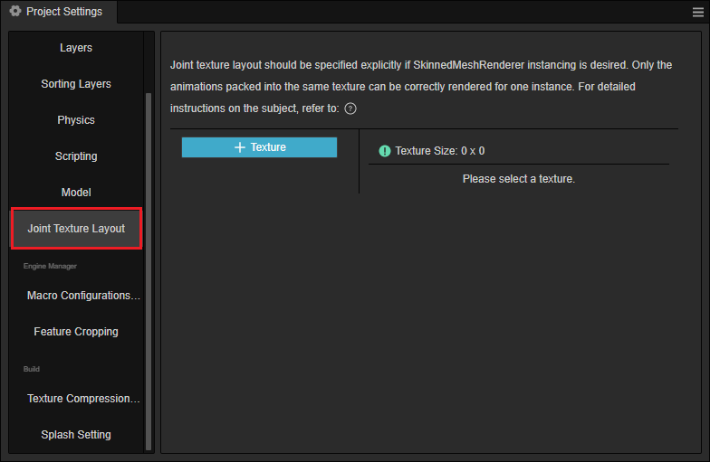

# Joint Texture Layout Settings

To ensure that [Skeletal Animation](./skeletal-animation.md) can also participate fully and correctly in [Dynamic Instancing](../engine/renderable/model-component.md#instancing-%E5%90%88%E6%89%B9), the developer needs to manually specify how the data for each skeletal texture is assigned.

For example, a scene where a large number of identical characters are to be drawn, each of which may be walking/jumping/attacking. If one Drawcall should be able to draw all characters correctly, an important prerequisite is that **the data for all three animations (walk, jump, attack) are stored inside the same joint texture**.

Currently, in the default [pre-baked skeletal animation mode](./skeletal-animation.md#pre-baked-Skeletal-Animation-System), the joint textures are already globally auto-reused, but the size of each texture and which animations they store are not available. and which animations are stored in each of them are unpredictable. If instancing of the skinned model is enabled without any processing, The final runtime effect may have some animations that are correct and some that are completely wrong, which are completely unpredictable.

A **Joint Texture Layout Settings** page was added to the editor **Project Setting** panel to manually specify which animation information is stored for which skeletons in each joint texture.

> **Note**: the joint texture layout settings panel provides, essentially, runtime **memory allocation guidance rules**. For specified skeleton and animation assets, they are guaranteed to be allocated according to the specified rules. However, if an asset is used at runtime that is not specified by the rules, it will go back to the automatic allocation mode of global reuse.

## Joint texture layout settings

Use the **instanced-skinning** scenario from the example project [show-cases](https://github.com/cocos/cocos-example-projects/tree/v3.7/show-cases/assets/scenes) as an example to see how the joint texture layout is set up and how it works. The following figure shows a sample scene.

The following figure shows a sample scenario with multiple instances from the same model, playing completely different animations at the same time. Notice the current scene, plus the UI, has a total Drawcall of 60 and an instance count of 0. This state will be used as the basis for later changes to compare.

To create a model with instancing version turned on, the following steps are required:

1. In the **Inspector** panel, check the `UseBakedAnimation` property in the SkeletalAnimation component (using pre-baked animation mode).

    

2. check `USE INSTANCING` for all materials used by SkinningModel.

    

In the example scene, two sets of Prefabs were made and set the material diffuse color to blue in the instancing version in order to see and distinguish the performance of both systems. Notice that the effect has been exactly correct and that only 5 drawcalls (each model is divided into 5 parts) were used, with 45 instances.

> **Note**: the reason for rendering all models correctly here is that the amount of animation data is still relatively small, and the generic joint texture global reuse logic already writes all animation data to the same texture, so the effect is correct. However, if the size of the default joint texture (360 * 360) is exceeded by new animations that may be added at any time, the animation will definitely go wrong, which is why the joint texture layout panel must exist.

## Joint Texture Layout Effects

For demonstration purposes, we can intentionally put each animation on a separate texture in the **Joint Texture Layout Settings** panel to see the final rendering effect.

First, open the **Joint Texture Layout Settings** panel:

The three **+** in the panel are used as follows:

- ① - Used to add Texture units, a Texture unit consists of multiple Skeleton units.
- ② - Used to add Skeleton units, a Skeleton unit consists of a Skeleton asset and one to more AnimationClip assets.
- ③ - Used to add AnimationClip asset slots.

Here there are 9 different animations separated into 9 Texture cells.

Rerun the scene and the effect becomes:

Notice there is a problem with the animation, all the animations become attack actions, and the model disappears from time to time. The reason behind this can be precisely analyzed.

- Each drawcall draws 9 instances, which are broadcasting 9 different animations.
- However, each drawcall can only use one skeletal animation texture, and here it is obvious that the Texture unit 0 is used and there is only one attack animation.
- The length of different animation segments is different, and some of them are longer than the attack segment, so at the last time they will be read outside the valid area of Texture unit 0, where the data is not defined (usually the default is all 0), not valid skeleton transformation data, so naturally they cannot be rendered correctly.

> **Note**: the 9 textures here all have the same skeletal animation information, so only the action is wrong in the final result, even if the texture is already wrong, but if there are multiple skeletons with animation information in one texture, and the textures don't match at the same time, the rendering effect will be completely wrong.

For the example scene above, since the model does need to play the 9 animation clips on the same screen at the same time, the correct joint texture layout setting should be:

This will **guarantee** that it renders correctly. Observe the change in the relevant data on the panel:

- Texture cell 0 has a total size of 276 x 276 (automatically generated by the algorithm, the minimum size sufficient to hold all the specified animation data).
- The specified 9 groups of animation data take up 94.41% of this texture, with 5.59% excess space (this space is not involved in global reuse at runtime).

In addition, the color of the icon next to the texture size indicates the device adaptation of the current texture:

- Green (up to 1024 sides): all devices are guaranteed to work.
- Yellow (1024 ~ 2048 sides): Some mobile devices or mini-game platforms that do not support floating point texture may not support it.
- Red (side length 2048 or more): Not supported on many mobile devices.

> **Note**: this is just a set of 9 animations for one skeleton, on one texture, but **any number of animations for any number of skeletons** can be put on each texture, as long as the total size does not exceed the device limit. It is often more common to have multiple sets of skeletons on a single texture, for example for [flat shadows for skinned models](./skeletal-animation.md#about-dynamic-instancing).

As more instances continue being adding to the scene, notice the number of drawcalls does not change, only the number of instances increases:

