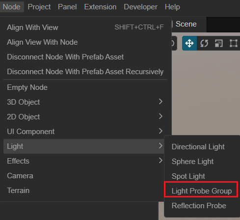
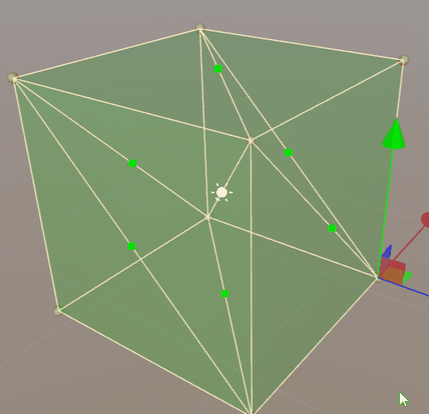

# Light Probes

The Light Probe is designed to provide high quality light information for objects in the scene by pre-calculating; it also provides light information for objects that require LOD.

After hitting an object in a scene, light may bounce back to another object, and such bounces may occur multiple times.

The following figure demonstrates how light bounces once in the scene and is captured by the light probe.

After the light hits the surface of object A, it is reflected to object B. Through the light probe, the reflection of this light from object B is captured on the map, and then the light is reconstructed at runtime to get the indirect reflected light information of static objects in the scene.

Cocos Creator supports up to 4 bounces, please refer to [Light Probe Panel](light-probe-panel.md) for details.

## Add light probe group

In the **Main Menu** select **Nodes** -> **Light** -> **Light Probe Group** to add light probes to the scene.

## Properties

| Properties | Description |
| :-- | :-- |
| **Generating Method** | Generated in a way that currently only supports built-in |
| **Generating Min Pos** | The minimum value of the bounding box at the time of generation |
| **Generating Max Pos** | The maximum value of the bounding box at the time of generation |
| **Number Of Probes X** | Number of probes on the X-axis |
| **Number Of Probes Y** | Number of probes on the Y-axis |
| **Number Of Probes Z** | Number of probes on the Z-axis |
| **Edit Area Box**  | Editing the generated enclosing box   Clicking this button will put you in the editing mode of the probe enclosing box in the scene, please refer to the editing documentation below for more detailed information   The editing process will affect the values of **Generating Min Pos** and **Generating Max Pos** above  |
| **Generate Probes** | Generate Light Probes Clicking on the button will regenerate all probes and the old ones will be deleted The generated probes are uniform, if you need to adjust them manually, please click the decentralized **Enter Probe Edit Mode** button |
| **Enter Probe Edit Mode** | Enter edit probe mode  Click this button to select different probes in the scene editor with **left mouse button** and modify the probe position with **transform tool** |

## Edit Probes

### Edit Probe Range

Clicking on **Edit Area Box** to edit the bounding box. The scene will be displayed as a **Green** box, which can be resized by clicking the green Gizmo on the box.

Click the **Done Edit** button to exit edit mode.

You can then click **Generate Probes** to regenerate the probes.

### Generate Probes

Probes can be generated by clicking the **Generate Probes** button. At this point the old probes will be deleted, if you need to re-bake the probes, please refer to the **Bake Light Probes** section below.

### Edit Probe Position

After generating a probe, you can click the **Enter Probe Edit Mode** button to enter the probe editing mode.

Only then the probe of the scene can be selected.

The position of the probes can be adjusted by dragging and dropping these Gizmo's with the mouse.

## Use Probes

Check **Use Light Probe** in the node's **Inspector** panel and set the node's **Mobility** property to **Movable** to enable node probes.

When enabled, select the node within **Hierarchy** to see which probes the node is affected by. The white dots in the illustration are light probes.

## Bake Light Probes

For nodes that need to be baked, check the node's **Bake To Light Probe**.

After editing the light probe, you can open the [Light Probe Panel](light-probe-panel.md) by selecting **Project** -> **Light-Bake** -> **Light-Probe**.

More examples can be found in [IBL Example](example.md).

## Theoretical reference

Usually light probes are calculated by means of spherical harmonic functions. For developers interested in technical details, we have also prepared some reference documents.

- [Spherical Harmonic Lighting: The Gritty Details](http://www.cse.chalmers.se/~uffe/xjobb/Readings/GlobalIllumination/Spherical%20Harmonic%20Lighting%20-%20the%20gritty%20details.pdf)
- [Spherical harmonic lighting Wiki](https://en.wikipedia.org/wiki/Spherical_harmonic_lighting)
- [Fourier Transform Wiki](https://en.wikipedia.org/wiki/Fourier_transform)
- [Spherical Harmonic](https://en.wikipedia.org/wiki/Spherical_Harmonic#:~:text=.%20In%20mathematics%20and%20physical%20science%2C%20spherical%20harmonics,solving%20partial%20differential%20equations%20in%20many%20scientific%20fields.)
