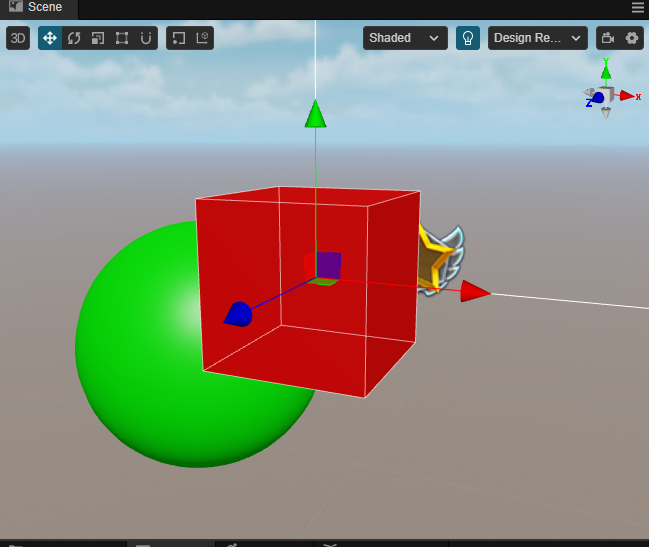

# Sorting

For most rendering cases, the default sorting is sufficient. But in practice, due to the special nature of translucent objects, we may need to sort these objects manually. For this case, the **Sorting** component can be used.

Click the **Add Component** button inside the **Inspector** panel and select **Sorting** to add it.


> **Note**: This component is only available for nodes holding **MeshRenderer** and **SpriteRenderer** components.

## Properties

| Properties | Decription |
| :-- | :-- |
| **Sorting Layer** | Select **Sort Layers** <br> Select different sort layers by using the drop down box, these layers need to be set within **Project Settings** -> **Sort Layers** before they can be selected  <br>  |
| **Sorting Order** | Sorting priority within the same layer |

## Example

- Add Sorting Layer 1 to **Project Settings** -> **Sorting Layer**.

    

- Build the following scene as shown in the example.

    

- The cube and sphere materials require the option of using the translucent render queue.

    

     Adds the Sorting component and leaves the properties as default.

- The image needs to use the **SpriteRenderer** component (note that it is not a Sprite component), the shader needs to use the **builtin-sprite-renderer**, and the Sorting component needs to be added, keeping the properties defaulted to.

    

At this point it can be observed that the nodes are sorted in the default order.

### Sorting Layer Example

The Sorting Layer of the SpriteRenderer node is adjusted as follows.


Since the custom level is higher than the level default for cubes and spheres, the result can be observed in the following figure.


### Sorting Order Example

The Sorting Order property allows you to adjust the priority of rendering objects within the same sorting layer.

The scene is similar to the example above, but with the Sorting Order property within the Sorting component of the cube adjusted to 1.


At this point, the cube is prioritized over the sphere within the rendering queue, so you can observe the result in the following figure.



## Code Example

The following code demonstrates how to modify the Sorting Order and Sorting Layer at runtime.

```ts
import { _decorator, Component, Sorting, SortingLayers } from 'cc';
const { ccclass, property } = _decorator;

@ccclass('SortingSample')
export class SortingSample extends Component {

    @property(Sorting)
    sorting:Sorting | null = null;

    start() {
        this.sorting.sortingLayer = SortingLayers.getLayerIndexByName("Sorting Layer 1");
        this.sorting.sortingOrder = 1;
    }
}
```

**SortingLayers** The names and indexes of sorting layers can be obtained at runtime, but cannot be modified at runtime.

## API

The API for sorting components can be found in [Sorting](__APIDOC__/en/class/Sorting) and [SortingLayers](__APIDOC__/en/class/SortingLayers) 。
