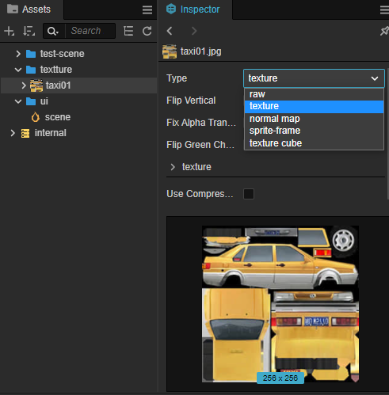

# 纹理贴图资源（Texture）

纹理贴图资源是一种用于程序采样的资源，如模型上的贴图、精灵上的 UI。当程序渲染 UI 或者模型时，会使用纹理坐标获取纹理颜色，然后填充在模型网格上，再加上光照等等一系列处理便渲染出了整个场景。

纹理贴图资源可由图像资源（ImageAsset）转换而来，图像资源包括一些通用的图像转换格式如 PNG、JPEG 等等。

## Texture2D

Texture2D 是纹理贴图资源的一种，通常用于 3D 模型的渲染，如模型材质中的反射贴图、环境光遮罩贴图等等。

在将图像资源 [导入](asset-workflow.md) 到 Creator 后，即可在 **属性检查器** 面板将其设置为 **texture** 类型，texture 类型便是 Texture2D 纹理资源。



## Texture2D 属性

当导入图像资源时，编辑器默认将其设置为 **texture** 类型，并且在导入的图像资源下会自动创建一个或多个子资源，点击 **资源管理器** 中图像资源左侧的三角图标即可展开查看所有的子资源，如下图所示：


选中生成的 Texture2D 子资源后可以在 **属性检查器** 设置相关属性：


| 属性               | 说明 |
| :----------------- |:---  |
| **Anisotropy**     | 各向异性值，应用各向异性过滤算法的最大阈值 |
| **Filter Mode**    | 过滤模式，可选项为 **Nearest（None）**、**Bilinear**、**Bilinear with mipmaps**、**Trilinear with mipmaps** 以及 **Advanced**，请参考下方 **过滤方式** 以获取更多信息|
| **Wrap Mode**      | 设置寻址模式，可选项为 **Repeat**、**Clamp**、**Mirror** 以及 **Advanced** <br> 在选择 **Advanced** 时，设置 S（U）/ T（V）方向上的纹理寻址模式，也就是像素对纹理在 S（U）或者 T（V）方向上的映射模式，请参考下文 **寻址模式** 以获取更多信息 |

> **注意**：由于默认的 Wrap Mode 在渲染图像的透明边缘时可能会出现黑边，所以在将图像资源类型设置为 **sprite-frame** 时，Creator 会自动将 texture 资源的 Wrap Mode S 和 Wrap Mode T 属性自动调整为 **clamp-to-edge**。如有特殊需要，开发者可以自行修改。

接下来我们对部分属性进行简单的说明。

### 过滤方式


当 Texture2D 的原始大小与屏幕映射的纹理图像尺寸不一致时，通过不同的纹理过滤方式进行纹理单元到像素的映射会产生不同的效果。

Texture2D 中的 **Min Filter** 和 **Mag Filter** 属性，分别用于设置在缩小或者放大贴图时采用的纹理过滤方式：

1. 邻近过滤（`nearest`）

    邻近过滤是 **默认** 使用的纹理过滤方式。使用中心位置距离采样点最近的纹理单元颜色值作为该采样点的颜色值，不考虑其他相邻像素的影响。<br>
    需要注意的是使用临近过滤方式可能会出现边缘不平滑，锯齿较为明显的情况。

2. 线性过滤（`linear`）

    线性过滤使用距离采样点最近的 2 x 2 的纹理单元矩阵进行采样，取四个纹理单元颜色值的平均值作为采样点的颜色，像素之间的颜色值过渡会更加平滑。<br>
    需要注意的是使用线性过滤方式可能会出现边缘黑边的情况，如果是像素类游戏，可能会出现模糊情况。

### Generate Mipmaps

为了加快 3D 场景渲染速度和减少图像锯齿，贴图被处理成由一系列被预先计算和优化过的图片组成的序列，这样的贴图被称为 mipmap。mipmap 中每一个层级的小图都是原图的一个特定比例的缩小细节的复制品，当贴图被缩小或者只需要从远距离观看时，mipmap 就会转换到适当的层级。


当勾选 **Generate Mipmaps** 属性或者将 texture 的 **Filter Mode** 选择为 **Bilinear with mipmaps** 或 **Trilinear with mipmaps** 时，会在两个相近的层级之间插值，自动生成 mipmap。因为渲染远距离物体时，mipmap 贴图比原图小，提高了显卡采样过程中的缓存命中率，所以渲染的速度得到了提升。同时因为 mipmap 的小图精度较低，从而减少了摩尔纹现象，可以减少画面上的锯齿。另外因为额外生成了一些小图，所以 mipmap 需要额外占用约三分之一的内存空间。

Texture2D 可以在运行时动态选择 mipmap 的范围。设置完 mipmap 范围后，只有在范围之内的 mipmap 可以被使用。这允许我们通过跳过低层级来达到节约带宽的目的，同时也可以避免使用过高层级而降低效果。

可以通过以下方法设置 Texture2D 的 mipmap 层级范围：

```Javascript
texture.setMipRange(minLevel, maxLevel);
```

其中 `minLevel` 指定了最小限制，`maxLevel` 指定了最大限制。

> **注意**：
> 1. 该限制无法超出已有的 mipmap 层级。
> 2. 该方法对 WebGL 和 GLES2 后端无效。

### 寻址模式

一般来说，纹理坐标在水平轴（U）和垂直轴（V）的取值范围为 `[0，1]`，当传递的顶点数据中的纹理坐标取值超出 `[0，1]` 范围时，就可以通过不同的寻址模式来控制超出范围的纹理坐标如何进行纹理映射。

Texture2D 中的 **Wrap Mode S** 和 **Wrap Mode T** 属性便是分别用于设置纹理在 UV 方向上的寻址模式：

1. 重复寻址模式（`repeat`）

    重复寻址模式是默认使用的纹理寻址模式。对于超出 `[0，1]` 范围的纹理坐标，使用 `[0，1]` 内的纹理坐标内容不断重复，也就是在超出纹理坐标范围外的地方重复放置纹理贴图。

    > **注意**：在 WebGL1.0 平台，当贴图宽高不是二次幂时，`repeat` 寻址模式是无效的。运行时会自动将其切换为 `clamp-to-edge` 寻址模式，这将会使材质的 `tilingOffset` 等属性失效。

    当 Texture2D 的 **Wrap Mode S** 和 **Wrap Mode T** 属性都设置为 `repeat` 时，效果图如下：

    

2. 钳位寻址模式（`clamp-to-edge`）

    将纹理坐标约束在 0 到 1 之间，只复制一遍 `[0，1]` 的纹理坐标。对于 `[0，1]` 之外的部分，将使用边缘的纹理坐标内容进行延伸，产生类似边缘被拉伸的效果。

    当两个属性都设置为 `clamp-to-edge` 时，效果图如下：

    

3. 镜像寻址模式（`mirrored-repeat`）

    类似重复寻址模式，只不过贴图是镜像重复放置的。

    当两个属性都设置为 `mirrored-repeat` 时，效果图如下：

    

## 使用 Texture2D

Texture2D 是使用范围非常广泛的资源，在 Creator 中的使用方式主要包括在编辑器中使用和动态获取使用：

- 在编辑器的 **属性检查器** 面板中，任何标记为 Texture2D 类型的属性，都可以将 Texture2D 资源拖拽到属性框中使用。例如设置材质资源的 Texture2D 类型资源：

  

  > **注意**：如果材质中没有定义 `USE TEXTURE` 就没有该属性。

- 动态使用时，需要先获取图像资源（ImageAsset），然后根据获取到的 ImageAsset 实例化出 Texture2D 资源。

  ```ts
  resources.load("testAssets/image/texture", Texture2D, (err: any, texture: Texture2D) => {
    const spriteFrame = new SpriteFrame();
    spriteFrame.texture = texture;
    this.node.getComponent(Sprite).spriteFrame = spriteFrame;
  });
  ```

  详情请参考 [资源加载](./dynamic-load-resources.md#%E5%8A%A0%E8%BD%BD-spriteframe-%E6%88%96-texture2d)。

## 参考链接

[LearnOpenGL — 纹理](https://learnopengl-cn.github.io/01%20Getting%20started/06%20Textures/#_1)
  