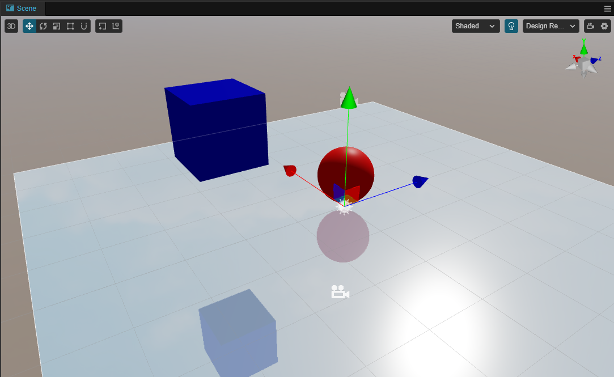

# 反射探针美术工作流

## 烘焙反射探针工作流

- 在场景内创建 **反射探针** 节点

- 将需要烘焙反射的节点的 **Mobility** 属性修改为 **Static**

    

- 在需要烘焙反射的节点的 **属性检查器** 上下拉找到 **Reflection Probe Settings**，并调整其对应的属性：

    

    - **Reflection Probe**: 选择反射探针的类型
    - **Bake To Reflection Probe**: 勾选是否将该网格渲染器的反射信息烘焙至反射探针相关的贴图

    详情请参考 [MeshRenderer 组件参考](../../../../engine/renderable/model-component.md)

- 烘焙

    - 点击 **属性检查器** 上的 **Bake** 按钮，烘焙当前已选择的反射探针：

        

    - 主菜单上选择 **项目** -> **光照烘焙** -> **反射探针**，打开 [反射探针面板](reflection-probe-panel.md)，通过点击面板上的烘焙按钮进行烘焙。

- 检查烘焙结果

    烘焙完成后，**资源管理器** 内会创建以 **reflectionProbe_** 开头为命名的贴图。开发者可查看这些贴图是否满足预期。

更多示例请参考 [基于图像的光照示例](example.md)。

## 实时反射探针工作流示例

- 搭建如图示的场景：

    

- 场景中创建 **反射探针** 节点:

    - 修改 **探针类型** 为 **PLANNAR**
    - 配置 **Source Camera** 属性为上述步骤中创建的 **Main Camera** 节点

    

- 修改场景中 **Plane** 节点的 **MeshRenderer** 属性的 **Reflection Probe** 为 **PLANNAR_REFLECTION**：

    

- 此时可以观察到场景内，该平面的反射变化：

    
