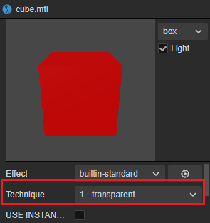
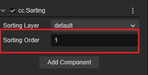

# 3D 渲染排序组件

对于大部分渲染情况来说，默认的排序已经满足需求。但是实际上由于半透明物体的特殊性，我们可能需要手动对这些物体进行排序。对于这种情况，可以使用 **渲染排序组件**。

在 **属性检查器** 内点击 **添加组件** 按钮选择 **Sorting** 即可添加。


> **注意**：该组件只对持有 **MeshRenderer** 和 **SpriteRenderer** 组件的节点生效。

## 属性

| 属性 | 说明 |
| :-- | :-- |
| **Sorting Layer** | 选择 **排序图层** <br> 通过下拉框选择不同的排序图层，这些图层需要在 **项目设置** -> **排序图层** 内设置后才可以选择 <br>  |
| **Sorting Order** | 在相同图层内的排序优先级 |

## 示例

- 在 **项目设置** -> **排序图层** 内添加排序图层 Sorting Layer 1。

    

- 按照示例中搭建如下的场景：

    

- 立方体和球体的材质需要选择使用半透明渲染队列：

    

    添加 Sorting 组件且属性保持默认。

- 图片需要使用 **SpriteRenderer** 组件（注意不是 Sprite 组件），着色器需要使用 **builtin-sprite-renderer**，并添加 Sorting 组件，保持属性默认：

    

此时可观察到这些节点的排序方式是按照默认顺序排序。

### Sorting Layer 示例

调整后方 SpriteRenderer 节点的 Sorting Layer 如下图：


由于自定义的层级是高于立方体和球体的层级 default 的，因此可以观察到下图的结果：


### Sorting Order 示例

Sorting Order 属性可以调整同一个排序图层内物体渲染的优先级。

场景和上述的示例类似，但是将立方体的 Sorting 组件内的 Sorting Order 属性调整为 1：



此时，立方体在渲染队列内的优先级是高于球体的，因此可以观察下图的结果：


## 脚本示例

下面的代码演示了如何在运行时修改 Sorting Order 以及 Sorting Layer。

```ts
import { _decorator, Component, Sorting, SortingLayers } from 'cc';
const { ccclass, property } = _decorator;

@ccclass('SortingSample')
export class SortingSample extends Component {

    @property(Sorting)
    sorting:Sorting | null = null;

    start() {
        this.sorting.sortingLayer = SortingLayers.getLayerIndexByName("Sorting Layer 1");
        this.sorting.sortingOrder = 1;
    }
}
```

**排序层管理器（SortingLayers）** 可以在运行时获取排序图层的名称和索引，但无法在运行时修改。

## API

渲染排序组件的 API 可以参考 [Sorting](%__APIDOC__%/zh/class/Sorting) 以及 [排序层管理器 SortingLayers](%__APIDOC__%/zh/class/SortingLayers) 。
