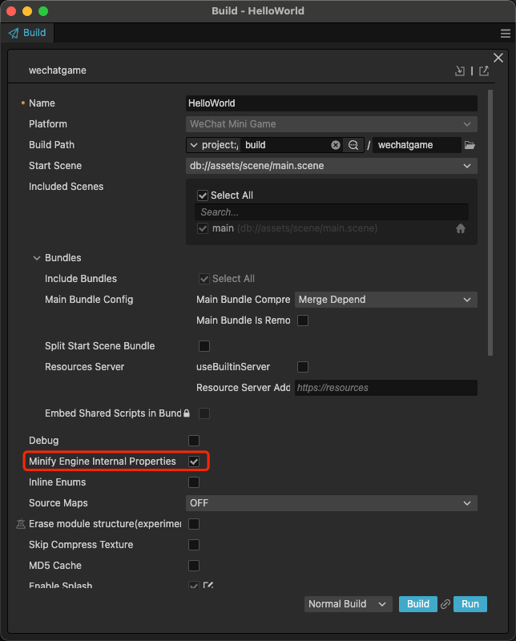

# Mangle Engine Internal Properties

To help users further reduce game package size, the Cocos Engine team has introduced engine internal property mangling functionality starting from version 3.8.6. This feature can mangle properties in the engine's TypeScript code, effectively reducing game package size without compromising game performance.

> Note: This feature currently does not support native platforms.

## Enable Engine Property Mangling During Build



## Generate Mangle Configuration

During the build process, an `engine-mangle-config.json` file will be generated in the project root directory. If users want to quickly generate this configuration file, they can start a build and interrupt the build task after the configuration file is generated in the project root directory.

## Mangle Configuration Fields

By default, this feature mangles private properties in the engine's TypeScript code. If you need to mangle public and protected properties, you'll need to configure this in the configuration file.

| Field | Description |
| :-------------- | :----------- |
| mangleProtected | Whether to mangle protected properties (default is false) |
| mangleList | Add engine properties that need to be mangle |
| dontMangleList | Add engine properties that should not be mangle |

### Configuration Example

#### "Profiler._meshRenderer" is a custom added property, while others are default mangle configurations.

```json
{
    "COMMON": {
        "mangleProtected": false,
        "mangleList": [
            "UITransform._sortSiblings",
            "UITransform._cleanChangeMap",
            "Node._findComponents",
            "Node._findChildComponent",
            "Node._findChildComponents",
            "Node.idGenerator",
            "Node._stacks",
            "Node._stackId",
            "Node._setScene",
            "EffectAsset._layoutValid",
            "EffectAsset._effects",
            "ReflectionProbe.DEFAULT_CUBE_SIZE",
            "ReflectionProbe.DEFAULT_PLANER_SIZE",
            "WebGLDeviceManager.setInstance",
            "WebGL2DeviceManager.setInstance",
            "CanvasPool",
            
        ],
        "dontMangleList": [
            "Component",
            "Profiler._meshRenderer"
        ]
    },
    "MINIGAME": {
        "extends": "COMMON",
        "mangleList": [],
        "dontMangleList": []
    },
    "WECHAT": {
        "extends": "MINIGAME",
        "mangleList": [],
        "dontMangleList": []
    }
}
```

## Important Notes

When this feature is enabled and debug mode is active during packaging, it will slightly increase the size of the debug package.