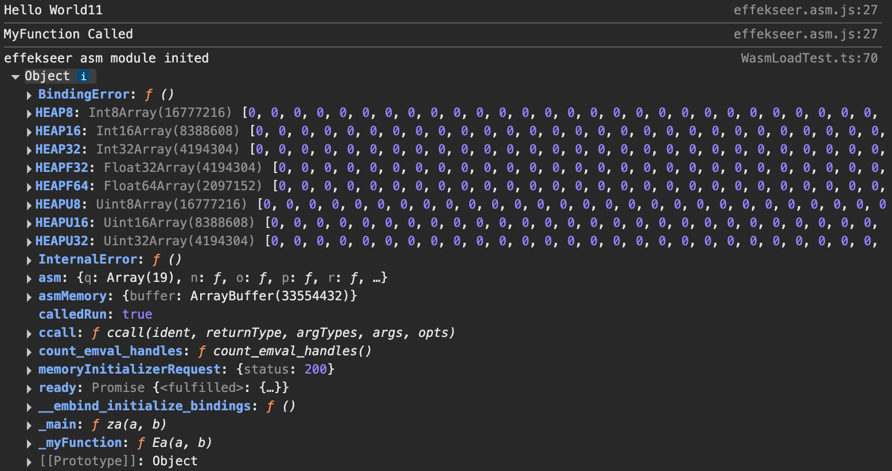

# Custom Loading of Wasm/Asm Files and Modules

The CocosCreator engine provides interfaces for manually loading Wasm/Asm modules such as Spine and Box2D. However, if users want to load custom Wasm/Asm files and modules, they need to implement the loading logic themselves within their project.

> #### Note: This article does not cover how to create Wasm/Asm files but focuses on loading them in CocosCreator.

1. Add support for Wasm/Asm files in loaders and parsers. Insert the following example code outside the script's class or translate it into JavaScript and include it as a JS plugin in the project.

    ```js
    // Determine if the current platform supports loading wasm files. The Cocos engine currently does not support loading wasm files on iOS platforms.
    if (sys.hasFeature(sys.Feature.WASM) || sys.os !== sys.OS.IOS) {
        if (sys.isNative) {
            //@ts-ignore
            assetManager.downloader.register('.wasm', assetManager.downloader._downloaders[".bin"]);
            //@ts-ignore
            assetManager.parser.register('.wasm', assetManager.parser._parsers[".bin"]);
        }
        else if (sys.isBrowser || sys.platform === sys.Platform.WECHAT_GAME) {
            //@ts-ignore
            assetManager.downloader.register('.wasm', assetManager.downloader._downloadArrayBuffer);
            //@ts-ignore
            assetManager.downloader.register('.mem', assetManager.downloader._downloadArrayBuffer);
        }
    } else {
        if (sys.isNative) {
            //@ts-ignore
            assetManager.downloader.register('.mem', assetManager.downloader._downloaders[".bin"]);
            //@ts-ignore
            assetManager.parser.register('.mem', assetManager.parser._parsers[".bin"]);
        }
    }
    ```

* Both wasm and mem files are binary files, so the built-in binary file loading functions of the engine are used as download and parsing functions for these formats.

2. Modify the tsconfig.json file in the project to add `CommonJS` module support, enabling dynamic imports of JS scripts.

    ```json
    {
        /* Base configuration. Do not edit this field. */
        "extends": "./temp/tsconfig.cocos.json",

        /* Add your custom configuration here. */
        "compilerOptions": {
            "strict": false,
            "module": "CommonJS"
        }
    }
    ```

3. Import Wasm/Asm files into the resource manager of the CocosCreator editor and place both .wasm and .mem files in the same bundle folder. Below is an example of the file distribution structure for reference:

    

    

4. Add the wasmOrAsmLoadTest function to import Wasm/Asm module scripts. Add success and failure callbacks, invoking the loading of Wasm/Asm binary files in the success callback.

    > #### Note: The third parameter received by the loadWasmOrAsm function is the resource Uuid of the Wasm/Asm file in the editor. Developers should replace it with the Uuid of resources in their own projects.

    ```js
    wasmOrAsmLoadTest () {
        if (sys.hasFeature(sys.Feature.WASM) || sys.os !== sys.OS.IOS) {
            import('./effekseer.js').then(({ default: wasmFactory })=> {
                this.loadWasmOrAsm("wasmFiles", "effekseer", "44cacb3c-e901-455d-b3e1-1c38a69718e1").then((wasmFile)=>{
                    //TODO: Initialize wasm file
                    
                }, (err)=> {
                    console.error("wasm load failed", err);
                })
            });
        } else {
            import('./effekseer.asm.js').then(({ default: asmFactory })=> {
                this.loadWasmOrAsm("wasmFiles", "effekseer.asm", "3400003e-dc3c-43c1-8757-3e082429125a").then((asmFile)=> {
                    //TODO: Initialize asm file

                }, (err)=> {
                    console.error("asm load failed", err);
                });
            });
        }
    }
    ```

5. Add the loadWasmOrAsm method, which is used to load Wasm/Asm binary files.

    ```js
    loadWasmOrAsm (bundleName, fileName, editorWasmOrAsmUuid): Promise<void> {
        return new Promise<void>((resolve, reject) => {
            if (EDITOR) {
                // Loading resources via UUID is more convenient in the editor; cannot load through bundles.
                if (editorWasmOrAsmUuid) {
                    assetManager.loadAny(editorWasmOrAsmUuid, (err, file: Asset)=> {
                        if (!err) {
                            //@ts-ignore
                            resolve(file);
                        } else {
                            reject(err);
                        }
                    })
                }
            } else {
                if (bundleName && fileName) {
                    assetManager.loadBundle(bundleName, (err, bundle)=>{
                        if (!err) {
                            bundle.load(fileName, Asset, (err2: any, file: Asset) => {
                                if (!err2) {
                                    //@ts-ignore
                                    resolve(file);
                                } else {
                                    reject(err2);
                                }
                            })
                        } else {
                            reject(err);
                        }
                    })
                }
            }
        })
    }
    ```

6. Write Wasm initialization code. After the Wasm binary file is loaded, call the instantiateWasm function to complete initialization.

    ```js
    initWasm (wasmFactory, file): Promise<void> {
        var self = this;
        return new Promise<void>((resolve, reject) => {
            wasmFactory({
                instantiateWasm (importObject, receiveInstance) {
                    self.instantiateWasm(file, importObject).then((result) => {
                        receiveInstance(result.instance, result.module);
                    }).catch((err) => reject(err));
                }
            }).then((instance: any)=>{
                resolve(instance);
            }).catch((err) => reject(err));
        });
    }

    instantiateWasm (wasmFile: Asset, importObject: WebAssembly.Imports): Promise<any> {
        if (sys.isBrowser || sys.isNative) {
            //@ts-ignore
            return WebAssembly.instantiate(wasmFile._file, importObject);
        } else if (sys.platform === sys.Platform.WECHAT_GAME){
            //@ts-ignore
            return CCWebAssembly.instantiate(wasmFile.nativeUrl, importObject)
        }
    }
    ```

7. Add a call to the initWasm function in the wasmOrAsmLoadTest function to complete the loading of Wasm.

    ```js
    wasmOrAsmLoadTest () {
        if (sys.hasFeature(sys.Feature.WASM) || sys.os !== sys.OS.IOS) {
            import('./effekseer.js').then(({ default: wasmFactory })=> {
                this.loadWasmOrAsm("wasmFiles", "effekseer", "44cacb3c-e901-455d-b3e1-1c38a69718e1").then((wasmFile)=>{
                    this.initWasm(wasmFactory, wasmFile).then((instance: any)=> {
                        Effekseer = instance;
                        Effekseer._myFunction();
                        console.log("effekseer wasm module inited", Effekseer);
                    }, (err) => {
                        console.error("effekseer wasm module init failed", err);
                    });
                    
                }, (err)=> {
                    console.error("wasm load failed", err);
                })
            });
        } else {
            import('./effekseer.asm.js').then(({ default: asmFactory })=> {
                this.loadWasmOrAsm("wasmFiles", "effekseer.asm", "3400003e-dc3c-43c1-8757-3e082429125a").then((asmFile)=> {
                    //TODO: Initialize asm file

                }, (err)=> {
                    console.error("asm load failed", err);
                });
            });
        }
    }
    ```

* After Wasm is loaded, you should see the following output in the browser console in this example:

    

    8. Write asm initialization code. First, add constants for the memory size of the asm module, then add the initAsm function to initialize the Asm module.

    ```js
    // Add constants for the memory size of the asm module, used during asm module initialization.
    const PAGESIZE = 65536; // 64KiB

    // Number of pages in the wasm memory
    // TODO: Make this configurable by the user.
    const PAGECOUNT = 32 * 16;

    // Total memory size of the wasm memory
    const MEMORYSIZE = PAGESIZE * PAGECOUNT; // 32 MiB
    ```

    ```js
    initAsm (asmFactory, file): Promise<any> {
        const asmMemory: any = {};
        asmMemory.buffer = new ArrayBuffer(MEMORYSIZE);
        const module = {
            asmMemory,
            memoryInitializerRequest: {
                //@ts-ignore
                response: file._file,
                status: 200,
            } as Partial<XMLHttpRequest>,
        };
        return asmFactory(module);
    }
    ```

9. Add a call to the initAsm function in the wasmOrAsmLoadTest function to complete the loading of Asm.

    ```js
    wasmOrAsmLoadTest () {
        if (sys.hasFeature(sys.Feature.WASM) || sys.os !== sys.OS.IOS) {
            import('./effekseer.js').then(({ default: wasmFactory })=> {
                this.loadWasmOrAsm("wasmFiles", "effekseer", "44cacb3c-e901-455d-b3e1-1c38a69718e1").then((wasmFile)=>{
                    this.initWasm(wasmFactory, wasmFile).then((instance: any)=> {
                        Effekseer = instance;
                        Effekseer._myFunction();
                        console.log("effekseer wasm module inited", Effekseer);
                    }, (err) => {
                        console.error("effekseer wasm module init failed", err);
                    });
                    
                }, (err)=> {
                    console.error("wasm load failed", err);
                })
            });
        } else {
            import('./effekseer.asm.js').then(({ default: asmFactory })=> {

                this.loadWasmOrAsm("wasmFiles", "effekseer.asm", "3400003e-dc3c-43c1-8757-3e082429125a").then((asmFile)=> {
                    this.initAsm(asmFactory, asmFile).then((instance: any)=>{
                        Effekseer = instance;
                        Effekseer._myFunction();
                        console.log("effekseer asm module inited", Effekseer);
                    }, (err) => {
                        console.error("effekseer asm module init failed", err);
                    });

                }, (err)=> {
                    console.error("asm load failed", err);
                });
            });
        }
    }
    ```

* After Asm is loaded, you should see the following output in the browser console in this example:

    

### Example Project Repository Address

[GitHub Repository Address](https://github.com/cocos/cocos-awesome-tech-solutions/tree/3.8.x-release/demo/Creator3.8.6_WasmOrAsmLoad)
