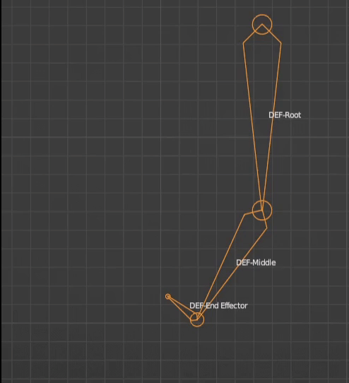

# Modify Poses

The pose graph provides several nodes for modifying poses. Each of these nodes accepts an input pose and outputs the modified pose.

| Input | Type | Description |
| :-- | :-- | :-- |
| `Pose` | Pose | The pose to be modified. |

For the operation of a pose node, see [pose graph node view](./node-operation.md).

## Apply Transform

**Apply transform node** Applies a transform (translate and rotation) to the specified node of the input pose.

| Input | Type | Description |
| :-- | :-- | :-- |
| `Position` | 3d-vector| The amount of modification to the position. |
| `Rotation` | Quaternion | The amount of modification to the rotation. |
| `Intensity` | Float |The intensity of application of the modification, in the range [0, 1]. 0 means that the modification is not applied at all, 1 means that the modification is applied completely. |

| Properties | Description |
| :---| :---|
| `Node` | The name of the node to be modified. |
| `Position Operation` | Specifies how to modify the position. See [Transform Operations](./modify-pose.md#Transform%Operation) |
| `Rotation Operation` | Specifies how to modify the rotation. See [Transform Operation](./modify-pose.md#Transform%Operation) |
| `Transform Space` | Specifies the space in which the modification occurs; that is, the space in which the specified `position` input and `rotation` input reside. |

### Transform Operation

The transform operation options specify how the applied transform node modifies the position or rotation. The options are listed below:

| Properties | Description |
| :-- | :-- |
| **LEAVE_UNCHANGED** | No modification. |
| **REPLACE** | When used as an application option for position, the `position` input is used directly as the new position of the node; when used as an application option for rotation, the `rotation` input is used directly as the new rotation of the node. |
| **ADD** | Adds the `position` input to the node's current position when used as an application option for position, or the `rotation` input to the node's current rotation when used as an application option for rotation. |

## Copy Transform

The **Copy Transform** node copies the transform of a node in the input pose to another node.

| Properties | Description |
| :---| :---|
|`Source node` | The name of the node to be copied. |
|`Target Node` | The name of the node to copy to. |
|`Space` |Specifies the space where the copy occurs. When `COMPONENT` indicates that the copy occurs in component space; when `LOCAL` indicates that the copy occurs in local space. |

## Set Auxiliary Curves

The **Set Auxiliary Curve** node modifies the current value of the specified auxiliary curve in the input pose.

| Input | Type | Description |
| :-- | :-- | :-- |
| `Value` | Float | The amount of modification to the auxiliary curve. |

| Properties | Description |
| :---| :---|
| `Curve Name` | The name of the auxiliary curve to be modified. |
| `Flag` | Specifies how to modify the auxiliary curve.   When `LEAVE_UNCHANGED` it is not modified; when `REPLACE` it means that the `Curve Value` input is used as the current value of the auxiliary curve;   when `ADD` it means that the `Curve Value` input is added to the current value of the auxiliary curve. |

## Double Skeleton IK

IK solving is often used to move or rotate a bone to a target position and drive the parent bone so that it remains the same distance from the parent (or within an acceptable range). For example, when moving a foot, the knee bone and thigh bone should bend accordingly.

**Two-bone IK solver node** solves IK problems consisting of two sections of (three bones) bones for the input pose. These three bones form a direct parent-child relationship, i.e. "child level - parent level - parent of parent level". The "child" is called the **end-effector** or **end-bone**, the "parent of parent" is called the **root-bone** (in this IK problem), and the "parent of parent " is called the **intermediate bone**.

> Therefore, the "two" in "two-bone IK" should be interpreted as "two segments of bones" rather than "two bones".

When evaluating, the solver will transform the end and middle bones, and rotate the root bone so that the end bone reaches the specified position; and keep the distance between the parent and child levels unchanged, and the position of the root bone unchanged in the process.

For fixed end-bone and root-bone positions, an infinite number of solutions exist for the intermediate bones when solving. As shown in Fig:

The solver will try to find the "best" solution, but there may still be more than one such solution, and it may not be the desired one.

Therefore, in order to explicitly specify the orientation of the intermediate bones, the solver also allows to specify a **pole-target** to determine the bending direction of the skeletal chain.

| Input | Type | Description |
| :---| :---|---|
| `End-effector-target` |3d-vector|Target position of the end-effector. |
| `Polar target` |3d-vector | The position of the polar target. |

| Attributes |  Description |
| :---| :---|
| `End-effector node` | The name of the end-effector node. |
| `End-Executor-Target` | The target setting of the end-effector. |
| `Polar target` |The polar target setting. |

### Target settings

The target setting is used to describe the end-effector target or the poleward target. The options are as follows:

| Attributes |  Description |
| :-- | :-- |
|`Type` |Target type. When `VALUE`, it means that the target position is represented as the specified (3D vector) value; when `BONE`, it means that the position of another bone is used as the target position; and when `NONE`, it means that the current position is used as the target position, i.e., the target is not solved for. |
|`Target Bone`| The name of the target bone when the target type is `BONE`. |
|`Target Position Space` | The space of the target position when the target type is `VALUE`. |
