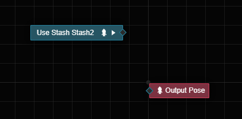

# Pose Stash

It is not possible to connect the output of a pose node to multiple nodes in a pose graph, when you try to connect a pose node to a new node, the old connection will be broken. If you need to reuse a pose in multiple places, you need to use pose stash.

## Concepts

**Pose stash** is a mechanism for storing the results of one pose graph and using the resulting poses in other pose graphs. A **pose stash** (hereafter referred to as a pose stash or stash) is a means of implementing such a mechanism, which associates a pose graph.

> A visual, but incomplete, understanding of a pose stash is to think of a pose stash as a cache variable that holds pose objects.

Pose stash is attributed to animation graph hierarchies. Multiple stashes can be created at each layer, and once created, the stash can be referenced in any pose graph in that layer via the **Use Stash Pose** node.

> We can think of this as taking some already edited pose node and saving it as some sort of blueprint or resource for use elsewhere. It's just that this blueprint has a limited scope and can only be in a specific layer in this animation graph.
> This also means that we can treat stash as some special pose node and use it just like a normal pose node.

Pose stash is allowed to be referenced multiple times, and the associated pose graph will only be updated and evaluated once per frame.

## Editing a pose stash

The **Property Inspector** of a selected animation graph layer allows you to view, create, and edit all pose stash for that layer.

Click on a layer in the animation graph and find the **Layer Stashes** property in the **Property Inspector**.

Click the  button to start editing the pose graph associated with the selected stash. Click  to delete the temporary storage. Deletion is not restorable, so please be careful.

The information text in this property below will indicate how many times the stash has been referenced, if it is greater than 0 then the stash has been referenced.

Click the **New Stash** button to create a new stash.

## Usage of Stashed Pose

The **Use Stashed Pose** menu lists all the stash that can be used in the pose graph. Clicking on this will create the **Use Stashed Pose** node.

The **Use Stashed Node** node outputs the pose generated by the specified stash; there are no additional inputs for this node.

Double-click the **Use Stash** node to access the edit view for the pose stashed associated with that node.

## Stash This Graph

Often it is not always possible to think of which poses to stash at the beginning of the design; more often than not, a graph has been developed and it is realized that it needs to be reused in more than one place.
To do this, right-click in any pose graph to access the context menu and click the Execute menu item **Stash This Graph**:

When executed, the original contents of the current graph will be moved to a newly created pose stash, and a **Use Stashed Pose** node will be created in the current graph to reference the newly created pose stash.

Clicking **Stash This Graph** creates a new Stashed Pose.

Here is an example of a pose that plays an animation clip.

Click the **Stash This Graph** menu, and you can see the change in the following image:

You can observe that the previous pose node, the **Play Animation Clip** node, no longer exists, and has been replaced by a node named **Use Stash StashX** (X is the number, the name of the stash can be changed in the **Inspector** panel). This node is the new **Stashed Pose**.
