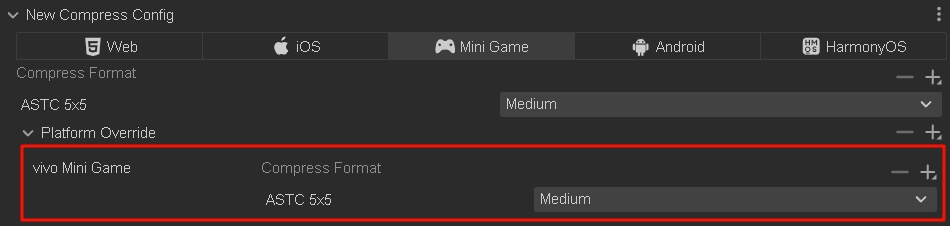

# Compressed Textures

Cocos Creator allows you to directly set the compression method for textures in the editor, and then automatically compresses textures during project publishing. It supports exporting multiple image formats for the same platform simultaneously, and the engine will load the appropriate compressed texture based on the device's support for compressed texture formats.

## Advantages of Compressed Textures

* For compressed textures like PNG, JPG, WEBP, etc.
    - Configuring compressed textures allows compressing texture pixel data during project build to reduce resource size and improve game resource download speed.
* For GPU compressed textures like ASTC, ETC1, ETC2, PVRTC, etc.
    - Configuring compressed textures allows converting texture pixel data into GPU-specific compressed formats during project build. These formats can be used directly in GPU memory without runtime decompression, significantly reducing memory usage, lowering bandwidth requirements, and improving game rendering performance and loading speed.

> **Note**:
> * For non-GPU compressed texture formats like PNG, JPG, WEBP, compressing image quality does not reduce the time to decode image resources or reduce game memory.
> * Compressing PNG, JPG, WEBP and other format images uses the [sharp](https://github.com/lovell/sharp) open source library. Its compression ratio is slightly lower than [tinypng](https://tinypng.com/) and may result in larger images after compression. If you need to optimize this issue, it is recommended to use [Custom Texture Compression](../editor/publish/custom-build-plugin.md#custom-texture-compression-processing) to solve it yourself.

## Compressed Texture Support

Cocos Creator supports loading images in various formats (see table below for details).

| Image Format | Android | iOS | Mini Games | Web | Windows | Mac |
| :----------- | :------ | :-- | :--------- | :-- | :------ | :-- |
| PNG | Supported | Supported | Supported | Supported | Supported | Supported |
| JPG | Supported | Supported | Supported | Supported | Supported | Supported |
| WEBP | Natively supported on Android 4.0+, other versions can use [parsing library](https://github.com/alexey-pelykh/webp-android-backport) | Can use [parsing library](https://github.com/carsonmcdonald/WebP-iOS-example) | Supported | [Partially supported](https://caniuse.com/#feat=webp) | Not supported | Not supported |
| PVR | Not supported | Supported | Supported on iOS devices | Supported on iOS devices | Not supported | Not supported |
| ETC1 | Supported | Not supported | Supported on Android devices | Supported on Android devices | Not supported | Not supported |
| ETC2 | Partially supported, depends on mobile hardware | Not supported | Not supported | Supported on some Android devices | Not supported | Not supported |
| ASTC | Supported (Android 5.0+) | Supported (iOS 9.0+/iPhone6+) | Supported on platforms like WeChat, Douyin, Alipay, Taobao, etc. For details, see [Compressed Texture Support Details for Each Platform](#Compressed-Texture-Support-Details-for-Each-Mobile-Platform). Note: Developer tools do not support, requires real device debugging | Partially supported | Not supported | Not supported |

### Compressed Texture Support Details for Each Mobile Platform

In addition to `JPG` and `PNG` which are supported across all platforms, the support for other texture compression formats is as follows:

| Platform Name | Supported Compression Formats |
| :------------ | :---------------------------- |
| Web Mobile | ASTC / ETC1 / ETC2 / PVR / WEBP |
| WeChat Mini Game | ASTC / ETC1 / ETC2 / PVR |
| ByteDance Mini Game | ASTC / ETC1 / ETC2 / PVR |
| Alipay Mini Game | ASTC / ETC1 / PVR |
| Taobao Mini Game | ASTC / ETC1 / PVR |
| OPPO Mini Game | ETC1 |
| vivo Mini Game | ETC1 / ASTC |
| Huawei Quick Game | ETC1 |
| Xiaomi Quick Game | ETC1 |
| iOS | ASTC / ETC1 / ETC2 / PVR / WEBP |
| Android / Huawei AGC | ASTC / ETC1 / ETC2 / WEBP |

**Note**: Currently, adding ASTC compressed textures in the general configuration for mini game platforms temporarily does not support the vivo mini game platform, but you can use [Platform Override Configuration](#platform-override-configuration) to enable ASTC compressed textures for the vivo mini game platform as well.

## About ASTC

For projects that require GPU compressed texture formats, it is recommended to use the ASTC compression format because it has high compression ratio and better quality, while also supporting HDR textures. ASTC was released in 2012, 12 years ago, and has nearly 100% support rate on mobile devices.

For games with higher quality requirements, you can choose ASTC 5x5 for 2D elements and UI, and ASTC 6x6 for model textures.

For games with lower quality requirements, you can choose 6x6 for 2D elements and UI, and 8x8 for model textures.

## Compressed Texture Configuration

When no compressed texture configuration is set, the project build outputs the original images. If you need to compress image resources in the project or large images generated by auto-atlas, you can select the image or auto-atlas in the **Assets Manager**, then check `useCompressTexture` in the **Inspector**, and select the texture compression preset for the image in `presetId`. After setting, click the green checkmark button in the upper right corner, and then the image resource will become a compressed texture resource after project build.

When configuring compressed texture presets, platform general configuration is used by default. This configuration will stop generating compressed textures of this format based on whether the build platform supports the configured compressed texture format.

`presetId` provides the editor's default compressed texture presets, which cannot be edited. If you need to customize presets, click the **Edit Preset** button next to `presetId` to go to the [Project Settings -> Compressed Textures](../editor/project/index.md#compressed-textures) panel for configuration.

The compressed texture options on image resources will be stored in the resource meta file, where `presetId` is the ID of the selected compressed texture preset. Projects with many images can manage the `presetId` used for image compression in batches through plugins or scripts.

**Note**:
After configuring compressed textures, only images of the corresponding format will be generated during build. If some image formats are not supported on certain devices, it may cause display abnormalities. To avoid this problem, when adding texture compression presets, please additionally select some general image formats (such as PNG, JPG) as default images.

## Platform Override Configuration
When configuring compressed texture presets for mini game platforms, if developers need to ignore internal rules to ensure that configured compressed texture resources are generated during build, they need to add platform override configuration.

## Compressed Texture Details

Cocos Creator 3.0, when building images, will check whether the current image has compressed texture configuration. If not, it will output the original image.

If compressed texture configuration is found, it will perform texture compression on the image according to the found configuration. The compressed texture configuration in project settings is divided by platform categories, and there may be some differences in the actual support level for specific platforms. The build will perform certain filtering and priority selection on the configured texture formats based on the **actual build platform** and the current **transparency channel situation of the image texture**. You can refer to the examples below to understand these rules.

Not all generated images will be loaded into the engine. The engine will select and load images of appropriate formats based on the configuration in [macro.SUPPORT_TEXTURE_FORMATS](%__APIDOC__%/en/interface/Macro?id=SUPPORT_TEXTURE_FORMATS). `macro.SUPPORT_TEXTURE_FORMATS` lists all image formats supported by the current platform. When loading images, the engine will find the format that is **higher in priority** (i.e., ranked higher) in this list from the generated images to load.

Developers can modify `macro.SUPPORT_TEXTURE_FORMATS` to customize the image resource support situation of the platform and the loading order priority.

## Smart Filtering

### Example 1

As shown in the figure above, for the compressed texture preset of the MiniGame platform, if **building for Huawei Quick Game or other platforms that only run on Android devices, PVR texture format will not be packaged during build**. For more platform filtering details, please refer to the [Compressed Texture Support Details for Each Platform](#Compressed-Texture-Support-Details-for-Each-Mobile-Platform) at the end of the document.

### Example 2

In the example diagram above, both ETC1 and PVR types have **configured both RGB and RGBA texture formats simultaneously. In this case, the build will prioritize one of the formats based on whether the current image has a transparency channel**. The image in the example diagram has a transparency channel, so the build will only package compressed texture formats with RGBA type. Of course, this filtering only occurs when both exist. If only RGB image format is configured in the configuration, even if the current image has a transparency channel, it will be packaged normally.

## Custom Build Texture Compression Processing

Texture compression currently takes effect after build, and the editor comes with a set of processing tools. If you need to customize compression tools, please refer to [Custom Texture Compression](../editor/publish/custom-build-plugin.md#custom-texture-compression-processing).
