# Tiled Map Resources (TiledMap)
## Problem
When using a texture atlas, if a 1-pixel stretch is not applied, adjacent images may blend together, leading to incorrect edge colors, such as the appearance of black edges. Therefore, when creating the texture atlas, it is necessary to stretch each image by one pixel to serve as the edge pixel.

The previous implementation of the engine handled this automatically and would indent by 1 pixel. The code implementation was as follows:
```javascript
if (spFrame) {
    grid._name = spFrame.name;
    const lm = spFrame.unbiasUV[0];
    const bm = spFrame.rotated ? spFrame.unbiasUV[1] : spFrame.unbiasUV[5];
    grid.l = lm + (grid.x + 0.5) / texWidth;
    grid.t = bm + (grid.y + 0.5) / texHeight;
    grid.r = lm + (grid.x + grid.width - 0.5) / texWidth;
    grid.b = bm + (grid.y + grid.height - 0.5) / texHeight;
    grid._rect = new Rect(grid.x, grid.y, grid.width, grid.height);
}
```

But there's another problem, it makes the UI design of a good map may look indented, as seen in this [issue](https://github.com/cocos/cocos-engine/issues/17257).

In order to solve this problem, it is necessary to set the extension 1 pixel when the user creates a texture altas.

## Creating a Texture Atlas for Tiled Maps

Generally, you'll need to create a texture atlas. You can use the [TexturePacker](https://www.codeandweb.com/texturepacker) tool for this.

- Add the materials to the tool, as shown in the image below:  
  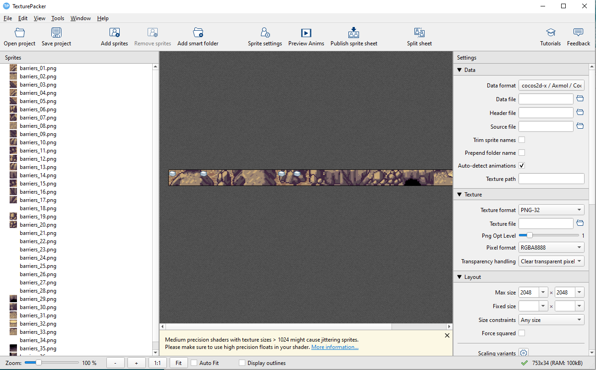

- Arrange the exported atlas layout and set the parameters.  
  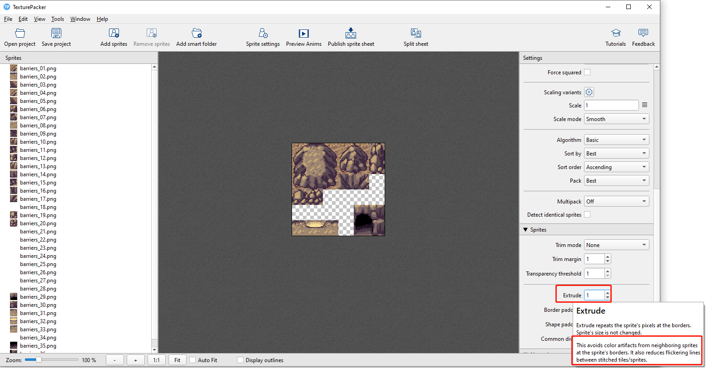  

  **Note: You need to stretch by 1 pixel here. If you don't stretch by one pixel, the edges of adjacent textures may appear abnormal when used.**

- Export the sprite sheet and then set the save path.  
  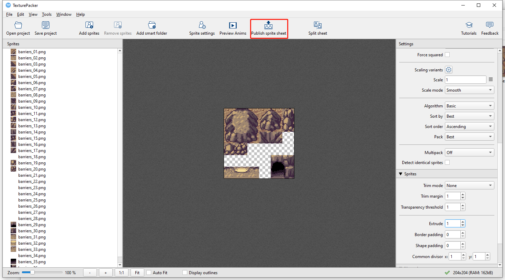

## Creating and Editing Maps Using Tiled

Tiled map resources are exported in a data format by the [Tiled Editor](https://www.mapeditor.org/).

| Creator Version | Tiled Version |
| :------------- | :----------- |
| v3.0 and above | v1.4          |
| v2.2 and above | v1.2.0        |
| v2.1 and below | v1.0.0        |

- Create map tiles.  
  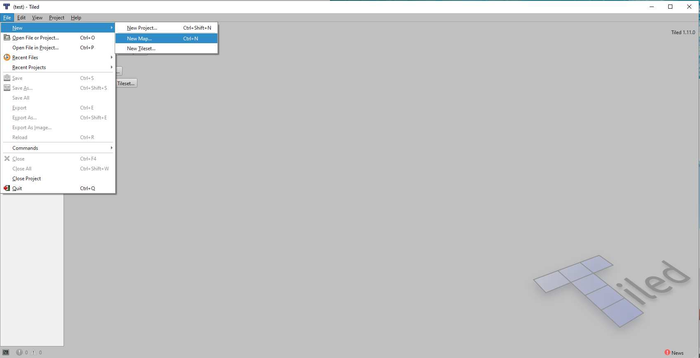

- Set the tile size.  
  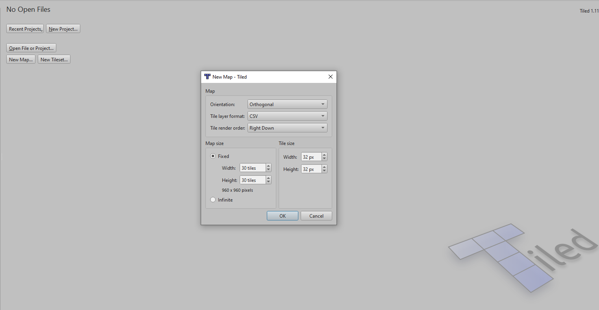  
  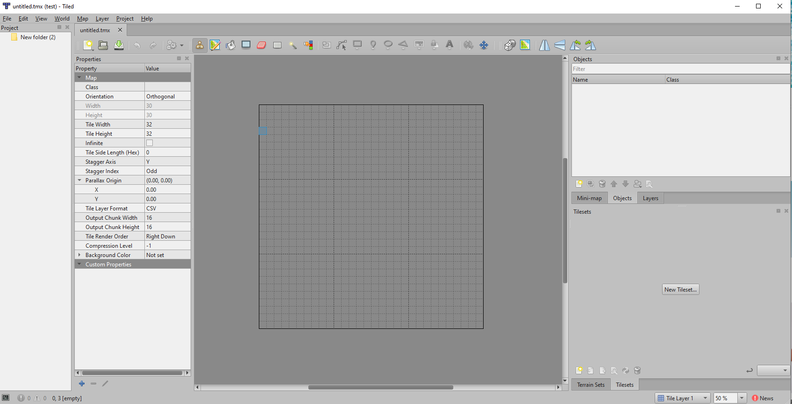

- Create a new tileset.  
  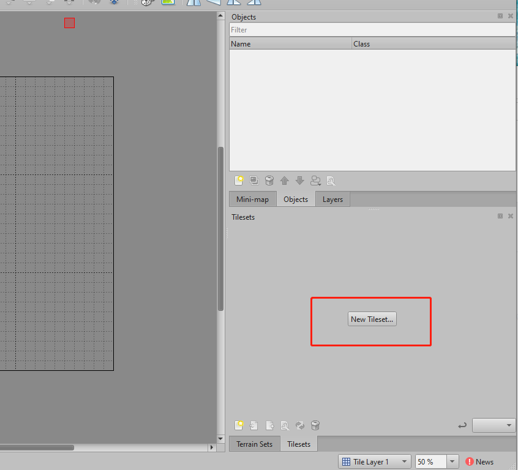

- Select the texture atlas created using TexturePacker.  
  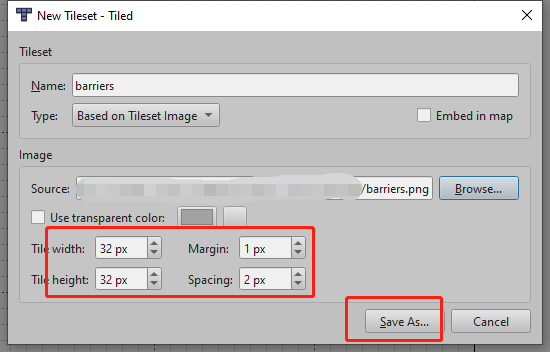

  **Set the size to match the original image, i.e., 32x32 pixels. Also, set the margin to 1 (offset the image by 1 pixel on all sides) and set the spacing to 2 (1 pixel on each side, making it 2 pixels total).If you haven't set stretching in TexturePacker, you need to set the margin to 0 and the spacing to 0 here**

- Complete the map, as shown below:  
  

- Save the `.tmx` file.

## Importing Map Resources

The resources required for the map include:

- `.tmx` map data
- `.png` texture atlas
- `.tsx` tileset configuration file (required by some `.tmx` files)

  

## Creating Tiled Map Resources

Drag the map resources from the **Assets** panel to the Tmx File property of the created TiledMap component:


## Organizing in the Project

To improve resource management efficiency, it is recommended to store the imported `.tmx`, `.tsx`, and `.png` files in a separate directory, rather than mixing them with other resources. Make sure to keep the `.tmx` and `.tsx` files in the same directory; otherwise, the resources might not load correctly.

### Notes

1. If the texture is not stretched in the TexturePacker, the result may be an error.

   Without stretching, the effect is as shown below:  
   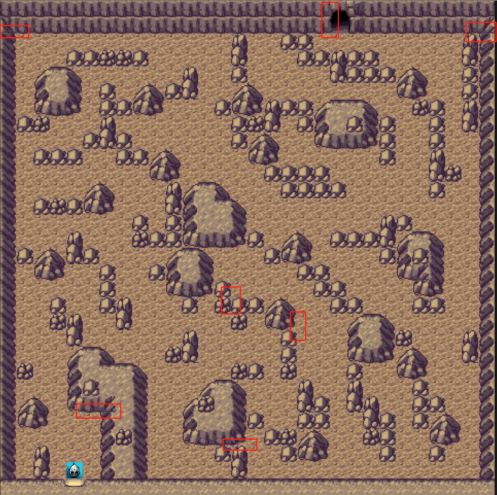

   With stretching, the effect is as shown below:  
   

2. If you have existing atlases and maps, you can update the atlas without having to recreate it.

   (1) Add a new atlas with new configurations, making sure not to embed it in the map.  
   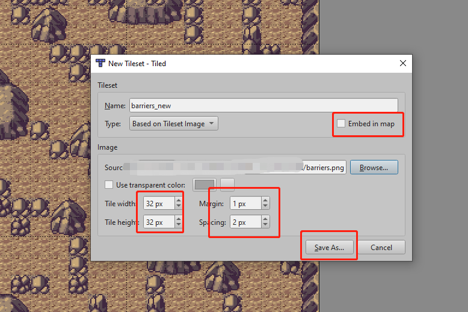

   (2) In the old atlas tab, select and click Replace Tileset, then choose the new atlas created in step (1) to complete the update.  
   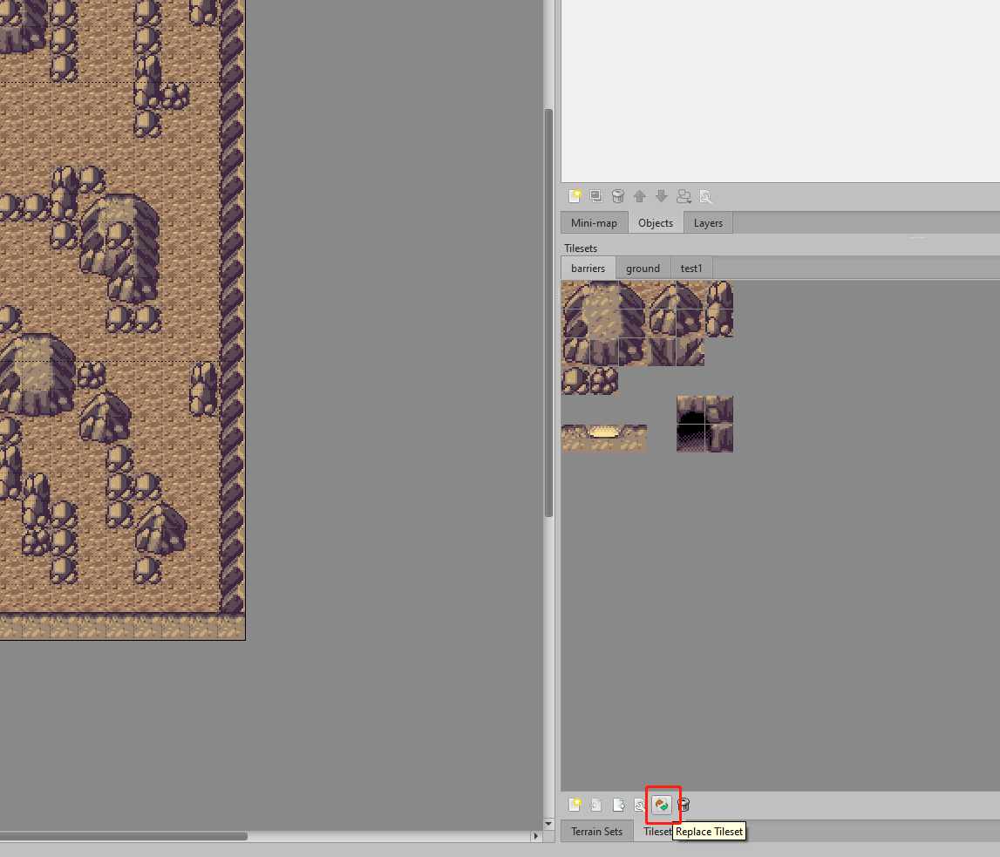