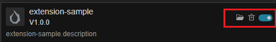

# Extension Manager Panel

The **Extension Manager** is used to manage extensions within the editor. Click **Extension -> Extension Manager** in the main menu bar of Cocos Creator to open.


The Extension Manager panel is as follows.


## Functions

Its relevant functions are described as follows.

1. Extension type, divided into **Cocos Official** and **Builtin**, selected by drop-down menu. 
2. Installed, click it to show the currently installed extensions.
3. From left to right, **Search Extensions**, **Import Extension** and **Refresh Extension List**
    - **Search Extensions**: When clicked, you can find the extensions within the current project by keywords in the input box shown below.
        
    - **Import Extension**: Click to import a new extension via zip file
    - **Refresh Exntesion List**: Refresh the current status of all extensions
4. Extension list.

    

    For each extension, the extension name, icon, version number and description are displayed on the left side.
    The buttons on the right side are.
      - **Open extension directory**
      - **Delete** the extension
      - **Enable/Disable** the extension
    The built-in and official extensions cannot be deleted or disabled, some of the buttons need to be visible by moving the mouse over the entry.
5. Details of extensions

## Import Methods

- **Import Extension Folder**: If you choose this import method, you need to copy the extension to the "extensions" directory of the project.
- **Developer Import**: After choosing this import method, the extension will be referenced in the form of a soft link and doesn't need to be copied to the "extensions" directory, which facilitates developers in project management.

## Manually Sharing Extensions by Editor Version

In Cocos Creator **3.8.6 and 3.8.8**, extensions can be placed in a version-specific directory under the user's home directory and shared by projects using the **same editor version** on that computer. Extensions are stored by the full editor version number: for example, `3.8.6` and `3.8.8` use separate directories.

The announcement about deprecating global extensions in 3.7 referred to the earlier `.CocosCreator/extensions` directory. The `builtin-extensions` version directories below use a separate loading path; this does not mean that the Extension Manager has restored the earlier global installation option.

> **Note**: `builtin-extensions` also stores updates to built-in extensions. When manually adding a custom extension, use a separate extension folder and package name, and do not overwrite existing built-in extensions. Installation and version management are manual; placing an extension here does not automatically register it as a project dependency. Check the loading behavior before using this approach with other editor versions.

### Directory and Installation

The shared extension directory is `<user-home>/.CocosCreator/builtin-extensions/<full-editor-version>/`. For example, when using Creator 3.8.6 on macOS, the directory is:

```text
/Users/<username>/.CocosCreator/builtin-extensions/3.8.6/
```

1. Close the editor instances that need the extension.
2. Open the shared directory for the editor version. Create it if it does not exist.
3. Place the complete extension folder in that directory, with `package.json` at the root of the extension folder. For example:

    ```text
    .CocosCreator/
    └── builtin-extensions/
        └── 3.8.6/
            └── my-extension/
                ├── package.json
                └── ...
    ```

4. Reopen a project with that editor version and check that the extension loads and its menus or features are available.

### Scope of Use

- **Version isolation**: Extensions in the `3.8.6` directory are shared by projects using Creator `3.8.6` on that computer. When switching to another version, such as `3.8.8`, install the extension in the corresponding directory and check its compatibility with that version.
- **Project distribution**: The shared directory is outside the project and is not distributed with its repository. Team members and other computers need to install the extensions separately. Use the project's `extensions` directory for extensions that need to be delivered with the project.
- **Development**: To reference the same extension source code from multiple projects, use **Developer Import** as described above to create a symbolic link in each project to the shared source directory.
- **Avoid duplicate installations**: Avoid placing different versions of an extension with the same name in both the project directory and the shared directory for a project that uses it. This can make it difficult to identify which version is loaded.
