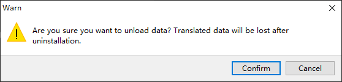

# Localization

Localization (hereinafter referred to as L10N) is a feature introduced in Cocos Creator 3.6 that integrates translation services from third-party translation service providers, while running the localization of text, audio and image resources into the engine and supporting one-click publishing to different languages.

> L10N is the abbreviation of the first and last letter of the word Localization, 10 means Localization with 10 letters in the middle.

## L10N OverView

The Localization Editor panel can be opened by selecting **Panel** -> **Localization Editor** in the top menu of the engine.  

At first start-up, the user has to manually enable the L10N function.

You can edit it after starting it.

In the upper right corner of the panel, the L10N provides two functions **Turn Off L10N** and **Unload Data**.

- **Turn Off L10N**: Disable the L10N function. After selecting Confirm in the secondary menu that pops up, the data is still retained and the developer can enable the function again:

    

- **Unload data**: After selecting Confirm in the popup secondary menu, the L10N data will be cleared and the associated components in the scene will be deleted:

    

    > **Note**: The uninstalled data cannot be recovered, please operate with caution.

## Translation Service Provider

The engine integrates the translation services of several translation service providers, and developers can choose different translation service providers to provide more complete and diversified services. For details, please refer to [Translation Service Provider](translation-service.md).

## Collect and Count

Collect and count collects resources that may need to be translated in a project to facilitate translation, and developers can also filter them by specifying specific files, directories, or through configuration. For details, please refer to [Collect and Count](collect-and-count.md)

## Compile Language

Language translation allows you to view the currently configured and translated languages and view their progress or delete actions. Manual processing of certain non-text resources is also provided. For more details, please refer to [Compile Language](compile-language.md)

## Programming Guide

Please refer to [Sample](script-using.md) for an example of programmatic use of L10N.

## Publish

Once the translation has been completed according to the above steps, it can be published with one click on the build panel at

- **Language used**: This will contain all the languages set in the **Localization Editor**, and developers can select them as needed depending on the version
- **Default language**: the language used when the project is started after the release
- **Alternate language**: the alternate language to be used if there is a problem with the default language

## Q & A

- Q: Is there a solution if I accidentally modify the data file and the data file becomes corrupted and I cannot open L10N?
  A: You can modify it by searching the corresponding file in "{project directory}\localization-editor\translate-data".
