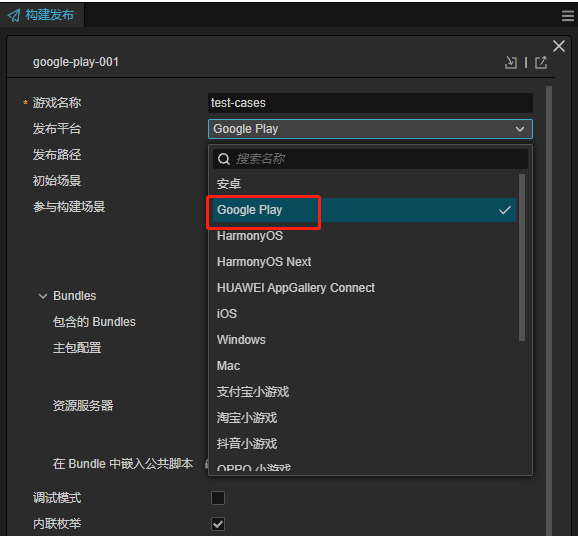
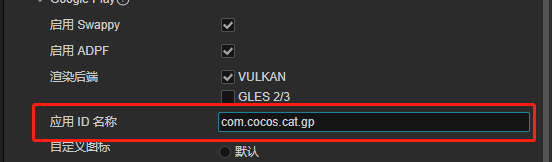
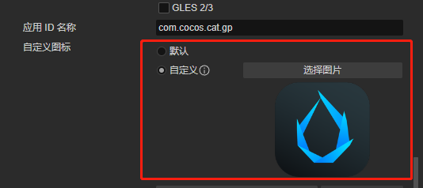
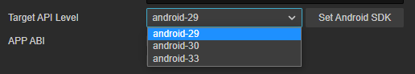
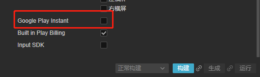
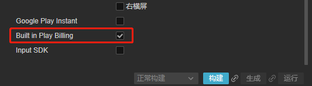
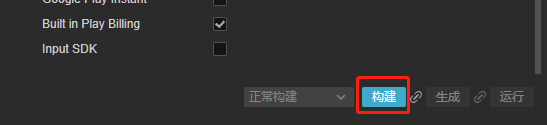
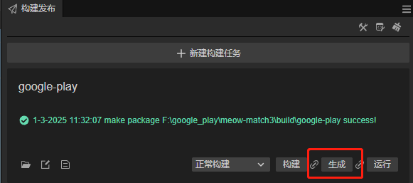
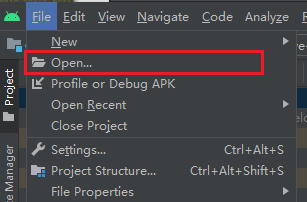
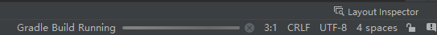

# Google Play Build Example

This article demonstrates the process of publishing a Cocos Creator project as a Google Play application.

Please prepare a Cocos Creator project with at least one scene.

## Setting Up the Publishing Environment

To publish a Google Play native application, you need to install the Android Studio development environment, along with specific versions of JDK (or OpenSDK), Android SDK, and NDK. For details, please refer to [Configure Android Native Development Environment](../../../../en/editor/publish/android/build-setup-evn-android.md).

## Publishing Process

Next, in Cocos Creator, find the **Project** menu, click the **Build** button to open the **Build** panel.

### Creating a Build Task

1. Select **Project** -> **Build** menu to open the build panel

    

2. Click the **New Build Task** option in the panel:

    

3. Select Google Play as the build platform:

    

4. Select at least one scene as the initial loading scene. When there is only one scene, it will be added by default:

    

5. Enable ADPF (Optional) 

    

6. Refer to [Android Platform Build Options - Render Backend](../../../../en/editor/publish/native-options.md#%E6%B8%B2%E6%9F%93%E5%90%8E%E7%AB%AF) to select the render backend

    

7. Enter the package name

    

    > For naming conventions, please refer to [Application ID Name](../../../../en/editor/publish/native-options.md#%E5%BA%94%E7%94%A8-id-%E5%90%8D%E7%A7%B0)

8. Change Application Icon (Optional)

9. Select Target API Level

    

    > If there's no dropdown box, please check if the **SDK and NDK Configuration** above is correct.

10. Enable Google Play Instant (Optional)

    
    
11. Enable Google Play Billing Feature

    

    > Without checking this option, you cannot use the Google Play Billing interface

For other options, please refer to [Android Platform Build Options](../../../../en/editor/publish/native-options.md#android-%E5%B9%B3%E5%8F%B0%E6%9E%84%E5%BB%BA%E9%80%89%E9%A1%B9) for configuration.

### Build and Publish

1. Build: Click the **Build** button below to create a new build task and start building

    

2. Wait for the build to complete

    

#### Generate AAB Package via Creator
1. Click **Generate** 

    

2. Wait for the generation to complete

    

3. Click the button below to open the generated project:

    

4. Find the publish directory
    
    

5. Find the generated AAB package
    
    

#### Generate AAB Package via Android Studio
1. 找到工程对应的目录

    

2. Open Android Studio menu:

    

3. Open the built project at `{project path}/build/google-play/proj`:

    

4. Build APK using Android Studio

    After opening Android Studio, it will take some time for preparation. Once Android Studio has finished preparing the project, you can package the APK. The preparation process might take a while. If there's no response for a long time, please check your network or switch to another mirror. If you need to interrupt the current background task, you can refer to the following closing method:

    > When Android Studio has background tasks, you can click the background task bar at the bottom of the window:
    >
    > 
    >
    > Click the × on the right in the popup window to end the background task:
    >
    > 

5. Open the **Build** menu and select **Build Bundle(s) / APK(s)**:

    

6. After successful publication, you can find the Debug version of the APK in the proj/build directory:

    

## Others
Other aspects are basically the same as Android. You can refer to [Android Build Example](../../../../en/editor/publish/android/build-example-android.md)

## Google Play Game Services
[Google Play Game Services Documentation](./google-play-game-services.md)