# Google Play Build Example

This feature is only available on the Google Play platform. Please refer to [Publish Google Play Example](./build-example-google-play.md)

### Auto Sign-in
When players launch a game with auto sign-in enabled, they can sign in without interacting with the sign-in prompt. Players can enable auto sign-in either in the Google Play Games app or through the initial sign-in prompt displayed in the game.

#### Google Cloud Backend Configuration

- Create Credentials

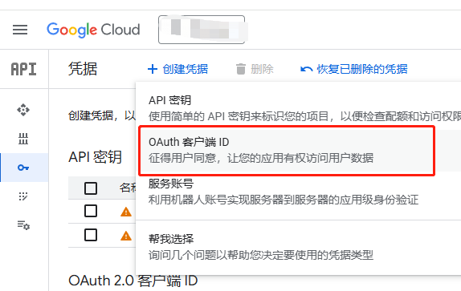

You need to create an OAuth client ID in Google Cloud before you can see it in the credentials section of the Google Console.

### Google Play Console Backend Configuration
[Reference Documentation](https://developer.android.com/games/pgs/console/setup?hl=en#add_your_game_to_the)

1. Add New Credentials
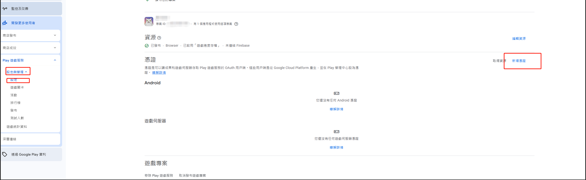
2. Fill in Credential Information
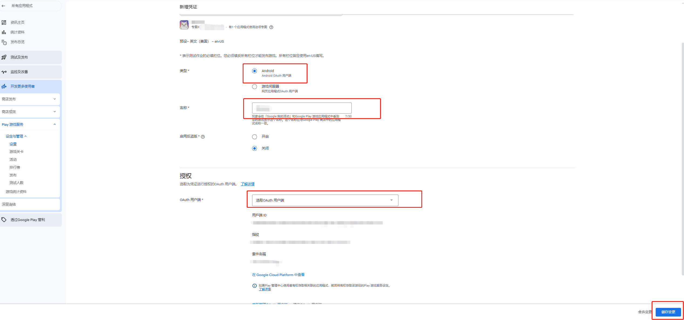
3. Creation Completed
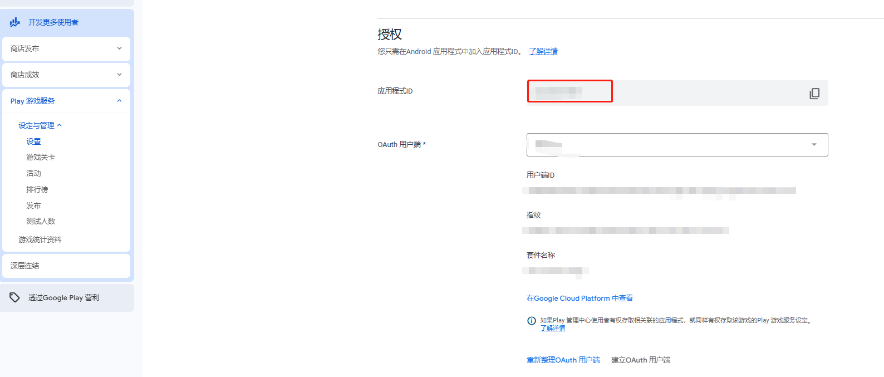
The Application ID highlighted in the red box is what you'll need to fill in below.
4. After building for the Google Play platform, users need to configure the application ID.

For English applications, configure in English:
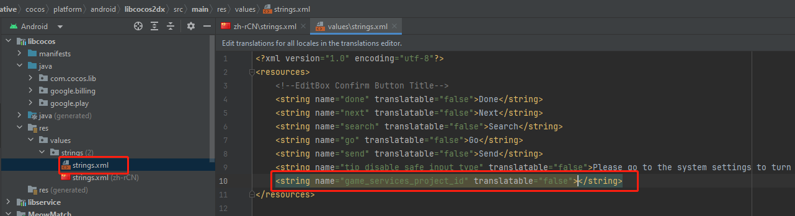
For Chinese applications, configure in Chinese:
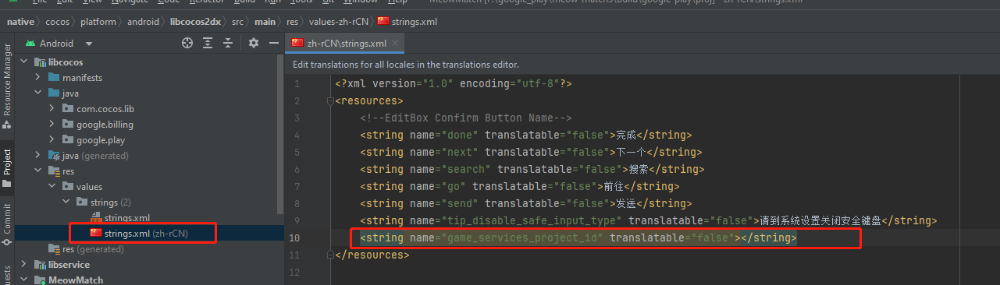

You can configure both English and Chinese simultaneously.

If not configured, you'll see the following error:
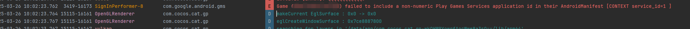

#### Usage Example
1. Initialize SDK:
```typescript
import { google } from 'cc';
// Initialize Play Games SDK
google.play.PlayGamesSdk.initialize();
```

2. Get Login Result
```typescript
    gameSignInClient.isAuthenticated().addOnCompleteListener({
        onComplete: (isAuthenticatedTask: google.play.Task<jsb.AuthenticationResult>) => {
            const isAuthenticated =
                (isAuthenticatedTask.isSuccessful() &&
                isAuthenticatedTask.getResult().isAuthenticated());
            if (isAuthenticated) {
                // Continue with Play Games Services
            } else {
                // Disable your integration with Play Games Services or show a
                // login button to ask  players to sign-in. Clicking it should
                // call GamesSignInClient.signIn().
            }
        },
    });
```

### Achievements
Achievements are an excellent way to increase user engagement in your game. You can implement achievements to encourage players to try features they might not normally use or to play the game in completely different ways. Achievements also allow players to compare their game progress and easily engage in friendly competition.

#### Google Backend Configuration
1. Create Achievement
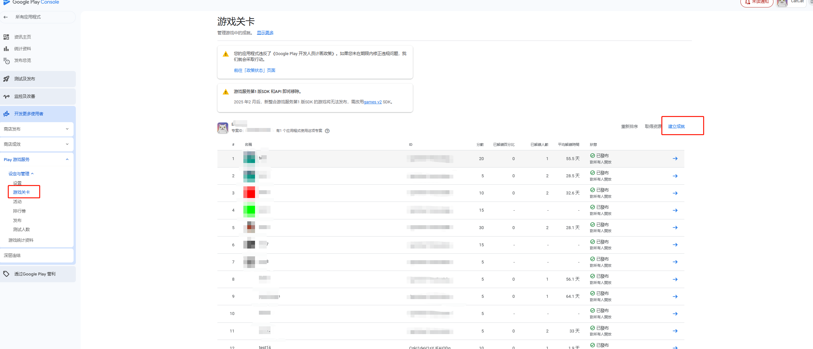
2. Fill in Achievement Information
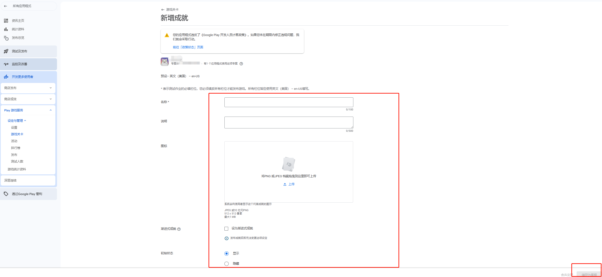
3. Publish Achievement Information
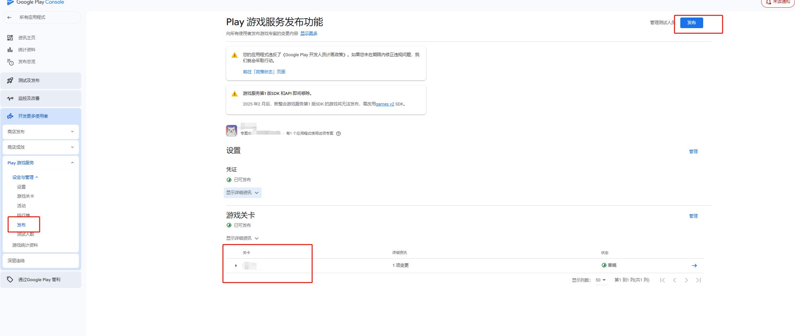

Usage Examples:
1. Display Achievements:
```typescript
import { google } from 'cc';
// Show default achievements interface
google.play.PlayGames.getAchievementsClient().showAchievements();
```
The display effect is shown below:

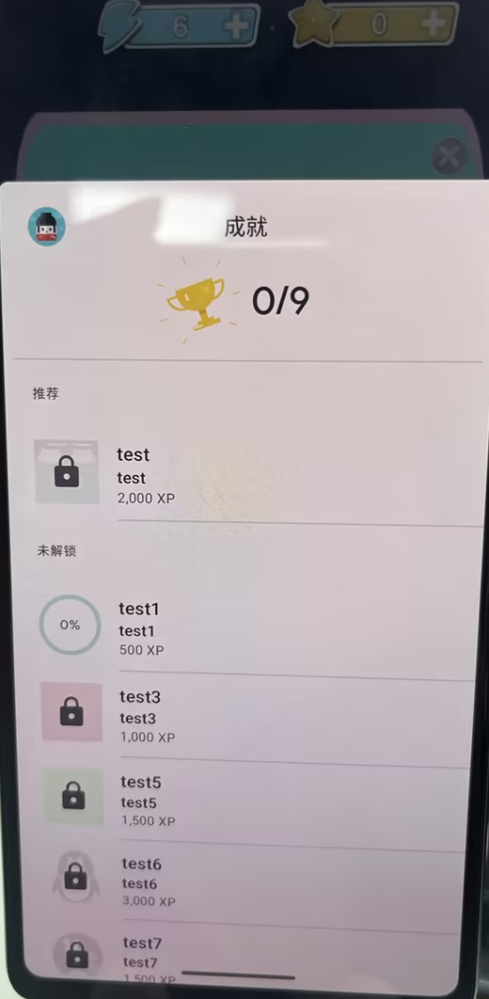

2. Unlock Achievement:
```typescript
import { google } from 'cc';
google.play.PlayGames.getAchievementsClient().unlock("achievementId");
```

If the achievement is incremental (requires several steps to unlock), call AchievementsClient.increment() instead:
```typescript
import { google } from 'cc';
google.play.PlayGames.getAchievementsClient().increment("achievementId", 1);
```
Google Play Games Services will automatically unlock the achievement when the completed steps meet the requirement.

3. Load All Achievement Information:
```typescript
    import { google } from 'cc';
    const achievementsClient = google.play.PlayGames.getAchievementsClient();
    achievementsClient.load(false).addOnSuccessListener({
        onSuccess: (data: google.play.AnnotatedData) => {
            this.addLog("isStale : " + data.isStale());
            const achievements = data.get();
            for(let i = 0; i < achievements.getCount(); ++i) {
                str += `getCurrentSteps : ${achievements.get(i).getCurrentSteps()}\n`;
                str += `getState : ${achievements.get(i).getState()}\n`;
                str += `getTotalSteps : ${achievements.get(i).getTotalSteps()}\n`;
                str += `getType : ${achievements.get(i).getType()}\n`;
                str += `getLastUpdatedTimestamp : ${achievements.get(i).getLastUpdatedTimestamp()}\n`;
                str += `getXpValue : ${achievements.get(i).getXpValue()}\n`;
                str += `getAchievementId : ${achievements.get(i).getAchievementId()}\n`;
                str += `getDescription : ${achievements.get(i).getDescription()}\n`;
                str += `getFormattedCurrentSteps : ${achievements.get(i).getFormattedCurrentSteps()}\n`;
                str += `getFormattedTotalSteps : ${achievements.get(i).getFormattedTotalSteps()}\n`;
                str += `getName : ${achievements.get(i).getName()}\n`;
                str += `getRevealedImageUrl : ${achievements.get(i).getRevealedImageUrl()}\n`;
                str += `getUnlockedImageUrl : ${achievements.get(i).getUnlockedImageUrl()}\n\n`;
            }
            console.log(str);
        } 
    });
```

4. Reveal Hidden Achievement:
```typescript
import { google } from 'cc';
google.play.PlayGames.getAchievementsClient().reveal();
```

### Recall API
To communicate with Google's servers using the correct information, you need to request a Recall session ID from the client SDK and send it to your game server.
```typescript
const recallClient = google.play.PlayGames.getRecallClient();
recallClient.requestRecallAccess().addOnSuccessListener({
    onSuccess: (recallAccess: google.play.RecallAccess) => {
        const recallSessionId = recallAccess.getSessionId();
        // Send the recallSessionId to your game server
    }
})
```