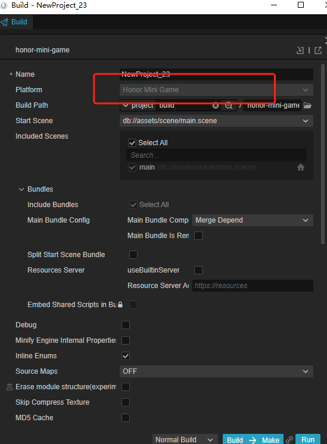
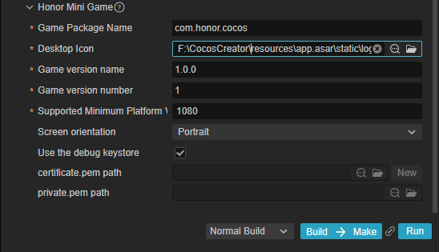
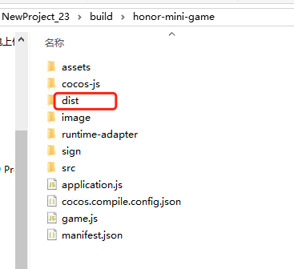
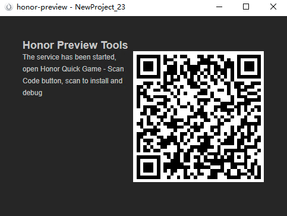
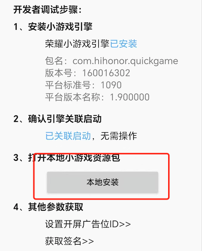

# Publish to Honor Mini Games

Starting from Cocos Creator v3.8.6, games can be published to **Honor Mini Games**.

## Preparation Work

- Refer [Honor Mini Games Integration Guide](https://developer.honor.com/cn/docs/game_center/guides/miniGame/miniGameGuidelines), complete the developer registration process and app creation on the Honor Open Platform.

- Download [Honor Quick Game APP](https://developer.honor.com/cn/docs/game_center/guides/miniGame/miniGameGuidelines#开发+调试指引) and install it on your honor mobile device.

## Build Options

Open the project you want to publish with Cocos Creator, and from the Menu Bar -> Project, open the Build and Publish panel, select Honor Mini Games as the Publish Platform.



General build options can be set according to [General Build Options](build-options.md). The specific build options for Honor Mini Games are as follows:



| Name | Optional | Description | Field name |
| :-- | :-- | :-- | :-- |
| **Game Package Name** | required | such as `com.example.demo` | `package` |
| **Desktop Icon** | required | Click the **search icon** button at the back of the input box to select the icon you want. When building, the **Desktop Icon** will be built into the Honor Mini Game project. It is suggested to use `PNG` images for the **Desktop Icon**. | `icon` |
| **Game Version Name** | required | **Game Version Name** is the real version, such as: **1.0.0**. | `versionName` |
| **Game Version Number** | required |  **Game Version Number** is different from the **Game Version Name**, and the **Game Version Number** is mainly used to distinguish the version update. Each time when you submit audit, the game version number is at least 1 higher than the value of the last submitted audit. It must not be equal to or less than the value of the last submitted audit, and it is recommended that the **Game Version Number** be recursively incremented by 1 each time when the audit is submitted. | `versionCode` |
| **Supported Minimum Platform Version Number** | required | For compatibility checks to prevent incompatibilities from arising when running on lower version platforms after going live. | `minPlatformVersion` |
| **Screen orientation** | - | Device direction, it will be written in `manifest.json`.| `orientation` |
| **Use debug keystore** | - | true | When you check **Use Debug Keystore**, it means that the rpk package built with the certificate that comes with Creator is used by default, and it is only used for **debugging**. when the rpk package is to be used to submit an audit, do not check the **Use Debug Keystore** to build it.| `useDebugKey` |
| **Key certification path** | - | - | The key store certificate, the quick game on the Huawei App Market, must be signed with the release version certificate, and the certificate fingerprint must be configured in the background of the Huawei Developers Alliance. For details, please refer to the following **Generate Signature File** | `privatePemPath`, `certificatePemPath` |

### Generate signature file

If you don't check the **Keystore**, you need to configure the signature files **certificate.pem path** and **private.pem path**, where you build a rpk package that you can **publish directly**. The developer can configure two signature files by using the **search icon** button to the right of the input box.

There are two ways to generate a signature files:

- Generated by the **New** button after the **certificate.pem path** in the **Build** panel.

- Generated by the command line.

    The developer needs to generate the signature file **private.pem**, **certificate.pem** through tools such as **openssl**.

    ```bash
    # Generate a signature file with the openssl command tool
    openssl req -newkey rsa:2048 -nodes -keyout private.pem   -x509 -days 3650 -out certificate.pem
    ```

    > **Note**: **openssl** can be used directly in the terminal in Linux or Mac environment, and in the Windows environment you need to install `openssl` and configure system environment variables. Restart Creator after the configuration is complete.

### Building

After setting the build options in the **Build and Publish** panel, click the **Build and Generate** button.

After completion, click the folder icon button at the bottom left of **Build Task** to open the project's published package. You can see that a `honor-mini-game` folder (subject to the specific build task name) is generated in the default publish path build directory. This folder is the exported Honor Quick Game project directory and rpk, and the rpk package is in the `build/honor-mini-game/dist` directory.



If you need to modify the generated rpk package, after making changes, click the **Generate** button at the bottom right of **Build Task** to regenerate the rpk package without rebuilding.

## Run the rpk

There are two ways to run rpk on your phone:

- **Method One**

    Click the **Run** button in the **Build and Publish** panel and wait for the QR code interface to generate:

    

    Then open the **Quick App** that was installed before on your Android device. Click the **Scan code install** button to scan the QR Code to open the **rpk**.

    

- **Method Two**

    Copy the generated mini game **rpk** file (located in the `dist` directory) to the internal storage directory of the mobile phone.

    Open the **Quick App** that has been installed before on the Android device, click **Local Install**, then find the **rpk** file from the internal storage directory of your mobile phone and select **Open**.

    

## Honor Mini Game Environment Resource Management

The part of honor mini games that exceed the package size limit must be downloaded through the network.

Cocos Creator helps developers to download, cache and manage remote resources. For details, please refer to [Resource Management](../../asset/cache-manager.md).

## Reference documentation

- [Honor Mini Games Integration Guide](https://developer.honor.com/cn/docs/game_center/guides/miniGame/miniGameGuidelines)
- [Honor Quick Game APP](https://developer.honor.com/cn/docs/game_center/guides/miniGame/miniGameGuidelines#开发+调试指引)
