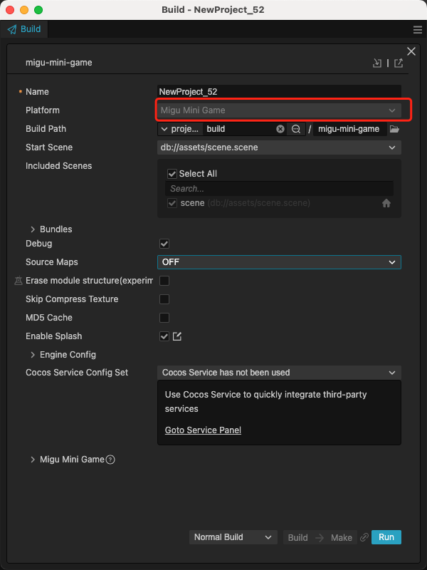
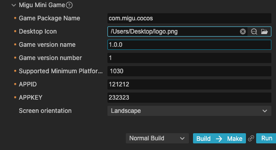
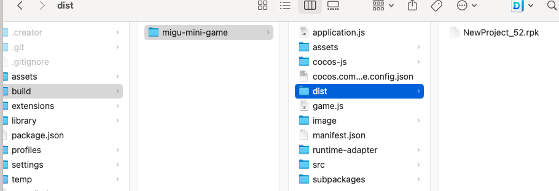

# Publish to Migu Mini Games

## Preparation Work

- Refer [Migu Mini Games Integration Guide](https://open.migufun.com/document/detail?id=640), complete the developer registration process and app creation on the Migu Open Platform.

- Download [Migu Quick Game](https://g.migufun.com/cocosdebugtool) and install it on your mobile device.

- The minimum version required for Migu Quick Game is Android 5.0.

## Build Options

Open the project you want to publish with Cocos Creator, and from the Menu Bar -> Project, open the Build and Publish panel, select Migu Mini Games as the Publish Platform.

General build options can be set according to [General Build Options](build-options.md). The specific build options for Migu Mini Games are as follows:

| Name | Optional | Description | Field name |
| :-- | :-- | :-- | :-- |
| **Game Package Name** | required | such as `com.example.demo` | `package` |
| **Desktop Icon** | required | Click the **search icon** button at the back of the input box to select the icon you want. When building, the **Desktop Icon** will be built into the Migu Mini Game project. It is suggested to use `PNG` images for the **Desktop Icon**. | `icon` |
| **Game Version Name** | required | **Game Version Name** is the real version, such as: **1.0.0**. | `versionName` |
| **Game Version Number** | required |  **Game Version Number** is different from the **Game Version Name**, and the **Game Version Number** is mainly used to distinguish the version update. Each time when you submit audit, the game version number is at least 1 higher than the value of the last submitted audit. It must not be equal to or less than the value of the last submitted audit, and it is recommended that the **Game Version Number** be recursively incremented by 1 each time when the audit is submitted. | `versionCode` |
| **Supported Minimum Platform Version Number** | required | Please refer to [Official Documentation [cn]](https://open.migufun.com/document/detail?id=640) to check the latest version number of Migu engine. | `minPlatformVersion` |
| **APPID** | required | The ID assigned by the Migu Open Cooperation Platform for content, it will be written in `manifest.json`.| `appId` |
| **APPKEY** | required | The Key assigned by the Migu Open Cooperation Platform for content, it will be written in `manifest.json`.| `appKey` |
| **Screen orientation** | - | Device direction, it will be written in `manifest.json`.| `orientation` |

### Building

After setting the build options in the **Build and Publish** panel, click the **Build and Generate** button.

After completion, click the folder icon button at the bottom left of **Build Task** to open the project's published package. You can see that a `migu-mini-game` folder (subject to the specific build task name) is generated in the default publish path build directory. This folder is the exported Migu Quick Game project directory and rpk, and the rpk package is in the `build/migu-mini-game/dist` directory.

If you need to modify the generated rpk package, after making changes, click the **Generate** button at the bottom right of **Build Task** to regenerate the rpk package without rebuilding.

## Run the rpk

Click the **Run** button in the **Build and Publish** panel and wait for the QR code interface to generate.

Then, on the Android device, open the previously installed **Migu Quick Game**, click the **Scan** button in the upper right corner of the **My page**, and scan the QR code to open the rpk directly.

## Migu Mini Game Environment Resource Management

The part of migu mini games that exceed the package size limit must be downloaded through the network.

Cocos Creator helps developers to download, cache and manage remote resources. For details, please refer to [Resource Management](../../asset/cache-manager.md).

## Reference documentation

- [Migu Mini Games Integration Guide](https://open.migufun.com/document/detail?id=640)
- [Migu Quick Game](https://g.migufun.com/cocosdebugtool)
