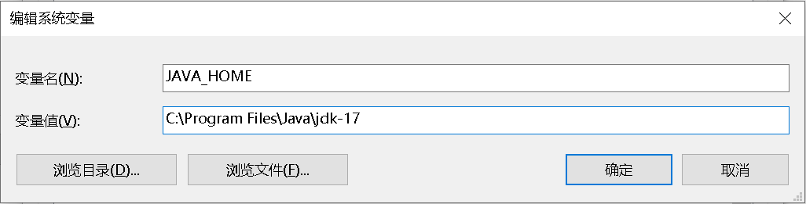

# Setting Up Native Development Environment

Cocos Creator supports building projects into native application projects that comply with different platform specifications. Before building and publishing native applications, developers need to configure the relevant native development environment.

### Download Java SDK (JDK)

Compiling Android projects requires a complete Java SDK toolkit on your development machine. Please download the appropriate installation package matching your operating system and architecture from:

[JDK Development Kit 17.0.7 downloads](https://www.oracle.com/java/technologies/downloads/#java17)

For Windows systems, after installing JDK, you need to add the `JAVA_HOME` system variable to environment variables. Follow these steps: Right-click My Computer -> Properties -> Advanced system settings -> Environment Variables. Add the variable as shown in the following image (variable value is the JDK installation path), then restart your computer for changes to take effect.



To verify Java environment configuration, execute the following command in Mac Terminal or Windows Command Prompt. Successful installation will display version information:

```
java -version
```

If your system uses JRE, install [JAVA SE Runtime Environment](http://www.oracle.com/technetwork/java/javase/downloads/index.html).

> **Note**: [OpenJDK](https://openjdk.org/) and JDK differ only in open-source licenses, with no fundamental differences in functionality or configuration methods.

## Download Android Studio

Different versions of Cocos Creator engine typically support different Android Studio versions. Users can refer to the following version recommendations and download the corresponding IDE from [Android Studio Archive](https://developer.android.com/studio/archive?hl=zh-cn).

| Cocos Creator Version Range | Recommended Android Studio Version |
| :-------------------------- | :--------------------------------- |
| v2.4.12+ or v3.8.0+         | 2022.2.1 or 2022.3.1              |
| v2.4.11- or v3.0.0-3.7.4    | 2020.3.1 or earlier versions      |

## Download Android SDK and NDK

After installing Android Studio, open SDK Manager following the official documentation: [SDK Manager Guide](https://developer.android.google.cn/studio/intro/update.html#sdk-manager).

1. In SDK Platforms tab, select your desired API Levels. Recommended choices include mainstream API Level 26 (8.0), API Level 28 (9.0), etc.
    * [Check Android versions corresponding to API Levels](https://developer.android.google.cn/tools/releases/platforms)
    * [View minimum system versions supported by engine](../../advanced-topics/supported-versions.md)
2. Remember the **Android SDK Location** path shown in the window, which will be used for configuring SDK and NDK paths in Cocos Creator editor
3. In SDK Tools tab, check **Show Package Details** to display different tool versions before installation
4. Under **Android SDK Build-Tools**, select the latest build tools version
5. Check **Android SDK Platform-Tools** and **CMake**. For Android Support Library installation, refer to [Official Documentation - Support Library Setup](https://developer.android.google.cn/topic/libraries/support-library/setup)
6. Select desired **NDK** version. Recommended versions: **r21 ~ 23** to avoid compatibility issues
7. Click **Apply** to install. You can also manage installed tools here later

    

## Install Windows & Mac/iOS Development Environments

- Windows requires [Visual Studio 2019/2022 Community Edition](https://www.visualstudio.com/downloads/download-visual-studio-vs). During installation, select **Desktop development with C++** and **Game development with C++** modules.
- After Visual Studio installation, you can build and publish Windows platform games.

  > **Important**: Do NOT check the **Cocos** option under **Game development with C++** module.

- macOS requires Xcode 14 or later, [Download here](https://apps.apple.com/us/app/xcode/id497799835).
- After Xcode installation, you can build and publish Mac & iOS platform games.

## Configure Android Build Environment Paths

After setting up native build environment, configure development paths in Cocos Creator editor (skip if not building for Android).<br>
From main menu: **Cocos Creator -> Preferences**, open **Program Manager** page to configure:

- **Android SDK**: Enter the `Android SDK Location` path (should contain `build-tools`, `platforms` folders)
- **Android NDK**: Find ndk folder under `Android SDK Location` path. For newer Android Studio versions, this folder contains multiple NDK versions. Enter your downloaded NDK version path in **Android NDK** field

  > **Note**: New Android Studio versions support multiple NDK versions in ndk folder, while older versions store single version in `ndk-bundle`.

    

> **Note**: These configurations apply during native project building. If configuration fails, manually set these environment variables: `NDK_ROOT`, `ANDROID_SDK_ROOT`.

## Troubleshooting Notes

Based on public beta feedback, here are additional potential issues:

1. Package Name Issues

    Verify **Game Package Name** in Build panel. Refer to [Build Options Documentation](./native-options.md#build-options) for platform-specific naming conventions.

2. Android Runtime Error: `dlopen failed: cannot locate symbol "xxxx" referenced by "libcocos.so"...`

    Verify NDK and Android SDK versions match the target device's Android system architecture. Test with NDK/SDK versions specified in this documentation.

3. JDK Version Compatibility

    When upgrading Android Studio and Gradle, ensure JDK version is upgraded to 17 or specified version to maintain compatibility.

If build failures persist, please submit feedback via [Cocos Forum](https://discuss.cocos2d-x.org/c/33) including:
- Cocos Creator version
- Detailed reproduction steps
- Build log from Build panel
- Sample project reproducing the issue
