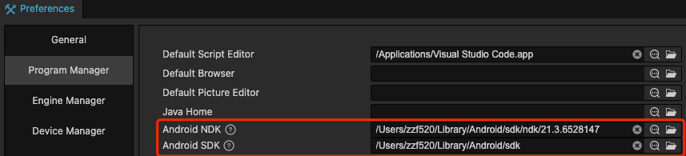

# Setting up Native Development Environment

Projects created with **Cocos Creator** can be published to multiple native platforms. Before publishing, it is necessary to configure native development related environment first.

The document provides specific development environment requirements, and we have verified and ensured the smooth operation within these specified environments. However, please note that we cannot guarantee full functionality outside of the specified environments. If you encounter any issues in non-specified environments, please don't hesitate to reach out to our forum or support channels. Our community is dedicated to assisting you in resolving problems and collecting feedback to improve our documentation and tools.

Please be aware that our support and ability to address issues in non-specified environments may be limited. For the best support and experience, we strongly recommend using the validated environments we have provided.

## Android Platform Dependencies

To publish to the Android platform, it is necessary to install all of the following development environments. If there is no need to publish to the Android platform, or if the operating system already has a full Android development environment, skip this section.

### Downloading the Java SDK (JDK)

Compiling the Android project requires a complete Java SDK tool on the local computer, download it at the following address:

[JDK Development Kit 17.0.7 downloads](https://www.oracle.com/java/technologies/downloads/#java17)

Before downloading, make sure to select the operating system and architecture that matches the machine architecture and operating system. Run the installer after the download is complete.

After the installation is complete, please confirm that the `java` command is valid on the command line. Input the following code into Mac terminal or Windows command line tool to check:

```bash
java -version
```

If `JAVA SE` is displayed, there is no problem. If `JRE` is displayed, then it is necessary to install the [JAVA SE environment](http://www.oracle.com/technetwork/java/javase/downloads/index.html).

On the Windows platform, confirm if `JAVA_HOME` is included in the system environmental variables. By right-clicking the **Computer** icon and choosing **Property -> Advanced system settings -> Environment Variables** to check and modify environmental variables. It may be necessary to restart the system after the changes are made before they take effect on the Windows platform. For details, please refer to the [How do I set or change the PATH system variable?](https://www.java.com/en/download/help/path.xml) documentation.

### Downloading and Installing Android Studio

To use Cocos Creator with the Android platform, you will need to use [Android Studio](https://developer.android.com/studio#downloads) **Flamingo | 2022.2.1** as the build tool. Additionally, you should download the required SDK and NDK packages within Android Studio. 

### Downloading the SDK and NDK required to publish to the Android platform

After installing **Android Studio**, refer to the official documentation and open the **SDK Manager**: [SDK Manager Instructions](https://developer.android.com/studio/intro/update.html#sdk-manager).

1. In the **SDK Platforms** tab page, check the API level you want to install, and it is recommended to select the required mainstream API Level such as `API Level 26 (8.0)`, `API Level 28 (9.0)`, etc.
2. In the **SDK Tools** tab page, first check the lower right corner of the **Show Package Details**, to show the version of the tool selection.
3. In the **Android SDK Build-Tools**, select the latest build tools version.
4. Check the **Android SDK Platform-Tools** and **CMake**. To install the **Android Support Library**, please refer to the official [Support Library Setup](https://developer.android.com/topic/libraries/support-library/setup) documentation.
5. Check the **NDK** and the recommended version is **r21~23**.
6. Take note of the path of **Android SDK Location** on top of the **SDK Manager** window. Later we need to fill in the location of the SDK in **Cocos Creator**.
7. Click **OK** and follow the prompts to complete the installation.


## Installing C++ Compiling Environment

Please install the following runtime environment:

- In Windows, the installation of [Visual Studio 2019/2022 Community Edition](https://www.visualstudio.com/downloads/download-visual-studio-vs) is needed. When installing Visual Studio, please check **Desktop development with C++** and **Game development with C++** two modules.

  > **Note**: there is a **Cocos** option in the **Game development with C++** module. Do **NOT** check it.

- On macOS, the installation of [Xcode] 14.3 (https://developer.apple.com/xcode/download/) and the command-line tools are necessary.

## Configuring Native development environments path

Next, go back to Cocos Creator to configure the environmental path of the native platform. Choose **Cocos Creator/File -> Preferences** in the main menu, and open the **Preferences** panel. We need to configure the following two paths here:



- **Android NDK**: choose the `ndk-bundle` folder in `Android SDK Location` path we just noted in Android Studio SDK Manager window. You can skip this if you don't need to compile on Android platform.

  > **Note**: the new version of Android Studio's NDK can be downloaded in multiple versions, with the previous `ndk-bundle` file name changed to `ndk`. You can select a specific version of the NDK as needed in the `ndk` directory.

- **Android SDK**: choose the `Android SDK Location` path just noted in Android Studio SDK Manager window (the directory of Android SDK should include folders like `build-tools`, `platforms`, etc.). Skip this if there is no need to compile for the Android platform.

After the configuration is complete, Creator will automatically save it.

> **Note**: the configuration will work when building native project. If the configuration not work, please try to set these settings to **System Environment** manually: `NDK_ROOT`, `ANDROID_SDK_ROOT`.

## Notes

We have received lots of feedback about native packing in the public beta, and some possible reasons are supplemented here:

1. Package name issue

    Check the **Game Package Name** in the **Build** panel. Please refer to the [Build Options Description](./native-options.md#build-options) documentation in the corresponding native platform for specific naming conventions.

2. Android built successfully, but prompts `dlopen failed: cannot locate symbol "xxxx" referenced by "libcocos.so"...` in runtime.

    Please check if the architecture and version of NDK and Android SDK correspond to the phone's Android system. In addition try to test with the NDK and Android SDK versions used in this documentation.

3. JDK Version Issue

    After upgrading Android Studio and Gradle versions, it is necessary to upgrade the JDK version to 17 or the specified version. This ensures that your development environment is compatible with the latest Android Studio and Gradle versions.
    
In the end, if build still fails, please send us feedback via the [Cocos Forum](https://discuss.cocos2d-x.org/c/33) with Creator version, detailed reproduction steps, the build log file in the Build panel, and a demo that reproduces the problem.
