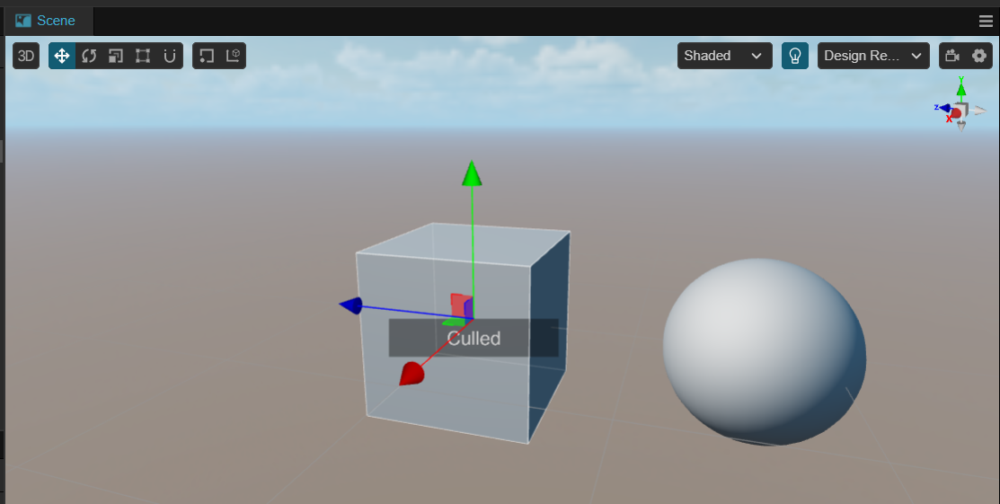
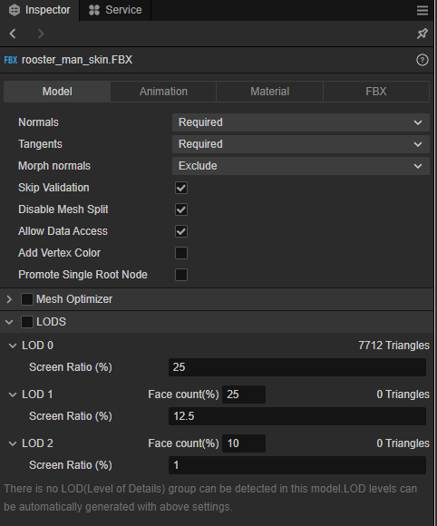
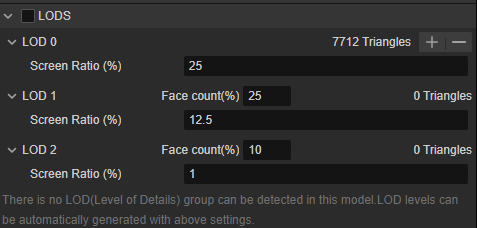

# Level Of Details

Level Of Details (LOD) is a common optimization method used in large-scene development, where the core of LOD is to reduce the display details of distant or unimportant objects to improve rendering efficiency.

The common practice of LOD is to use low-poly for some objects that are far away from the screen or unimportant instead.

To enable LOD in the engine, select the **Add Component** button in the **Inspector** panel and select the **LOD Group** component.


When added, the words **Culled** or **LOD** will be displayed in the scene.



## Properties


The properties of the LOD Group component are described as follows.

| Properties | Description |
| :-- | :-- |
| **Recalculate Bounds** | Recalculate Bounds <br> When this button is clicked, the model bounds for the entire group are recalculated <br> This button calls the `recalculateBounds` interface to recalculate the bounds, which will also effects the **Object Size** property |
| **Object Size** | Bounding box size <br> Calculate the bounding box of the object and take the axis with the largest value in X, Y, Z <br> Clicking the **Reset Object Size** button on the right will reset this property to 1
| **LOD(0 ~ 3)** | LOD. Click the **>** symbol on the left side to expand for configuration, please refer to the figure below for the expanded content.<br> LOD0 indicates the richest display detail <br> LOD2 shows low-poly <br> When the object's screen ratio is less than the **Screen Ratio** value of LOD2, the object will be culled |

Click on any **> LOD(0 ~ 3)** on the **Inspector** panel to expand it and the following image will be displayed.


Its properties and description are as follows.

| Properties | Description |
| :-- | :-- |
| **Screen Ratio(%)** | Screen Ratio [0, 1]。<br> Developers can enter a custom screen ratio in the back input box, or the screen ratio can be calculated automatically with **Apply Current Screen Ratio** <br> When the screen ratio is lower than the currently configured value, LOD will automatically switch to the next level; if there are no more levels, the object will be culled |
| **Apply Current Screen Ratio** | Applying the Current Screen Ratio <br> When pressed, the LOD Group component takes the screen ratio of the current display state as the value of **Screen Ratio (%)** |
| **Mesh Renderers** | Mesh Renderer <br> Please refer to the documentation below for more detailed information |
| **0 Triangle - 0 Sub Mesh(es)** | This property shows the number of triangulated surfaces configured at the current level and the number of their submeshes

### Mesh Renderer Properties

The mesh renderer can be changed by clicking on the  and  buttons below to add or remove actions.

Once added, the node with the mesh renderer within the hierarchy manager can be configured by dragging and dropping the following.


## LOD

Mouse over the right side of the LOD to display the mesh information to show the Add or Remove Levels button.


Clicking on  will add a new LOD to the end of the array.

Clicking on  will delete the LOD currently pointed to by the mouse; after deletion, subsequent LODs are automatically shifted forward.

## Preview

Once you have configured the LOD, you can preview the different levels with the mouse wheel in the scene manager.


As the mouse scrolling changes, the scene camera will gradually pull away, and the level of the LOD will change, if the screen ratio of the current object is lower than the configured screen ratio of LOD2, the scene management system will cull it. The screen will show the current LOD Group's hierarchy status LOD(0~3) or Culled.

## Use of scripts

The developer can obtain the component via the `getComponent` method.

```ts
import { _decorator, Component, Node, LODGroup } from 'cc';
const { ccclass, property, requireComponent } = _decorator;

@ccclass('LOD')
@requireComponent(LODGroup)
export class LOD extends Component {

    lodGroup : LODGroup | null = null;

    start() {
        this.lodGroup = this.node.getComponent(LODGroup);        
    }

    update(deltaTime: number) {
        
    }
}
```

API reference could be found at [LOD Group API](%__APIDOC__%/en/class/LODGroup)

## Art Workflow

In real project development, artists can perform faceting operations in DCC software (Maya, 3D Max, Blender) and export the model.

It is often possible to export multiple models at different levels or add different sub-meshes to the same model to represent different LOD levels.


### Automatic Matching

The LOD Group component automatically matches child meshes or mesh renderers of models exported via DCC software that have multiple child nodes ending in **_lod+[0,N]**.

#### Example of automatic matching

Make sure you have exported the appropriate model according to the rules above.

Import the prepared FBX or glTF file into the engine's **Asset Manager** at


In this case, the asset import system automatically recognizes these nodes and enables LOD Groups for automatic matching.


#### Auto LOD

Since v3.8, we have optimized the LOD when importing models, if the model does not have LOD information, you can find the Model pagination on the **Inspector** panel of the model, find and edit the LOD of the model, check the LOD check box to enable auto LOD.



Mouse over the hierarchy to click / to increase and decrease the level.



- Face count(%): the face count ratio, the ratio of the number of triangular faces of the optimized mesh divided by the number of faces of the original mesh. For example, 25% means 75% original faces will be optimized.
- Screen Ratio: the minimum screen ratio, same as the Screen Ratio property of the LOD component, see above.

Each tier is set up similarly to the LOD component, allowing you to modify the percentage of faces in different tiers.

## Q&A

- Can I add more than one LOD Group?

  Yes. They will work well with each other.

- Can I use LODs within a 2D scene?

    Since LOD Group components only recognize MeshRenderers and 2D or UI components usually don't have MeshRenderers, it doesn't make much sense to do so.
