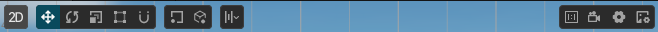
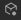
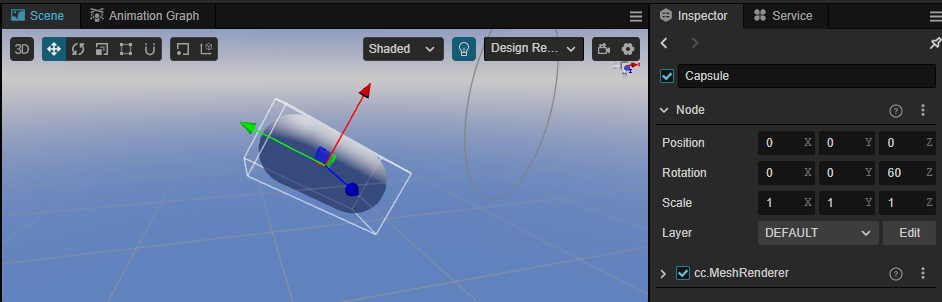
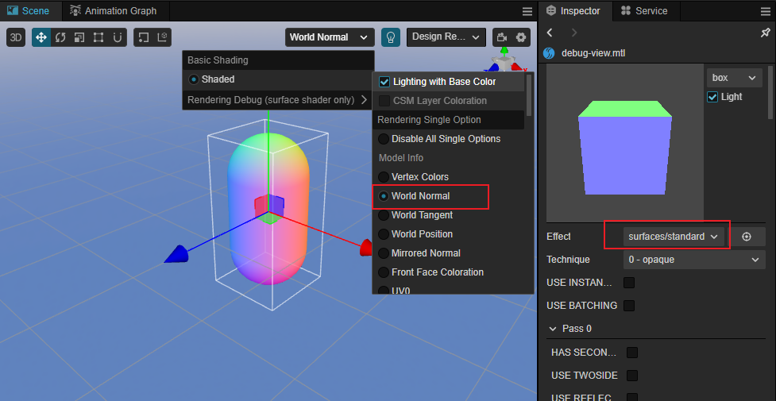
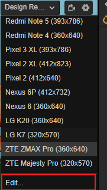
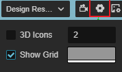

# Scene Panel

The **Scene** panel is the central work area for content creation, used for selecting and placing scene images, characters, effects, UI, and other game elements. This workspace allows to select and modify the position, rotation, and scaling of nodes with the **Transform Gizmos**, and get a WYSIWYG scene preview.

## Menu Bar Introduction

The menu bar at the top of the scene panel is slightly different after switching between 3D and 2D views, see below.

- 3D：

    

- 2D：

    

## View Introduction

The **Scene** panel includes two views, **3D** and **2D**. The 3D view is used for 3D scene editing, while the 2D view is mainly used for editing 2D elements such as UI nodes, etc. The scene view can be switched via the **3D/2D** button in the toolbar at the top left of the editor.

-  Indicates that the current view is **3D** view mode, when the view's camera is of perspective type. Click on it to go to **2D** view.
-  Indicates that the current view mode is **2D**, and the view camera is of orthogonal type at this time, which will return to **3D** view when clicked again.

### 3D view

In the 3D view, you can move and position the view of the **Scene** panel by the following actions:
- Left mouse button + Alt: rotates the view centered on its center point.
- Middle mouse button: pans the view.
- Spacebar + mouse/touchpad drag: pans the view.
- Mouse wheel: zoom the view centered on the view center point.
- Right mouse button + WASD: camera roaming.
- **F** Shortcut: focus the camera on the currently selected node.

### 2D view

In 2D view, the view of the **Scene** panel can be moved and positioned by the following actions:
- Middle mouse button: pans the view.
- Mouse wheel: zooms the view centered on the current mouse hover position.
- Right mouse button: pans the view.
- **F** Shortcut: focus the camera on the currently selected node.

## Transform Tools

The above tools are the transform tools group, responsible for node **moving, scaling, rotating, attaching, anchoring/centering, local/world coordinate system**, etc.

-  Switch the moving gizmo in the current scene to **Move Gizmo**, the shortcut key is <kbd>W</kbd>

    When selecting any node, notice a movement control handle consisting of red, green, and blue arrows and red, green, and blue squares in the center of the node in the **Scene** panel.

    The **control handles** are controllers that can be interacted with by the mouse in a particular editing state in the **Scene** panel. These controllers are only used to assist in editing and will not be displayed while the game is running.

    

    When the Move Gizmo is active:
    - Holding the red/green/blue arrows and dragging the mouse will move the node in the X, Y and Z directions respectively.
    - Holding the red/green/blue square and dragging the mouse will move the node in the Y-Z plane, X-Z plane, X-Y plane, respectively.

-  Switch the gizmo tool in the current scene to **Rotate Gizmo**, the shortcut key is <kbd>E</kbd>

    The handle of the Rotate Gizmo consists of three orthogonal red, green and blue circles (in 2D view it consists of an arrow and a circle). When you drag the mouse on any of the red/green/blue circles, the nodes will rotate around the X, Y and Z axes respectively.

    

    When the mouse hovers over any circle, the circle will be displayed in yellow, click on it to select it, and a yellow arrow will be displayed to indicate which axis the current node is rotated by. Drag any point on the circle to rotate the node, and before releasing the mouse, notice the rotation angle on the control handle.

    

-  Switch the transform gizmo in the current scene to **Scale Gizmo**, the shortcut key is <kbd>R</kbd>

   The scale gizmo consists of three axes with red, green and blue squares at the head and a gray square at the center. When the mouse is hovered over any of the squares, it appears yellow and can be selected and dragged by clicking on.

    - Holding the red/green/blue square and dragging the mouse will scale the node in the X, Y and Z axis directions respectively.
    - Dragging the mouse on a gray square will scale the node in X, Y, and Z directions at the same time.

    

-  Switch the transform tool in the current scene to **Rect Gizmo** with the shortcut key <kbd>T</kbd>.

    The Rect Gizmo consists of four vertex control points, four edge control points, and one center control point which is only valid for UI Components.

    

    When the Rect Gizmo is active:
    - Dragging either vertex control point of the control handle can modify both the `Position` property of the UI node and the `ContentSize` property in the UITransform component while keeping the position of the diagonal vertices unchanged.
    - Dragging either side of the control handle modifies both the `Position` (`X` or `Y` property) of the UI node and the `ContentSize` property (`width` or `height` property) of the UITransform component, while keeping the position of the opposite side unchanged.
    - Dragging the center control point of a control handle allows to modify both the `Position` property of the UI node and the `AnchorPoint` property of the UITransform component while keeping the size of the UI node unchanged.

    In the layout of UI elements, it is often necessary to use the **Rect Gizmo** to directly control the position and length of the node's four edges precisely. For image elements where the original image aspect ratio must be maintained, the Rect Gizmo is not usually used to resize.

-  **Incremental snap tool**, click this button and **Incremental snap configuration** will appear, please refer to **Incrase Snap Configuration** section below for details.
-  The transform gizmo control point is used to set the position of the gizmo and to control the orientation of the handles.

    -  Pivot: the transform gizmo will be displayed in the location of the 2D object **AnchorPoint** or in the 3D object's **world coordinate system**.
    -  Center: the transform gizmo will be displayed at the center of the node. If multiple nodes are selected at the same time, the center of all nodes will be displayed.
-  Toggle transformation tool gizmo is **local** coordinate system or **world** coordinate system.

    -  Local: the control handle of the transform gizmo is based on the direction of rotation of the node, as follows:

        

    -  Global: the direction of the control handles in the transform gizmo is based on the world coordinate system, and is not affected by the node rotation, as follows:

        

## Increment Snap Configuration

The incremental snap tool mainly consists of **Increment Snap Configuration** and **Rect Tool Snap Configuration**.

### Increment Snap Configuration

The increment snapping feature can be used to manipulate nodes in a set step size when using the move/rotate/scale transform tools in the scene editor. The increment snapping feature can be triggered in the following two ways:

1. Press and hold the <kbd>Ctrl/Command</kbd> key while using transform tools to trigger the increment snapping feature.
2. In the increment snapping configuration panel, use the button to enable the automatic snapping feature of corresponding transform tools. See below for details.

Click on the fifth **Increment Snapping configuration** button in the toolbar in the upper left corner of the editor's main window, the increment snapping configuration panel will pop up, which can be used to set the step size of corresponding transform tools, and enable the auto snapping feature:

| Button | Description |
| :-- | :-- |
| | This button is used to set whether to enable the automatic snapping when using the **Move Transform Tool**. X, Y, and Z are used to set the move steps on the X, Y, and Z axes respectively, and the default X, Y, and Z values are the same for X, or you can click the  button to set the step size for each axis separately.  |
| | This button is used to set whether to enable automatic snapping when using the **Rotation Transform Tool**. The box on the right side is used to set the rotation step, the default is 1. |
| | This button is used to set whether to enable automatic snapping when using the **Scale Transform Tool**. The box on the right side is used to set the rotation step, the default is 1.   Please note that the scale snap is a factor not an absolute value |

### Rect Tool Snap Configuration

When using the **Rect Tool Snap Configuration**, the Smart Alignment feature is enabled by default. When dragging UI elements around the scene and encountering elements that can be aligned, the alignment reference line will be displayed and automatically attached to the reference line position.

| Option | Description |
| :-- | :-- |
| Enable auto snap | Check this option to enable the Smart Alignment feature, which is enabled by default. |
| Snap threshold | Set the threshold value for adsorption detection (world space unit). |

## Alignment and Distribution

This tool is unique to the 2D view and is used for 2D/UI multi-node alignment and distribution functions.

- Alignment: Align selected nodes, at least two nodes need to be selected for the alignment to take effect

    

    In order from left to right, the menus are as follows:

    - Align Top
    - Align Vertical Center
    - Align Bottom
    - Align Left
    - Align Horizontal Center
    - Align Right

   The handling process of alignment is as follows: After selecting one or more nodes, the AABB for all selected nodes will be calculated via current **un-parent** nodes(This means if there is a parent-child relationship in the selected nodes, then only the parent node will be taken into consideration), and when clicking the Align Bottom button, all nodes will be put at the bottom of the AABB, and when clicking the Align Left button, all nodes will be put to the left side of the AABB.

- Distribution: Used to evenly distribute multiple selected nodes, at least three nodes are required for this to take effect

    

    The buttons in order from left to right are as follows:

    - Distribute Top
    - Distribute Vertical Center
    - Distribute Bottom
    - Distribute Left
    - Distribute Horizontal Center
    - Distribute Right

## Adsorption operation

In the 3D view, objects in the scene can be edited more accurately through adsorption. Two new adsorption modes have been added to the engine **Vertex Adsorption** and **Surface Adsorption**.

- **Vertex Adsorption**: The main purpose of vertex adsorption is to align more precisely through a vertex on one object to a certain vertex on another object. The shortcut is <kbd>v</kbd>
- **Surface Adsorption**: for objects with colliding bodies, surface adsorption will adsorb to the surface of the colliding body; and for objects without colliding bodies, it will adsorb to the surface of the object. The shortcut is<kbd>Ctrl/Command</kbd> + <kbd>Shift</kbd>

Operation process.
- Select the model model you want to move in **Hierarchy** panel
- Press the corresponding shortcut key in the scene, a white control block will appear below the model
- Hold down the left mouse button and drag the control block to move the model
- Move the mouse, during the movement, the object will move depending on the type of adsorption operation
- Release the left mouse button to determine the position of the object

## Shaded Mode

 It is mainly used to configure the way the scene is drawn. Clicking on it will display the shading configuration window.

Supports both basic shading mode and **Rendering Debug**.

By default, the base shading mode mode is used. To debug the scene, slide the mouse over the **Rendering Debug** menu (currently only the [Surface Shader](../../shader/surface-shader.md#Debug%20View)) is supported) to select a different debugging mode.

To demonstrate the use of **Rendering Debug** using **World Normal** as an example.

- Select the engine's built-in Surfaces/standard shader in the **Shader** property of the Material **Property Inspector**.
- Select the item to be debugged in the **Rendering Debug** drop-down menu
- Observe whether the rendering results in the view are as expected

## Render output target resolution setting

 The rendering output target resolution of the scene camera can be selected as needed, which will affect the viewing range of the scene camera and facilitate a similar display to the resolution selected in the final preview.

The resolution can be added/modified/deleted in the [Device Manager](../preferences/index.md#Device%20Manager)  of **Preferences** in the top menu bar to add/modify/delete resolutions.

The resolution can also be edited by scrolling down to the bottom:

## Scene lighting settings

 The button is mainly used to set whether to use the scene lights when doing scene editing, the default is to use.

If the button is shown in blue, it means that the scene lights are used and the scene will be illuminated with the lights added in the scene, as follows:

When there are no lights added to the scene, the scene is completely black, making it inconvenient to edit.

At this point, the button can be switched to black, indicating that no scene lights are used and the editor will automatically create a hidden directional light aligned with the scene camera view to illuminate the scene, as shown in the following figure.

## View Camera

Click on the  button in the right corner to set the properties of the scene camera (not the user-created camera).

| Options | Description |
| :-- | :-- |
| Fov | Field of view of the camera |
| Far |  The far clipping distance of the camera, should be as small as possible within acceptable range |
| Near  |  The near clipping distance of the camera, should be as large as possible within acceptable range |
| Color | The Clear Color of the camera  |
| Wheel Speed  | Set the speed at which the scene camera moves back and forth when the mouse wheel is scrolled |
| Wander Speed | Set the movement speed of the scene camera when wandering |
| Wander Acceleration |Set whether to enable acceleration when the camera wanders (new in v3.3) If this is checked, acceleration is enabled and the camera will move faster and faster If this is unchecked, the camera will move at a constant speed. |

For the description of camera viewing range, please refer to [Camera component](../components/camera-component.md)。

## Reference Image

Click the  button in the top right corner of the **Scene Editor** to open the **Reference Image** panel, which is mainly used as a cross-reference for developers when stitching together UI in the **Scene Editor**.

| Options | Description |
| :-- | :-- |
| Add | Add a UI reference image, multiple reference images can be added. |
| Delete | Deletes the UI reference image in the currently selected box. |
| Position X | The selected UI reference image is displayed in the X-axis position of the scene. |
| Position Y | The selected UI reference image is displayed on the Y-axis of the scene |
| Scale X | Scale on X-axis of the selected UI reference image |
| Scale Y | Scale on Y-axis of the selected UI reference image |
| Opacity | The transparency of the selected UI reference image in the scene |

### Grid Configuration

The grid in the scene is an important reference for the position of the scene elements when we place them, and can be set via the button at the top right of the **Scene Editor** at.

| Options | Function Description |
| :-- | :-- |
| 3D Icons | Whether the scene is 3D icon enabled or not, the input box after it is used to set the size of the icon Gizmo, the value range is 0 ~ 8.  If you check this box to enable 3D icons, the icon Gizmo in the **Scene Editor** will be a 3D slice with a near-large and far-small effect. If this item is unchecked, the icon Gizmo will be displayed as a fixed size image. |
| Show Grid | Whether to show the grid in **Scene Editor**, the color setting box behind is used to set the color of the grid. |

## Scene Gizmo

Scene Gizmo is in the upper right corner of the scene view, it shows the viewing direction of the current scene camera, and you can quickly switch between different viewing angles by clicking it.

- Click on the 6 directional axes to quickly switch to the top, bottom, left, right, front, and back angles to view the scene.
- Click the center cube to switch between orthogonal view and perspective view.

### Select node

Click the left mouse button in the scene view to select the node where the object is located. Selecting the node is a prerequisite for using transform gizmos to set the node position, rotation, scaling, etc.

### Multiple selection operation

Pressing the left mouse button and dragging the mouse within the scene will simultaneously review all the nodes within the current box selection range, and through the transform gizmos, you can batch transform the selected nodes.

### Gizmo operation introduction

The core function of **Scene** panel is to edit and arrange the visible elements in the scene in a WYSIWYG way. **Gizmos** are mainly used to assist in the visual editing of the scene.

- [Toolbar](../toolbar/index.md)
- [Camera Gizmo](./camera-gizmo.md)
- [Collider Gizmo](./collider-gizmo.md)
- [Particle System Gizmo](./particle-system-gizmo.md)
