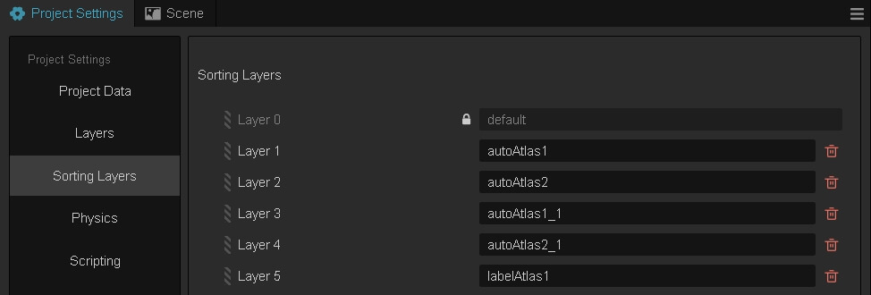
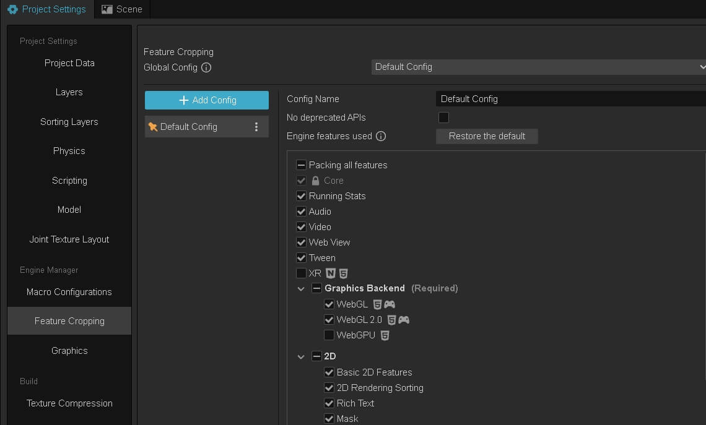
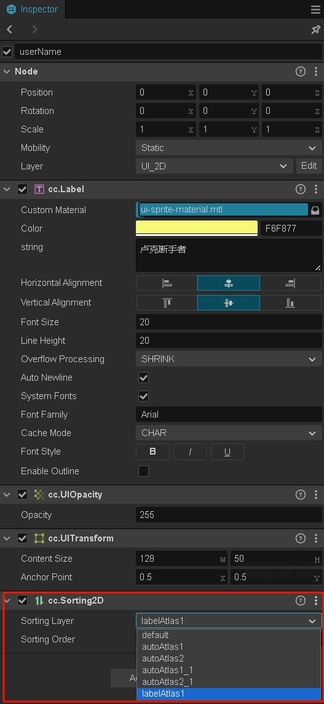

# 2D Rendering Sorting Component

The Sorting2D component allows customizing the rendering order of 2D objects without affecting the original node hierarchy. It can help solve the issue of increased DrawCalls caused by adjacent render objects using different materials.


## Sorting2D Properties

| Property | Description |
| :-------------- | :----------- |
| sortingLayer | Sets the sorting layer for render objects. [**Modify project's sorting layer configuration**](../../editor/project/index.md#sorting-layers). Lower layers are rendered first. Default layer is "Default". |
| sortingOrder | Sets the order of render objects within the same sorting layer. Objects with lower values are rendered first. If values are equal, nodes with lower hierarchy are rendered first. |

**Note**: When recursively collecting render elements from a 2D node tree encounters a Mask renderer, it will use custom sorting rules to render the recorded 2D UI, reset the render state, recollect render elements, and continue using custom sorting rules for the remaining 2D UI after collection is complete.

## Optimization Example

1. Configure sorting layers in your project

    

2. Enable the `2D Rendering Sorting` module in `Project Settings -> Feature Cropping`

    

3. Add Sorting2D component to 2D UI nodes and set sorting layers and orders.

    

4. Build the project, run and observe optimization results

    * Before optimization
    

    * After optimization
    

## Modifying Sorting2D Component's Layer and Order in Code

```typescript
import { _decorator, Component, find, Node, settings, Sorting2D } from 'cc';
const { ccclass, property } = _decorator;

const sortingLayers = settings.querySettings("engine", "sortingLayers");
const default_layer = sortingLayers[0].value;
const autoAtlas_1_layer = sortingLayers[1].value;
const autoAtlas_2_layer = sortingLayers[2].value;
const autoAtlas_1_1_layer = sortingLayers[3].value;
const label_layer = sortingLayers[4].value;

@ccclass('NewComponent')
export class NewComponent extends Component {

    start() {
        var testNode = find("Canvas/test");
        if (testNode) {
            this.changeUISortingLayer(testNode, autoAtlas_1_layer, 0);
        }
    }

    changeUISortingLayer(sortingNode: Node, sortingLayer: number, sortingOrder?: number) {
        if (sortingNode.getComponent(Sorting2D)) {
            sortingNode.getComponent(Sorting2D).sortingLayer = sortingLayer;
            if (sortingOrder !== undefined) {
                sortingNode.getComponent(Sorting2D).sortingOrder = sortingOrder;
            }
        }
    }
}
```

## API Reference and Examples

[Sorting2D API](https://docs.cocos.com/creator/3.8/api/en/class/Sorting2D)

[Sorting2D Demo](https://github.com/cocos/cocos-test-projects/tree/v3.8.7/assets/cases/ui/other/sorting2D)
