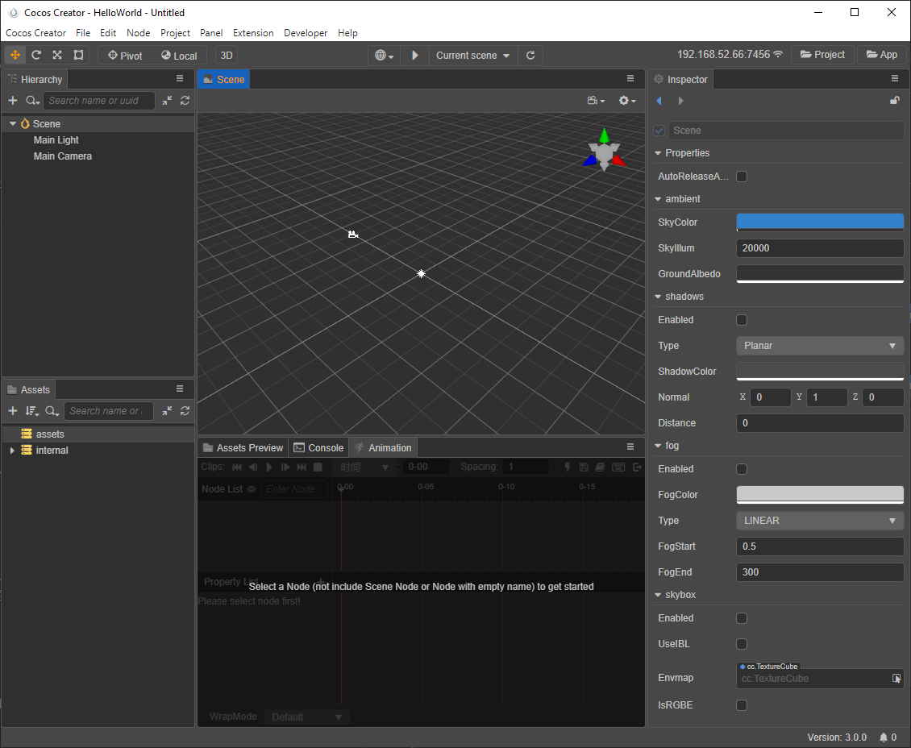
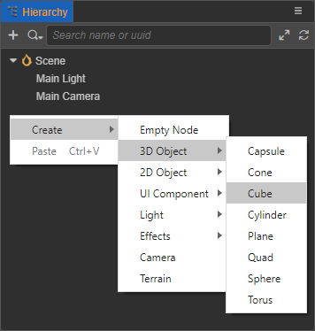
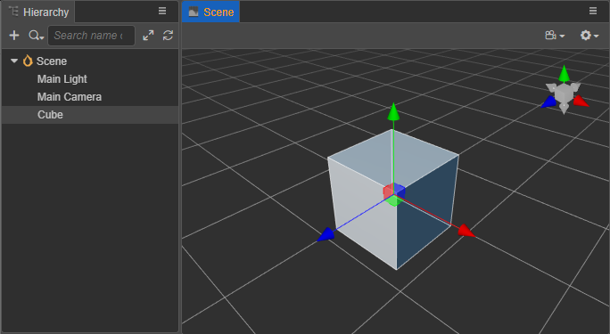
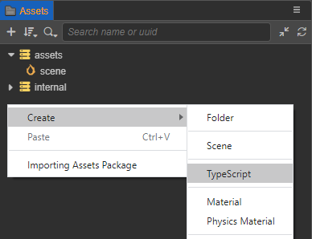
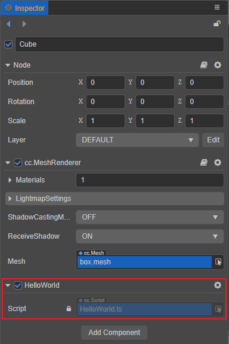
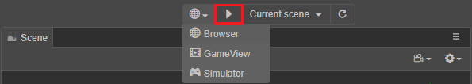
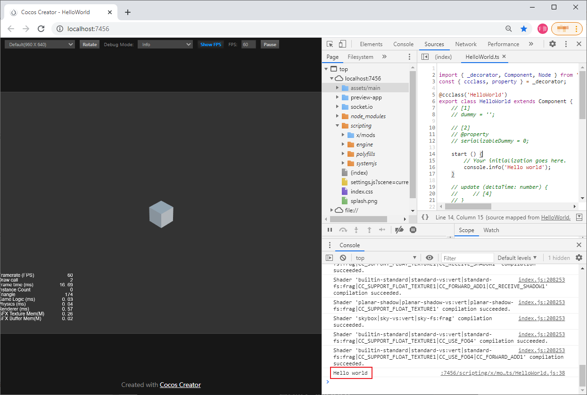
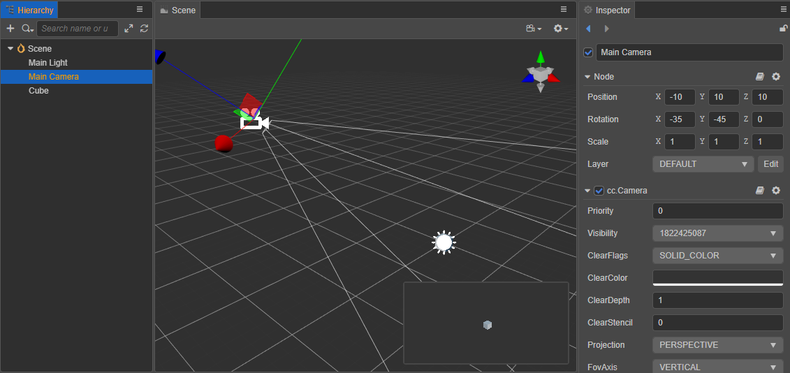
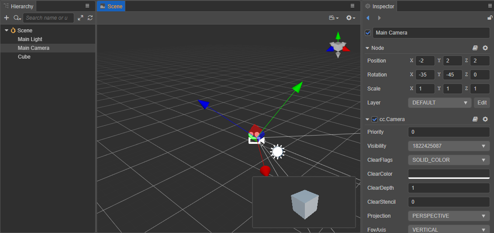
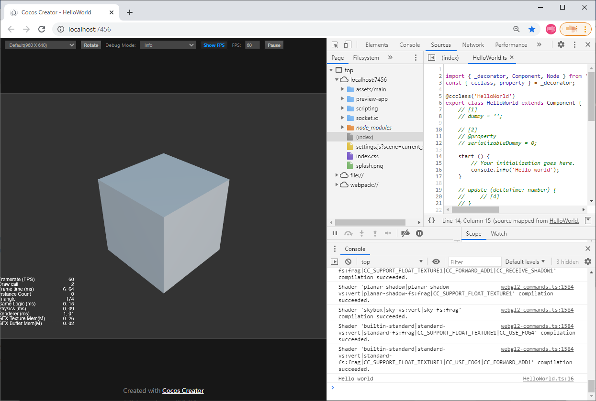

# Hello World Project

It's time to create and open the **Hello World** project.

Before we starts, please make sure you have read the [Install and Launch](../install/index.md), installed the Cocos Dashboard, and the newest Cocos Creator editor.

## Creating a new project

In the **Project** tab of Cocos Dashboard, click the **New** button in the bottom right corner to enter the **New Project** page. Select the **empty** project template, set the project name and project path


Then click the **Create and open** button at the bottom right to automatically create a project with an empty project template and open.



- **Assets**: shows all the assets in the project's assets folder (`assets`).
- **Scene**: working area for displaying and editing the visual content in the scene.
- **Hierarchy**: shows all nodes in the scene and their hierarchical relationships in a tree list, all content seen in the **Scene** panel can be found in the **Hierarchy** panel with corresponding node entries
- **Inspector**: working area for viewing and editing the properties of the currently selected node and its components
- **Assets Preview**: Selecting an asset in the **Assets** panel displays a thumbnail of the asset in the **Assets Preview** panel. If the folder where the asset is located is selected, the thumbnails of all assets under the folder can be displayed for easy viewing.
- **Animation**: used to create some less complex animations that need to be linked with logic, such as UI animations.
- **Console**: used to display error reports, warnings or other log messages generated by the editor and engine.

For more information about the various editor panels, please refer to [Editor Panels](../../editor/index.md).

## New Scene Creation

Right-click in the **Assets** panel at the bottom left and select **Create -> Scene**.


Alternatively, you can create a new scene in the `asset` directory in the **Assets** panel by clicking the **+** button in the upper left corner and selecting **Scene**.


## Creating Objects

In the **Hierarchy** panel on the top left, right-click and select **Create -> 3D Object -> Cube**. Or you can just click the **+** button in the top left corner and select **3D Object -> Cube Cube**.



A cube will be created and displayed in the **Scene** panel:



## Adding Scripts

- Create a new script

  Right click in the **Assets** panel, select **Create -> TypeScript**, and name it "HelloWorld" to create a new script in the `asset` directory of **Assets** panel.

  

- Adding code

  Double-click the new script and it will be automatically opened in the script editor, provided that you specify the script editor in the editor menu bar under **Cocos Creator/File -> Preferences -> Program Manager -> Default Script Editor**.

  Then add the `start()` function to the script. The `start()` function will be called when the component is activated for the first time and will output "Hello world".

  ```ts
  import { _decorator, Component, Node } from 'cc'; const { ccclass, property } = _decorator;

  @ccclass('HelloWorld')
  export class HelloWorld extends Component {
      /* class member could be defined like this */
      // dummy = '';

      /* use `property` decorator if you want the member to be serializable */
      // @property
      // serializableDummy = 0;

      start () {
          // Your initialization goes here.
          console.info('Hello world');
      }

      // update (deltaTime: number) {
      // // Your update function goes here.
      // }
  }
  ```

- Binding Scripts

  Select the created Cube node in the **Hierarchy** panel and click **Add Component -> Custom Script -> HelloWorld** at the bottom of the **Inspector** panel to mount the script to the Cube node. Alternatively, you can drag and drop the script directly into the **Inspector** panel.

  

  > **Note**: remember to save the scene after setting it up.

## Previewing the Scene

Once the simple scene setup is done, you can click the **Play on Device** button on top of the editor to preview the game. Currently, previewing is supported using **Browser/Simulator**.



Using the **Browser** preview as an example, Cocos Creator will run the current game scene with your default browser, as shown in the following image.



Notice the output "Hello World" in the log message in the developer tools of the browser.

## Modifying the Camera in the Scene

In the preview we can see that the cube seems a bit too small, so we can adjust the area of the scene by adjusting the Camera in the scene, which represents the player's perspective in the game.

- First, select the **Main Camera** node in the **Hierarchy** panel, and the **Scene** panel will display the transformation tool Gizmo and a small window with the player's perspective.

  

- Then drag the Gizmo in the **Scene** panel or modify the **Position** property in the **Inspector** panel to make the cube in the player's view window more visible.

  

- Then preview it again in the browser and you can see that the cube in the scene is now obvious.

  
