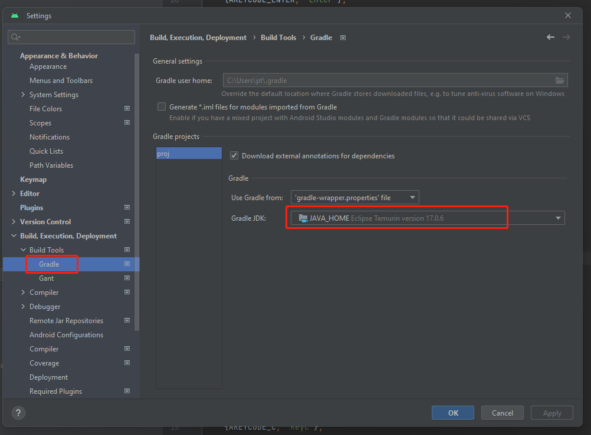

# Upgrading Android Project to v3.8

Starting from version 3.8, the Android project generated by the build supports the new version of Android Studio (Flamingo | 2022.2.1) by default. Due to the [requirement of the Android Gradle plugin](https://developer.android.com/studio/releases#jdk-17), developers need to upgrade their JDK to version 17 and also upgrade Android Studio to the Flamingo version.

> If the Android project generated by the build is not configured, you can directly delete the `native/engine/android` directory and `build/android`directory, and then rebuild it. This avoids the need for step-by-step modifications and upgrades to the project. However, please note that this step is risky, and developers need to understand the consequences.

For existing native Android projects, developers can follow the steps below to upgrade their projects:

## Step 1: Backup the Current Project

Before proceeding with the upgrade, it is important to backup the current native directory in case of any issues. For example, you can use Git to save the current modifications.

## Step 2: Upgrade Gradle Plugin Version

The Gradle plugin version acts as the interface between Gradle and the Android build system. Therefore, before upgrading Gradle, we need to upgrade the Gradle plugin version. In the project's `native/engine/android/build.gradle` file, change the Gradle plugin version in the classpath to 8.0.2.

```diff
         // jcenter() // keeped as anchor, will be removed soon
     }
     dependencies {
-        classpath 'com.android.tools.build:gradle:4.1.0'
+        classpath 'com.android.tools.build:gradle:8.0.2'

         // NOTE: Do not place your application dependencies here; they belong
         // in the individual module build.gradle files
```

## Step 3: Update Package Field

Remove the package attribute from the `native/engine/android/app/AndroidManifest.xml` file.

```diff
<?xml version="1.0" encoding="utf-8"?>
 <manifest xmlns:android="http://schemas.android.com/apk/res/android"
-    package="com.cocos.test"
     android:installLocation="auto">

     <uses-permission android:name="android.permission.INTERNET"/>
```

Based on the diff file below, edit `native/engine/android/app/build.gradle` and change `applicationId` to `namespace`.

```diff
     compileSdkVersion PROP_COMPILE_SDK_VERSION.toInteger()
     buildToolsVersion PROP_BUILD_TOOLS_VERSION
     ndkPath PROP_NDK_PATH
+    namespace APPLICATION_ID

     compileOptions {
         sourceCompatibility JavaVersion.VERSION_1_8
@@ -17,7 +18,6 @@ android {
     }

     defaultConfig {
-        applicationId APPLICATION_ID
         minSdkVersion PROP_MIN_SDK_VERSION
         targetSdkVersion PROP_TARGET_SDK_VERSION
         versionCode 1
```

### Step 4: Upgrade Gradle Version

Next, we need to upgrade the Gradle wrapper version. In the project's `build/android/proj/gradle/wrapper/gradle-wrapper.properties` file, change the distributionUrl to 8.0.2 as shown below:

```properties
distributionUrl=https\://services.gradle.org/distributions/gradle-8.0.2-bin.zip
```

## Step 5: Update Proguard Rules

Add the following code to file `native/engine/android/app/proguard-rules.pro`

```
# This is generated automatically by the Android Gradle plugin.
-dontwarn android.hardware.BatteryState
-dontwarn android.hardware.lights.Light
-dontwarn android.hardware.lights.LightState$Builder
-dontwarn android.hardware.lights.LightState
-dontwarn android.hardware.lights.LightsManager$LightsSession
-dontwarn android.hardware.lights.LightsManager
-dontwarn android.hardware.lights.LightsRequest$Builder
-dontwarn android.hardware.lights.LightsRequest
-dontwarn android.net.ssl.SSLSockets
-dontwarn android.os.VibratorManager
```

## Step 6: Install JDK 17

Download and install JDK 17 from the [official website](https://www.oracle.com/java/technologies/downloads/). During the installation process, make sure to configure the environment variables.

Once the installation is complete, you can verify if it was successful by running `java -version` in the command line.

## Step 7: Upgrade Android Studio

After upgrading Gradle, we also need to upgrade Android Studio. If you are currently using an older version of Android Studio, please download the latest version of Android Studio (Flamingo | 2022.2.1) from [https://developer.android.com/studio](https://developer.android.com/studio).

Once the download is complete, open Android Studio and import your project. Android Studio will automatically detect the required Gradle version for your project and prompt you to upgrade. Follow the prompts to complete the upgrade of Android Studio.

If you encounter the error report below when compiling in Android Studio,

you can refer to the following screenshot to modify the JDK 17 used by Gradle in the settings.


After completing the above steps, you can also perform a build by using the build panel.