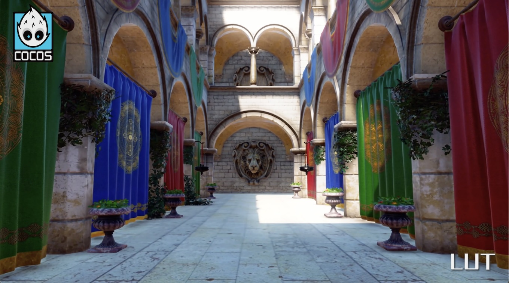

# Render Pipeline Overview

RenderPipeline is used to control the rendering process of a scene, including light management, object culling, rendering object sorting, and rendering target switching. Since each stage can have different optimization methods for different projects, it is difficult to achieve the most optimized results with a unified method for handling the rendering processes of different types of projects. A customizable render pipeline is used for more flexible control over each stage of the rendering scene, allowing for deeper optimization solutions tailored to different projects.

Since Cocos Creator 3.8.4, there are two sets of render pipelines: the new render pipeline and the legacy render pipeline.

## New Render Pipeline

Cocos Creator 3.8.4 introduces a brand-new customizable render pipeline, CRP - Customizable Render Pipeline.

The new customizable render pipeline mainly includes the following benefits:

1. In Cocos Creator 3.8.4 and above, the engine's built-in render pipeline is based on the CRP pipeline, making the engine's built-in pipeline and the user's custom pipeline have the same rendering mechanism and process, with stronger compatibility and stability.
2. Based on the CRP pipeline, developers can write rendering processes compatible with all platforms without modifying the engine's source code.
3. Based on the CRP pipeline, developers can customize rendering processes according to the project's needs, remove unnecessary rendering processes, save overhead, and improve performance.
4. Based on the RenderGraph rendering architecture in the CRP pipeline, developers can easily reuse and add rendering processes to achieve the advanced rendering effects and post-effects required by the project.

Related documentation is as follows:

- [Using Built-in Render Pipeline](./use-builtin-pipeline.md)
- [Using Post-Processing Effects](./use-post-process.md)
- [Writing a Render Pipeline (Advanced)](./write-render-pipeline.md)

## Legacy Render Pipeline

The legacy render pipeline, which started from Cocos Creator 3.0, is a set of render pipeline built based on the traditional rendering architecture.

It includes forward rendering and deferred rendering. It does not support custom rendering processes and post-effects.

The legacy render pipeline will be removed in the next major version. It is recommended that everyone use the new render pipeline in new projects.

Related documentation is below:

- [Built-in Render Pipeline - Legacy](./builtin-pipeline.md)
- [Custom Render Pipeline - Legacy](./custom-pipeline.md)
- [Post-Effects - Legacy](./post-process.md)

## Compatibility Mechanism Between New and Legacy Render Pipelines

1. New projects created in Cocos Creator 3.8.4+ default to use the new pipeline.
2. If an old project did not use a custom pipeline, it will use the lagecy render pipeline after upgrading.
3. If an old project used a custom pipeline, it will use the new render pipeline after upgrading.
