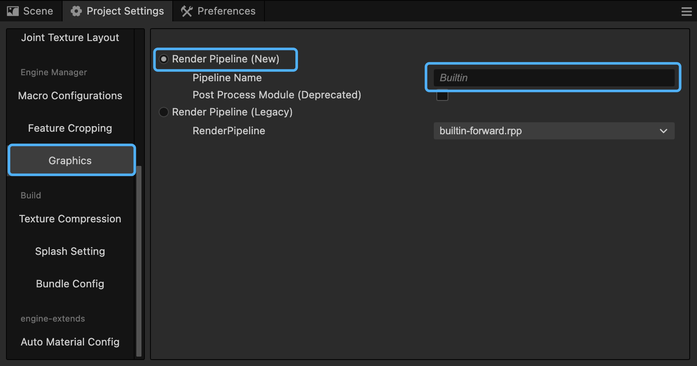
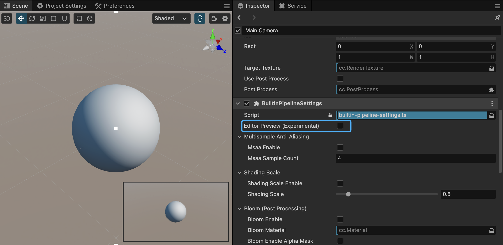

# Using the Built-in Render Pipeline

Select the **New Render Pipeline** in the Project menu -> Project Settings -> Graphics Settings.

The default render pipeline is the built-in render pipeline named **Builtin**.

## Built-in Render Pipeline

The built-in render pipeline (Builtin) is an implementation based on the CRP - Customizable Render Pipeline, providing basic cross-platform rendering capabilities suitable for all platforms.

The current built-in render pipeline supports the following features:

- Forward rendering
- Multisample Anti-aliasing (MSAA)
- Real-time shadows
- Post-processing, including (Bloom, Color Grading, FXAA, FSR, etc.)

It can meet almost all the needs of conventional projects.

## BuiltinPipelineSettings Component

Each camera in the scene is rendered in order and output to the screen or render texture.

We can add a `BuiltinPipelineSettings` component to each camera node to set up the rendering for that camera.

Through this component, we can control the camera's output behavior and post-effects.

> For user's custom render pipelines, it is recommended to copy the source code of this component into the project and modify it as needed.

## Editor Preview (Experimental)

When the `Editor Preview (Experimental)` is checked, you can directly preview the rendering effects in the scene editor.

Since scene rendering may include post-effects, previewing in the editor may have performance impacts, and some editor effects may display abnormally.

## Using Post-Processing Effects

For the configuration and use of post-processing effects, please refer to the document: [Using Post-Processing Effects](./use-post-process.md)

## Code Location

The implementation of the built-in render pipeline is located at `editor/assets/default_renderpipeline/builtin-pipeline.ts`.

The `BuiltinPipelineBuilder` class implements the main functionalities of the built-in pipeline.
