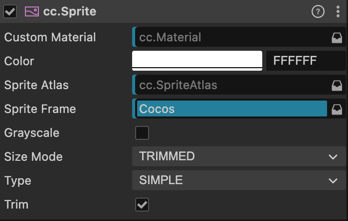
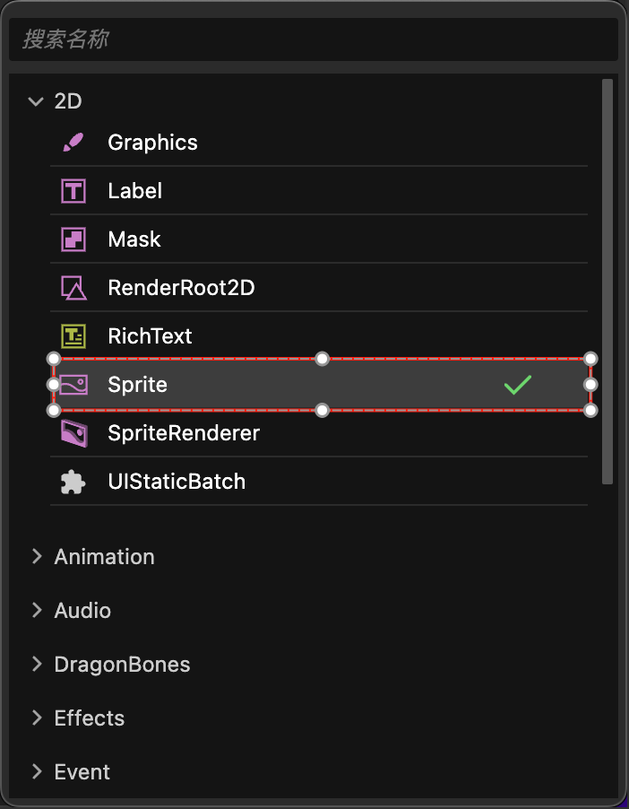

# Sprite Component Usage Example

A Sprite is typically a 2D image rendering component that reads texture colors from image resources to render game backgrounds or UI elements. Follow these steps to quickly create a game background displaying image colors in a scene:

1. **Add a Sprite**: Add a child node to a node that already has a Canvas component in the scene. Set this child node's Layer property to `Layers.Enum.UI_2D`, then add a Sprite component to this child node.

2. **Add spriteFrame**: Set a SpriteFrame type resource from the Asset Manager as the Sprite component's spriteFrame property to render the game background color.

3. **Add Solid Color spriteFrame**: To create a solid color background (e.g., cyan background), use the default_sprite_splash.png SpriteFrame resource from the default_ui folder in the internal built-in resource library as the Sprite component's spriteFrame.

4. **Modify Sprite Node Size**: After adding a SpriteFrame type resource to the Sprite component's spriteFrame property, the Sprite component will read the width and height values of the spriteFrame resource and set them to the node's UITransform component's contentSize property. When the Sprite component's Size Mode is Trimmed or Raw, it will use the spriteFrame resource's dimensions as the node's size, overriding the node's original size. If the Size Mode property is Custom, it will not change the node's dimensions.

5. **Modify Sprite Color**: If the Sprite's spriteFrame property is not empty, modifying the Sprite component's color property will change the Sprite component's final display color.

## Manually Adding Sprite Components in the Editor

Click the **Add Component** button on the node's **Property Inspector**, then select **2D/Sprite** to add a Sprite component to the node. At this point, the Sprite component's spriteFrame property is empty and cannot display any image. Developers need to manually add any SpriteFrame type resource to the spriteFrame property for rendering.

## Sprite Properties

| Property | Description |
| :-------------- | :----------- |
| CustomMaterial | Custom material. For usage, refer to [Custom Materials](../engine/ui-material.md) |
| Color | Image color |
| Sprite Atlas | The atlas to which the Sprite's displayed image resource belongs (refer to [Atlas](../../../asset/atlas.md)). |
| Sprite Frame | The [SpriteFrame image resource](../../../asset/sprite-frame.md) used to render the Sprite. |
| Grayscale | Grayscale mode. When enabled, the Sprite will be rendered in grayscale. |
| Size Mode | Specifies the Sprite's size: **Trimmed**: Uses the original image resource's dimensions after trimming transparent pixels **Raw**: Uses the original image's untrimmed dimensions **Custom**: Uses custom dimensions. When the user manually modifies the **Size** property, **Size Mode** will automatically be set to **Custom** unless specified as one of the previous two modes. |
| Type | Rendering mode, including Simple, Sliced, Tiled, and Filled. For details, refer to the **Rendering Modes** section below. |
| Trim | Whether to render transparent pixel areas around the original image. For details, refer to [Automatic Cropping of Image Resources](../engine/trim.md) |

After adding the Sprite component, drag a SpriteFrame type resource from the **Asset Manager** to the **SpriteFrame** property reference to display the resource image through the Sprite component.

If the dragged SpriteFrame resource is part of an Atlas resource, the Sprite's **Atlas** property will also be set automatically.

**To dynamically replace SpriteFrame, first dynamically load the image resource and then perform the replacement. For details, refer to [Acquiring and Loading Resources: Dynamic Loading](../../../asset/dynamic-load-resources.md#loading-spriteframe-or-texture2d).**

## Rendering Modes

The Sprite component supports the following rendering modes:

- `Simple Mode`: Renders the Sprite based on the original image resource. In this mode, we generally do not manually modify the node's dimensions to ensure the image displayed in the scene matches the proportions of the image produced by the artist.

- `Sliced Mode`: The image is divided into a 9-slice grid and scaled according to specific rules to adapt to freely set dimensions (`size`). Typically used for UI elements or to save game resource space by creating 9-slice images that can be infinitely enlarged without affecting image quality. For details, read the [Creating 9-Slice Images with the Sprite Editor](../engine/sliced-sprite.md#-) section.

- `Tiled Mode`: When the Sprite's size increases, the image is not stretched. Instead, it repeats according to the original image's size, tiling the entire Sprite like tiles.

  

- `Filled Mode`: Draws part of the original image based on the origin and fill mode settings, following a certain direction and proportion. Often used for dynamic displays like progress bars.

<!-- - `Mesh Mode`: Requires using **TexturePacker 4.x** or higher and setting the polygon algorithm to pack plist files to use this mode. -->

### Filled Mode

After selecting Filled mode for the **Type** property, a new set of properties becomes available for configuration:

| Property | Description |
| :-------------- | :----------- |
| Fill Type | Fill type selection: **HORIZONTAL** (horizontal fill), **VERTICAL** (vertical fill), and **RADIAL** (radial fill). |
| Fill Start | Normalized value for the fill start position (0 ~ 1, representing the percentage of total fill). When selecting horizontal fill, setting **Fill Start** to 0 starts filling from the leftmost part of the image. |
| **Fill Range** | Normalized value for the fill range (also 0 ~ 1). Setting it to 1 fills up to the entire original image range. |
| **Fill Center** | Fill center point. This property can only be modified when `RADIAL` fill type is selected. Determines which point on the Sprite the radial fill will revolve around. |
<!-- The coordinate system used is the same as [Anchor Points](../content-workflow/transform.md#-anchor-). -->

#### Additional Notes on Fill Range

For **HORIZONTAL** and **VERTICAL** fill types, the value set by **Fill Start** affects the total fill amount. If **Fill Start** is set to 0.5, even with **Fill Range** at 1.0, the actual filled range will only be half the total size of the Sprite.

In **RADIAL** type, **Fill Start** only determines the starting direction of the fill. When **Fill Start** is 0, filling starts from the positive x-axis direction. **Fill Range** determines the total fill amount, with a value of 1 filling the entire circle. Positive **Fill Range** values fill counterclockwise, while negative values fill clockwise.

#### API Documentation

For the component interface of images, refer to [Sprite API](%__APIDOC__%/en/class/Sprite).

### Example Demo

For usage examples, see the **Sprite** sample ([GitHub](https://github.com/cocos/cocos-test-projects/tree/v3.8/assets/cases/ui/01.sprite) | [Gitee](https://gitee.com/mirrors_cocos-creator/test-cases-3d/tree/v3.8/assets/cases/ui/01.sprite)).
