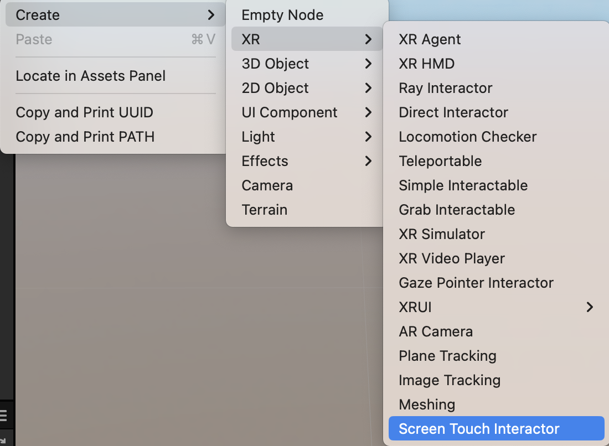

# AR Interaction

AR interaction is mainly driven by the `cc.ScreenTouchInteractor` component, which converts touch events into gestures such as tap, drag, and pinch. The interactor passes these gestures to interactive virtual objects, triggering corresponding behaviors.

## Gesture Interaction

The AR gesture interactor component converts screen touches into gestures. Cocos Creator's input system passes gesture signals to interactive objects, which respond to gesture events by transforming their behaviors. To enable interactive behaviors, the interactive objects must be bound with the `cc.Selectable` component. For a detailed description of the properties of this component, see the [XR Component - Selectable](component.md#Selectable).

To use the **Screen Touch Interactor**, right-click in the Hierarchy and create **XR -> Screen Touch Interactor**.

Create a 3D object of your choice (using a Cube as an example).

Modify the `scale` property of the Cube to (0.1, 0.1, 0.1), making it an actual size of 1000cm³. Modify the `position` property to (0, -0.1, -0.5), placing it 50cm away from the origin in space and 10cm below, and add the **XR > Interaction -> Selectable** component.

Next, let's create a selection effect.

In the `Assets` folder, create a prefab named "Selected Visualizer".

Under the root node of the prefab, create another Cube object with the same properties, but set the `scale` to 1.2 times based on the parent node.

Create a new material to highlight the selected state.

Adjust the material settings. It is recommended to select "builtin-unlit" for the `effect` and "1-transparent" for the `technique`.

After creating the material, apply it to the `cc.MeshRenderer` of the Cube in the prefab to complete the selection effect.

Finally, apply the prefab to the `Selected Visualization` property of the `cc.Selectable` component.

During runtime, you can move, rotate, and scale the virtual object by combining gestures.

## Placement

When using the **Screen Touch Interactor**, the AR hit test capability is enabled. It calculates the collision between the touch position on the screen, converted to the camera's coordinates, and the AR plane using Ray Cast. This way, it obtains the position of the collision point and places virtual objects in that position. The objects that can be placed must be equipped with the [`cc.Placeable` component](component.md#Placeable).

Using the previously created selectable object as an example, let's give it the ability to be placed.

Select the Cube object in the scene and add the **XR -> Interaction -> Placeable** component to it.

Drag this scene node into the Assets panel to generate a prefab, then delete the Cube object in the scene.

Drag this scene node into the Assets panel to generate a prefab, then delete the Cube object in the scene.

Refer to the newly generated Cube prefab in the **Screen Touch Interactor -> Place Action > Placement Prefab** property. Set the `Calculation Mode` to `AR_HIT_DETECTION`.

The placement calculation relies on `AR planes`, so we need to create a `Plane Tracking` node to request the device to activate the plane detection capability of the AR SDK. Right-click in the Hierarchy panel and create **XR -> Plane Tracking** to create the plane agent node.

Once all the work is done, you can build and publish the project to see the placement effect during runtime.

