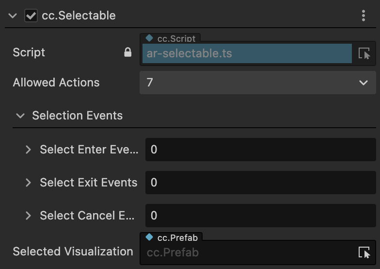
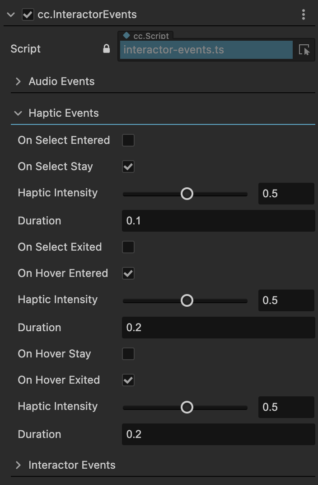

# XR Components

Cocos CreatorXR empowers entities through the combination of components, and different functional systems manage entities based on their different characteristics. Therefore, all XR-related features in Cocos Creator are driven by encapsulated XR components.

The functional components in Cocos CreatorXR consist of five main parts:

- [Device Mapping](#device-mapping-components)
- [Interaction Component](#interaction-components)
- [Interaction Constraint](#interaction-constraint-components)
- [Virtual Movement](#virtual-movement-components)
- [XR UI](#xr-ui)

After enabling the xr-plugin extension, you can add XR-related functional components to objects in the scene by clicking the **Add Component** button in the Inspector. In the component list that appears, navigate to the XR category and select the desired XR component, and then select the corresponding component under that category.

## Device Mapping Components

This component is mainly used to synchronize input/output information between physical devices in the real world and agent nodes in the virtual world. It ensures consistency between user interactions on XR devices and feedback in the virtual world.

The main components are as following:

### TrackingOrigin

| Property                 | Description                                                         |
| -------------------- | ------------------------------------------------------------ |
| Offset Object        | Specifies the object to be vertically offset. If the selected object has child objects, the offset will be applied to the selected object and all its child objects vertically. |
| Tracking Origin Mode | The mode of tracking offset. When "Unbond" or "Device" is selected, the YOffsetValue will appear below for manually inputting the value. When "Floor" is selected, the YOffsetValue is hidden. If "Floor" is selected and the device has boundary settings enabled, the current viewpoint height will be determined by the distance of the device from the floor (currently only supported by Quest 2). If "Device" is selected, the offset height will be the input value. |
| YOffset Value        | The value of the device offset. Manually input the offset value in meters. The default value is 1.36144m. If it is a fixed value, the Y value of the Transform property of the selected OffsetObject will be set to the entered value. |

### HMDCtrl

HMD (Head Mounted Display) controller is responsible for handling the head-mounted display devices. It can be considered as the general category for XR glasses devices that have the capability of rendering stereoscopic images. This component defines the parameters related to the rendering output for XR glasses.

| Property           | Description                                                         |
| -------------- | ------------------------------------------------------------ |
| Per Eye Camera | Enable per-eye rendering. When checked, the "Sync With Main Camera" option appears below. The two sub-nodes, LeftEye and RightEye, under XR HMD, transition from hidden to visible. |
| IPDOffset      | Adjust the inter-pupillary distance (IPD). When selecting "Manual" from the drop-down list, the OffsetValue input field appears below. When PerEyeCamera is enabled, adjusting the Manual parameter will change the Transform property's X value for LeftEye and RightEye (with a change of ±IPDOffset/2). |

### PoseTracker

PoseTracker is a component for tracking the position and orientation of an object.

| Property            | Description                                                         |
| --------------- | ------------------------------------------------------------ |
| Tracking Source | Select the tracking source device.                                        |
| Tracking Type   | Tracking mode. Select "POSITION_AND_ROTATION" to track both position and rotation of the device, "POSITION" to track only the position, or "ROTATION" to track only the rotation. |

### TargetEye

Specifies the target eye.

| Property       | Description                                                         |
| ---------- | ------------------------------------------------------------ |
| Target Eye | Specifies the target eye for rendering. "Both" displays for both left and right eyes, "Left" displays for the left eye, and "Right" displays for the right eye. |

### XRController

Abstract component for controllers.

| Property                 | Description                                     |
| -------------------- | ---------------------------------------- |
| InputDevice          | Binds the input device to the controller.                       |
| SelectAction         | Maps the "Select" action to a button on the controller.   |
| ActivateAction       | Maps the "Activate" action to a button on the controller. |
| UIPressAction        | Maps the UI press action to a button on the controller.   |
| AxisToPressThreshold | The threshold for triggering the action.                         |
| Model                | Specifies the model object for the controller.                 |

### ARCameraMgr

Properties for the mobile handheld device camera in AR.

| Property                     | Description                                                         |
| ------------------------ | ------------------------------------------------------------ |
| Auto Focus               | Enable or disable the camera's auto-focus function. When disabled, fixed-focus mode is used. The availability of auto-focus depends on the device's camera. |
| Light Estimate（Experimental） | When enabled, it estimates the ambient light properties at runtime and adjusts the scene lighting in real-time to provide consistent lighting between virtual and real objects. |

> **Note**: Starting from version 1.2.0, light estimation supports two modes: Basic and HDR

To enable the Basic mode, set the `Envmap` property of the Skybox in the scene to LDR.

To enable the HDR mode, set the `Envmap` property of the Skybox in the scene to HDR.

> **Note**: Currently, the Basic mode is only supported on iOS platforms.

## Interaction Components

An interaction operation requires coordination between two objects: the interaction subject and the interactable object. Correspondingly, the interaction components can be divided into two categories: **Interactor** and **Interactable**.

### RayInteractor

RayInteractor is a component for ray-based interaction.

| Property                     | Description                                                         |
| ------------------------ | ------------------------------------------------------------ |
| AttachTransform          | The position used as the final position where the grabbed object will be placed. If empty, the position of the current Interactor is used. |
| ForceGrab                | Enables long-range grabbing. When enabled, the grabbed object adheres to the Attach Transform, and when disabled, it grabs the position attached to the interaction point. |
| RayOriginTransform       | Allows changing the starting position from which the ray is cast. If empty, the current Interactor's position is used by default. |
| LineType                 | Changes the ray detection and ray style. "StraightLine" is a straight line, "Projectile Line" is a projectile curve, and "BezierLine" is a Bezier curve. |
| MaxRayDistance           | The maximum distance at which the ray interaction can be triggered.                                   |
| ReferenceNode            | Appears when LineType is set to "ProjectileLine" or "BezierLine". Defines the reference frame for the curve, including the ground plane and the up vector. If not set at startup, it will attempt to find the XR Agent, and if no reference is provided, it will default to the global up vector and origin. |
| Velocity                 | Appears when LineType is set to "ProjectileLine". Initial velocity. Increasing this value extends the curve further. |
| Acceleration             | Appears when LineType is set to "ProjectileLine". Gravity acceleration.             |
| Additional Ground Height | Appears when LineType is set to "ProjectileLine". Additional height below the ground plane. If the ray goes below the ground, it continues to be projected downward. Increasing this value lowers the height of the endpoint. |
| Additional Flight Time   | Appears when LineType is set to "ProjectileLine". Additional flight time after landing. If the ray goes below the ground, it continues to be projected downward. Increasing this value extends the flight time of the projection. |
| End Point Distance       | Appears when LineType is set to "BezierLine". Increasing this value moves the endpoint of the curve further from the starting point. |
| End Point Height         | Appears when LineType is set to "BezierLine". Decreasing this value lowers the endpoint of the curve relative to the starting point. |
| Control Point Distance   | Appears when LineType is set to "BezierLine". Increasing this value moves the peak of the curve further from the starting point. |
| Control Point Height     | Appears when LineType is set to "BezierLine". Increasing this value makes the peak of the curve higher relative to the starting point. |
| Sample Frequency         | Appears when LineType is set to "ProjectileLine" or "BezierLine". The number of sample points used to approximate the curve path. A higher number of samples provides better approximation but lower performance. |
| RaycastMask              | Only interacts with objects of this layer type.                        |
| SelectActionTrigger      | Selects the action trigger mechanism for the Select behavior. See the interaction functionality section for details.                    |

> **Note**: The functionality of projectile curves and Bezier curves requires the extended version >= v1.1.0 and the Cocos Creator version >= 3.7.1.

### DirectInteractor

DirectInteractor is a component for direct interaction.

| Property                | Description                                                         |
| ------------------- | ------------------------------------------------------------ |
| AttachTransform     | The position of the AttachTransform is used as the final position where the grabbed object will end up. If it is empty, the current Interactor's position is used instead. |
| SelectActionTrigger | Select action trigger mechanism. See the interaction functionality for details.                   |

### XRGazeInteractor

GazeInteractor allows interaction with objects (UI) by gazing at them with the center point of the HMD when there are no controllers or other input devices available. After gazing for a certain period, the interaction behavior is triggered.

| Property                    | Description                         |
| ----------------------- | ---------------------------- |
| Gaze Pointer Offset     | Vertical offset of the gaze point (in meters). |
| Max Ray Distance        | Maximum distance for ray projection (in meters).   |
| Gaze Default Distance   | Default distance of the gaze point from the UI (in meters).   |
| Gaze Timer Duration     | Duration (in seconds) for the gaze interaction to be triggered.   |
| Gaze Reticle Outer Ring | Outer ring UI of the gaze point.          |

> **Note**: GazeInteractor requires an extension version of >= v1.1.0 and Cocos Creator version of >=3.7.1.

### **ScreenTouchInteractor**

ScreenTouchInteractor is a component for screen gesture interaction.

| Action          | Property              | Description                                                         |
| ------------- | ----------------- | ------------------------------------------------------------ |
| Select Action |                   | Configuration for the select action, which controls whether it is enabled.                          |
|               | Gesture           | Optional gesture type for user interaction with virtual objects.                |
|               | Double Tap Gap    | Appears when Gesture is set to DoubleTap. Determines the maximum time gap between two taps for them to be considered a double tap. |
|               | HoldTouchDuration | Appears when Gesture is set to HoldTouch. Determines the minimum duration of touch for it to be considered a hold. |
| Move Action   |                   | Configuration for the move action, which requires Select Action to be enabled and controls whether it is enabled.    |
|               | Gesture           | Gesture associated with the move action.                                        |
| RotateAction  |                   | Configuration for the rotate action, which requires Select Action to be enabled and controls whether it is enabled.    |
|               | Gesture           | Gesture associated with the rotate action.                               |
|               | Drag Degree       | Appears when Gesture is set to 2FingersDrag. Determines the rate at which the object is dragged using two fingers.       |
|               | Twist Degree      | Appears when Gesture is set to 2FingersRotate. Determines the rate at which the object is rotated using two fingers.      |
| Scale Action  |                   | Configuration for the scale action, which requires Select Action to be enabled and controls whether it is enabled.   |
|               | Gesture           | Gesture associated with the scale action.                |
|               | Sensitivity       | Sensitivity of the scaling action.                   |
| Place Action  |                   | Configuration for the place action, which controls whether it is enabled.       |
|               | Gesture           | Gesture associated with the place action.               |
|               | Calculation Mode  | Method used to calculate the placement point when placing virtual objects. There are three modes: - AR_HIT_DETECTION: Uses AR Hit Test to detect the placement point and places the object at that location. - SPATIAL_DISTANCE: Places the object at a fixed distance in front of the screen interactor. - COLLISION_DETECTION: Uses raycast collision detection to determine the placement point and places the object at that location. |
|               | Distance          | Appears when Calculation Mode is set to SPATIAL_DISTANCE. Sets the distance between the interaction point and the object placement. |
|               | Avoid Occlusion   | Appears when Calculation Mode is set to SPATIAL_DISTANCE. Controls whether the object placement is affected by occlusion within the specified distance. When enabled, the object is placed at a fixed position regardless of occlusion. When disabled, if there is occlusion within the specified distance, the object is placed at the occluded position. |
|               | Located Prefab    | Appears when Calculation Mode is set to SPATIAL_DISTANCE. Specifies the prefab used for locating the placement position of the virtual object. |
|               | Placement Prefab  | Reference to the prefab with the Placeable component attached.            |

**Note**:

1. ScreenTouchInteractor requires an extension version of >=v1.1.0 and an editor version of >=3.7.1. The toggle functionality for each gesture action requires an extension version of >=v1.2.0.
2. Double-finger gesture input is not supported on the WebXR platform.

### GrabInteractable

The GrabInteractable component allows an object to be grabbed and interacted with.

| Property                      | Description                                                         |
| ------------------------- | ------------------------------------------------------------ |
| AttachTransform           | The position of the AttachTransform is used as the final position where the grabbed object will end up. If it is empty, the current position of the node is used instead. |
| AttachEaseInTime          | The duration in seconds for the object to be eased into the AttachTransform position. During this time, the grabbed object will have a trailing effect that becomes less prominent as the duration increases. |
| GrabTrigger               | Specifies when the grab action should be triggered: On Select action trigger or On Activate action trigger. |
| RayReticle                | The object referenced by this property will be displayed at the collision point when the interactor interacts with this interactable object. |
| HideController            | When enabled, the XR Controller's model will be hidden when the object is grabbed.   |
| ThrowOnDetach             | When enabled, allows simulating a throwing action when the object is detached.              |
| ThrowSimulationMode       | Determines how the throwing velocity is calculated when ThrowOnDetach is enabled: - InheritRigidbody: The velocity of the Rigidbody component is inherited when throwing the object. - CurveComputation: Allows customizing the calculation of the throw velocity using the ThrowSmoothingDuration and ThrowSmoothingCurve properties. |
| ThrowSmoothingDuration    | The duration in seconds used as the sampling interval for calculating the weighted average velocity of the object before it is thrown. This value is used as the initial velocity of the object when thrown. |
| ThrowSmoothingCurve       | The curve used for velocity sampling. The weighted average velocity is calculated based on the drawn curve. |
| ThrowVelocityScale        | The coefficient for the initial velocity. A higher value increases the instantaneous velocity of the throw, multiplying the inherited or calculated initial velocity by a factor. |
| ThrowAngularVelocityScale | The coefficient for the initial angular velocity. A higher value increases the instantaneous angular velocity of the throw, multiplying the inherited or calculated initial angular velocity by a factor. |

### Teleportable

The Teleportable component allows an object to be teleported.

| Property                 | Description                                                         |
| -------------------- | ------------------------------------------------------------ |
| TeleportableType     | The type of teleportation point: Area or Anchor. When set to Area, the object is teleported to the interaction point where the ray intersects with the teleportation area. When set to Anchor, the object is teleported to a fixed position within the teleportation area, independent of the interaction point. |
| Teleport Anchor Node | This property appears when TeleportableType is set to Anchor. It is used to specify the teleportation destination. If it is empty, the object is teleported to the default central area of the teleportation area. If it references another object, the object is teleported to the position of the referenced object. |
| RayReticle           | The object referenced by this property will be displayed at the collision point when the interactor interacts with this interactable object. |
| TeleportTrigger      | Specifies the event that triggers the teleportation action: OnSelectExited for when the Select action ends (button release), or OnSelectEntered for when the Select action is triggered (button press). |
| Teleporter           | Specifies the subject (usually an XR Agent) to be teleported. The subject must have the Teleporter component attached. |

### Selectable

The Selectable component allows an object to be selected and enables displacement, rotation, and scaling actions while selected.

| Property                   | Description                                         |
| ---------------------- | -------------------------------------------- |
| Allowed Actions        | The actions that are allowed when the object is selected.              |
| Selection Events       | Callbacks for selection actions triggered by specific events. |
| Selected Visualization | The visual effects that are activated when the object is selected.        |

> **Note**: The selection interaction requires an extension version of >= v1.1.0 and Cocos Creator version of >= 3.7.1.

### Placeable

The Placeable component allows an object to be placed in space, on an AR Plane, or an AR Mesh using a specified method.

| 属性                     | 说明                                         |
| ------------------------ | -------------------------------------------- |
| Preview Placement Prefab | The placeholder object to be placed before the placement of the actual object.        |
| Placement Offset         | The offset from the placement position specified by the interactor.        |
| Placement Events         | Callbacks for placement actions triggered by specific events. |

> **Note**: The placement interaction requires an extension version of >= v1.1.0 and Cocos Creator version of >= 3.7.1.

### Events

During the development process, users often encounter logic that relies on signals from XR components to trigger certain behaviors. To allow users to focus on logic development without worrying about the notification relationship between the components, Cocos CreatorXR encapsulates a set of event signals in some interactive components that are commonly used for event dependency. Users only need to bind the desired objects and methods to specific signals to trigger the desired behavior.

#### Event Signals

Event signals are divided into the following three types:

- Hover：Triggered when the ray from the XR input device hovers over an object.
- Select：Triggered when the Select button mapped to the input device is pressed.
- Active：Triggered when the Active button mapped to the input device is pressed.

The interaction behaviors are described as follows:

| Interaction Behavior | Event Signal         | Description                  |
| -------- | ---------------- | --------------------- |
| Hover    | OnHoverEntered   | Moment when the Hover behavior is executed  |
|          | OnHoverExited    | Moment when the Hover behavior exits  |
|          | OnHoverCanceled  | Moment when the Hover behavior is canceled  |
| Select   | OnSelectEntered  | Moment when the Select behavior is executed |
|          | OnSelectExited   | Moment when the Select behavior exits |
|          | OnSelectCanceled | Moment when the Select behavior is canceled |
| Active   | OnActivated      | Moment of activation            |
|          | OnDeactivated    | Moment when activation is canceled       |

These event signals can be used to handle input states in specific scenarios and can be selected in the following components.

#### Interactive Event Components

Interactive Components

The interactive components are as follows:

- InteractorEvents： Interactor event component.
- InteractableEvents：Interactable object event component.

#### InteractorEvents

| Property             | Description                                     |
| ---------------- | ---------------------------------------- |
| AudioEvents      | Interactable object event component.       |
| HapticEvents     | Enables controller vibration feedback for triggered events |
| InteractorEvents | Enables binding arbitrary callback functions       |

##### Audio Events

Audio Events can trigger different types of events based on the event signals and play specific audio clips when triggered.

By enabling or disabling the event signals on the right side, you can select which event signals to use. Once enabled, you can choose different audio resources from the dropdown menu on the right side of the AudioClip property.

##### Haptic Events

> **Note**: This event requires an extension version of >= v1.1.0 and the Cocos Creator version of >=3.7.1.

By selecting the radio button on the right side of the event signals, you can adjust the controller's vibration feedback. Vibration feedback can provide users with a more realistic tactile experience.

Haptic Intensity：The intensity of the vibration [0,1]

Duration：The duration of the vibration.

##### Interactor Events

Enter any integer value in the input box on the right side to add elements to the Interactor Events array.

After adding an event, you can configure the event callback:

- Node：The node that receives the callback.
- Component：The component of the callback.
Method: The callback method.
- CustomEventData：Custom data for the event, which will be passed as an argument to the callback method.

#### InteractableEvents

## Interaction Constraint Components

For interactive objects that have the `Selectable` component attached, you can use interaction restriction components to limit their interaction effects.

### MinMaxScaleConstrain

| Property      | Description                     |
| --------- | ------------------------ |
| Min Scale | The minimum scale ratio that can be scaled down. |
| Max Scale | The maximum scale ratio that can be scaled up. |

### RotationAxisConstrain

| Property            | Description                                                         |
| --------------- | ------------------------------------------------------------ |
| Axis Flag       | Restricts the interactive object to rotate only around the selected rotation axis. The screen interactor can only control dual-axis (x, y) rotation at most. |
| Use Local Space | Whether to rotate based on the local coordinate system. By default, rotation is based on the world coordinate system.     |

## Virtual Movement Components

In most VR projects, users navigate through virtual scenes from a first-person perspective. This type of movement behavior generally does not rely on real-world movement feedback, as tracking of positional data is limited by the physical space. Therefore, we need a component that can drive movement behaviors by accepting input signals from controllers, similar to how it's done in traditional 3D games. This component is called the Locomotion Component.

### LocomotionChecker

Movement checker.

| Property     | Description                                                         |
| -------- | ------------------------------------------------------------ |
| XR Agent | Specifies the XR Agent (or other objects) that needs to perform movement. When adding this component, it is automatically bound to the first node in the scene hierarchy that has a TrackingOrigin component attached, usually the XR Agent. Users can also manually specify the object that needs to perform locomotion operations. |

### Teleporter

Teleportation driver component.

| Property    | Description                                                         |
| ------- | ------------------------------------------------------------ |
| Checker | When adding this component, it is automatically bound to the first node in the scene hierarchy that has a Locomotion Checker component attached. Users can also manually assign the Locomotion Checker component they want to use. |

### SharpTurner

Instant turning driver.

| Property              | Description                                                         |
| ----------------- | ------------------------------------------------------------ |
| Checker           | When adding this component, it is automatically bound to the first node in the scene hierarchy that has a Locomotion Checker component attached. Users can also manually assign the Locomotion Checker component they want to use. |
| InputDevice       | Binds to the controller object that has the XRController component attached.                |
| TurnAngle         | The angle of rotation.                                 |
| EnableTurnAround  | When enabled, pressing the joystick button allows a 180° rotation (clicking the joystick button).     |
| ActivationTimeout | The time to wait for continuous turns to be executed.              |

### ContinuousTurner

Continuous turning driver.

| Property         | Description                                                         |
| ------------ | ------------------------------------------------------------ |
| Checker      | When adding this component, it is automatically bound to the first node in the scene hierarchy that has a Locomotion Checker component attached. Users can also manually assign the Locomotion Checker component they want to use. |
| InputDevice  | Binds to the controller object that has the XRController component attached.                  |
| InputControl | Binds to the joystick that accepts input.                  |
| TurnSpeed    | The angular speed                                      |

#### ContinuousMover

Translation movement driver.

| Property          | Description                                                         |
| ------------- | ------------------------------------------------------------ |
| Checker       | When adding this component, it is automatically bound to the first node in the scene hierarchy that has a Locomotion Checker component attached. Users can also manually assign the Locomotion Checker component they want to use. |
| InputDevice   | Binds to the controller object that has the XRController component attached.            |
| InputControl  | Binds to the joystick that accepts input.                   |
| MoveSpeed     | The movement speed.                            |
| ForwardSource | Select an object to use its orientation as the forward direction for movement.         |

## XR UI

The traditional way of generating UI controls is to draw them on a canvas, which doesn't have depth information (immutable position attributes). This results in the canvas being projected onto the screen, and interaction with the UI controls requires feedback from the screen.

However, XR devices have dual lenses and lack interactive capabilities, which doesn't meet the requirements of XR projects. Therefore, we need to change the interaction method of UI controls to interact with them in 3D space using interactors. This involves detaching UI controls from the canvas, allowing them to exist independently in space with complete positional attributes and collision detection capabilities.

XR UI is an extension of 2D UI and can be created by adding the XRUI component. For information on how to use 2D/UI components, refer to the 2D Objects Overview.

### Creating XR UI

To create XR UI, go to **Hierarchy -> Create -> XR -> XRUI**.

Compared to traditional UI controls, XR UI introduces additional components for collision detection and interaction. As shown in the image, the RaycastChecker and BoxCollider components enable XR input interaction with the UI.

> **Note**: For UI in 3D space, the root node requires the RenderRoot2D component for proper rendering.

#### Converting Existing UI

If you have already created UI and want to convert it from a 2D canvas to XR UI, you can follow these steps.

##### Method 1

Right-click in the Hierarchy and create an empty node (name it UIRoot). Add the RenderRoot2D component to the node, which will automatically add the UITransform component.

Detach the existing 2D UI nodes from the Canvas and move them under the UIRoot node. Modify the position and layer properties of the buttons. Set the Layer property of the button and its child nodes to match the layer of the Camera (e.g., DEFAULT).

Add a material to the button and its child nodes. In the Assets window, navigate to **xr-plugin -> xr -> res -> default_materials** and select `xr-3dui-sprite-material`. Drag it onto the `CustomMaterial` property of the `Sprite` component.

Add the `RaycastChecker` component for ray interaction to the button. Click on the button node and, in the Inspector panel, click the "Add Component" button. Select **XR -> UI -> RaycastChecker**.

The `RaycastChecker` and `BoxCollider` components will appear in the Inspector panel. Ensure that the xy values of the BoxCollider's `size` property match the `Content Size` value of the node's `UITransform`. You can replace the `BoxCollider` with other 3D colliders as needed, as long as they fit the UI components.

Move the button node to the desired position in the scene and adjust the Rotation and Scale values to meet the design requirements.

Once all the UI components have been added, delete the old Canvas node.

With these steps, you have successfully converted your existing UI to XR UI.

##### Method 2

Starting from version v1.1.0, there is a new feature to convert 2D UI to XR UI with a single click.

Right-click on the traditional 2D UI in the scene. In the context menu, you will see the option "2DUI to XRUI".

After successful conversion, the UI node will automatically add the following three components, and you can adjust their spatial properties in the `cc.Node`.

> **Note**: Once UI is converted to XRUI, it cannot be converted back.

### XR Keyboard

To add an EditBox as XR UI and attach a keyboard to it, create a child node named "KeyboardRoot" (you can choose any name) under the EditBox node and adjust the position information of KeyboardRoot as needed (you can temporarily place the XR Keyboard under the node for adjustment).

Create an XR Keyboard object: In the Asset Browser, navigate to **xr-plugin -> xr -> res -> default_prefab** and select XR Keyboard. Drag it into the scene.

Add the `XRKeyboardInputField` component to the EditBox node and bind it to `SuspendTransform` and `XRKeyboard` by dragging the nodes into the corresponding fields.

### Raycast Material

When interacting with XR UI using raycasting, you need to assign the xr-default-line-material to the ray. You can find this material in **Assets -> xr-plugin -> xr -> res -> default_materials**.

