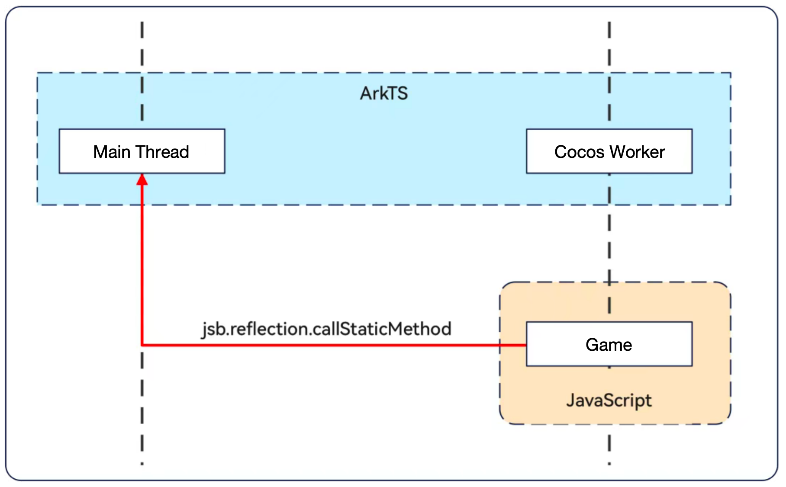

# 基于反射机制实现 JavaScript 与 HarmonyOS Next 系统原生通信

> 本文主要用于 Cocos 与 ArkTS 相关的通信，以实现引擎和系统交互的能力。
> 如果要对 Cocos 引擎的 C++ 层做扩展，或者集成 C++ 库，请参考 JSB 相关文档。

## native.reflection.callStaticMethod

使用 Cocos Creator 3.8.5及以上 打包的鸿蒙原生应用中，我们可以通过反射机制直接在 JavaScript/TypeScript 中调用 ArkTS 的静态方法。

它的函数原型声明如下：

```js
// clsPath (ets 脚本路径)。 例如：entry/src/main/ets/Test，
// methodName (模块名称/静态方法名称)。 例如：entry/test(模块名称可省略，省略为clsPath第一个字符串)
// paramStr (方法入参)。如果是空的，需要传入'', 如果有多个参数，可以转换成JSON字符串
// isSync （调用的 ArkTs 方法是同步方法或是异步方法）。如果调用异步的ArkTs方法可能会阻塞当前线程并等待异步回调的结果。
// result (返回值类型)。只支持基础的三种类型：string，number，boolean，如果需要返回复杂的类型，可以转换为json之后返回
var result = native.reflection.callStaticMethod(clsPath, methodName, paramStr, isSync);
```

> **注意**：创建的 ArkTS 文件需要放在 `entry/src/main/ets` 文件夹下才能被 JS/TS 调用。

在 callStaticMethod 方法中，我们通过传入 ArkTS 是否同步，模块路径或者依赖包名或者远程库名，方法名，参数就可以直接调用 ArkTS 的静态方法，并且可以获得 ArkTS 方法的返回值。

> callStaticMethod 这个函数本身是同步的，但是可以调用异步的 ArkTs 的异步方法，但是会阻塞当前的线程，等待 ArkTs 调用完成，然后获取结果返回。

## 使用场景

| 场景 | 详细分类 | 说明 |
| --- | --- | --- |
| 本地工程模块 | HAP 加载模块内文件路径 | 要求路径以 moduleName 开头 |
| 本地工程模块 | HAP 加载 HAR 模块名 | - |
| 远程包 | HAP 加载远程 HAR 模块名 | - |
| 远程包 | HAP 加载 ohpm 包名 | - |
| API | HAP 加载 @ohos.或 @system. | - |
| 模块 Native 库 | HAP 加载 libNativeLibrary.so | - |

>本文示范了本地工程模块的两种场景，其他场景可参阅详细说明使用

## 使用示例

### HAP 加载模块内文件路径

通常情况下，我们会把新增的原生代码添加到自己的项目中，则会采用这个通信方式。

1、新建一个 ArkTS 文件（假设命名为 Test.ets），并添加如下代码：

``` ts

//同步调用
function test(param: string): string {
  console.log("param::", param);
  return param;
}

//异步调用
function syncTest(param: string, cb: Function): void {
  console.log("param::", param);
  setTimeout(() => {
    cb(param);
  }, 1000);
}

export { test, syncTest };
```

> 虽然创建 Test.ts  也是可以的，但推荐在 HarmonyOS NEXT 原生项目中使用 ArkTS(*.ets) 文件。

2、需要在 entry 文件夹下的 build-profile.json5 文件中进行以下配置

> 千万不能忘，如果不将文件添加到这里，`callStaticMethod` 函数是调用不到的。

```json
"buildOption": {
  "arkOptions": {
    "runtimeOnly": {
      "sources": [
        "./src/main/ets/Test.ets"
      ]
    }
  }
}
```

3、在游戏脚本中调用

``` js
//定义参数对象
let param = {
    a:1,
    b:2
}

//同步调用
let o1 = native.reflection.callStaticMethod("entry/src/main/ets/Test","entry/test",JSON.stringify(param), true);
console.log("result::", o1, typeof o1, JSON.parse(o1).a);

//异步调用
let o2 = native.reflection.callStaticMethod("entry/src/main/ets/Test","entry/syncTest",JSON.stringify(param), false);
console.log("result::", o2, typeof o2, JSON.parse(o2).a);
```

> 注意：异步调用会产生等待，暂停游戏线程。 如果调用了需要较长时间才返回的异步调用，或者是永远不会有返回的异步调用，将导致游戏卡死。 如果需要异步调用，请配合 cocos.evalString 实现 callback 机制。

### HAP 加载 HAR 模块名

当公司有多个项目时，我们通常会把一些通用能力抽象为 HAR 静态库，`callStaticMethod` 可以直接调用 HAR 包中的静态函数。

1、新建一个 HAR 包，名字叫 'harlibtest'

2、在 HAR 包的 Index.ets 文件中加入如下代码

``` ts
function test(param: string): string {
  console.log("param::", param);
  return param;
}

function syncTest(param: string, cb: Function): void {
  console.log("param::", param);
  setTimeout(() => {
    cb(param);
  }, 1000)
}

export { test, syncTest };
```

3、在 oh-package.json5 文件中配置 dependencies 项

```json
{
    "dependencies": {
        "library": "file:../harlibtest"
    }
}
```

4、其次，还需要在 build-profile.json5 中进行配置

```json
"buildOption": {
  "arkOptions": {
    "runtimeOnly": {
      "packages": [
        "harlibtest"
      ]
    }
  }
}
```

5、游戏中调用

``` ts
let param = {
    a:1,
    b:2
}
let o1 = native.reflection.callStaticMethod("harlibtest","entry/test",JSON.stringify(param), true);
console.log("result::", o1, typeof o1, JSON.parse(o1).a);

let o2 = native.reflection.callStaticMethod("harlibtest","entry/syncTest",JSON.stringify(param), false);
console.log("result::", o2, typeof o2, JSON.parse(o2).a);
```

## ArkTS 调用 Cocos 引擎脚本

使用 Cocos Creator 3.8.6 及以上 打包的鸿蒙原生应用中，C++ 封装了 evalString 方法提供给开发者直接从 AtkTS 直接执行游戏脚本代码。

### 使用方法

1、在游戏脚本中增加一个全局函数

```ts
//方法1：使用 [] 添加 window 对象的全局属性
window['foo'] = (str:string,n:number)=>{
  console.log(str,n);
}

//方法2： 使用 . 添加 window 对象的全局属性，并用 @ts-ingnore 忽略编译报错。
//@ts-ingnore
window.foo = (str:string,n:number)=>{
  console.log(str,n);
}

//方法3：添加全局对象，方便统一管理
class NativeMessageHandler{
    foo(str:string,n:number){
      console.log(str,n);
    }
}

//@ts-ingnore
window.nmh = new NativeMessageHandler();
```

2、在 ArkTS 的 Cocos Worker 线程中调用：

```ts
import cocos from 'libcocos.so';
//调用全局方法
cocos.evalString(`foo('abc',123)`);

//调用全局对象的方法
cocos.evalString(`nmh.foo('abc',123)`);
```

---

### ⚠️注意事项

1. 此方法只能在 cocos worker 线程执行，因此如果有业务需求在主线程执行后调用的话，需要在主线程将结果发送给 cocos worker 线程后再调用 evalString。
2. 此方法需要在 worker 线程的 js 引擎初始化完成之后才可以调用，也就是 renderContext.nativeEngineInit() 执行之后
3. 此方法只能在 v8 和 jsvm 两种 js 引擎中有效，方舟引擎不支持。tips：方舟引擎的 js 交互可直接在 globalThis 上绑定对象后访问
4. 此方法只支持返回 number，string，boolean，纯对象相较于老办法 nativeSdkUtil.gameMsgHandle，性能提升约 30%+，推荐使用。
5. 请阅读 [线程安全](#线程安全) 部分，深入理解执行线程相关内容。

---

很多时候，我们的调用其实是从主线程发起的，这就需要我们做一个跨线程通信。

下面是一个完整的主线程中调用 `cocos.evalString` 的示例。

#### 游戏脚本代码

```ts
window.test1 = (a,b) => {
    console.log(a + b);
}
```

#### ArkTS 代码

``` ts
//cocos_worker.ts 中添加 evalString 消息处理
uiPort._messageHandle = function (e) {
  //....
  case "backPress":
    appLifecycle.onBackPress();
    break;
  //添加 evalString 用于处理消息
  case "evalString":
    cocos.evalString(msg.param);
    break;
  default:
    console.error("cocos worker: message type unknown");
    break;
  //......
}

// 在其他地方调用时
import { WorkerManager } from '../cocos/WorkerManager';
let callStr = "test1(1,2)";
const cocosWorker = WorkerManager.getInstance().getWorker();
cocosWorker.postMessage({ type: "async", data: { name:"evalString", param: callStr } });
```

> 注意1：跨线程通信走的是 worker 间的消息机制，其性能远低于直接的函数调用，因此需要避免高频调用。

## 线程安全

> 注意：在做 HarmonyOS NEXT 原生交互时，一定要明白当前代码是在哪个线程里执行的，错误的跨线程访问，必然引发崩溃。

### 主线程与游戏线程

HarmonyOS NEXT 运行时，会有两个主要的线程。

- **主线程**：这是 HarmonyOS NEXT 的原生 App 启动时的默认线程，用于执行原生 UI 的渲染、
ArkTS 的装载和执行、启动其他线程。
- **游戏线程**：主线程启动成功后，会开启游戏线程，引擎启动、渲染更新、JSVM/V8 脚本的执行都在这个游戏线程。

由于线程资源的竞争性，为了安全起见，主线程和游戏线程是不能直接访问彼此负责的资源的，否则会导致 App 崩溃闪退。

可以通过以下方式确认线程 ID：

```ts
import process from '@ohos.process';
console.log('current thread id:',process.tid);
```

> **小技巧**：如果将上述代码写在函数体外，则打印的是主线程 id，因为 TS/ArkTS 代码是由主线程负责加载的。

### 主线程调用游戏线程函数

在主线程启动后，会立即启动游戏线程，主要源码为 `WorkerManager.ts` 和 `cocos_worker.ts` 这两个。

如果要新增处理任务，需要在 `cocos_worker.ts` 中新增一个消息处理函数。

其他线程（比如主线程），可以通过下面的方式向游戏线程发送消息：

```ts
const cocosWorker = WorkerManager.getInstance().getWorker();
cocosWorker.postMessage({ type: "async", data: { name:msgName, param: paramStr } });
```

`name:string`：msgName 对应的是 `cocos_worker.ts` 中的消息类型，用于分发任务。
`param:string`：paramStr 对应的是消息参数。

### 游戏线程调用主线程函数

游戏线程访问主线程，有两种情况。

#### 情况1：游戏脚本层访问主线程

我们可以通过 `native.reflection.callStaticMethod` 方式来实现游戏脚本调用原生层 TS/ArkTS 函数。

需要注意的是，虽然引擎脚本是在游戏线程（`Cocos Worker`）中执行的，但被调用的函数是在主线程环境中执行，以方便我们访问原生系统的功能、资源以及原生 UI 控件。

线程关系如下图所示：



#### 情况2：游戏线程里访问主线程

有时候，我们也需要在引擎的 `Cocos Worker` 中调用主线程的函数。需要我们做两件事情。

1. 在 pages/index.ts 中添加需要执行的消息
2. 在**游戏线程**代码中使用下面的方式向主线程发送消息

    ```ts
    let mainThreadPort = worker.workerPort;
    mainThreadPort.postMessage({ type: "async", data: { name:msgName, param: paramStr } });
    ```

## 自定义项目模板代码

在目前的版本中，cocos_worker.ts 等 native 中的代码，会在 Cocos Creator 构建时被还原，此问题会在后面的版本中修复。

当前版本中，开发者可以用下面的方式解决。

1. 将需要自定义的文件复制到根目录下（与 `assets` 平级），如果有多个文件，则建议放入一个文件夹，后期对这些文件的修改，以这个目录下的文件为主
2. 新建一个构建扩展
3. 在构建扩展的 `hook.ts` 中的 `onAfterBuild` 里，添加如下代码：

```ts
//这是单个文件的方式，多个文件请遍历目录再进行复制
if(options.platform === 'harmonyos-next' ){
    let src = `${Editor.Project.path}/cocos_worker.ts`;
    let dest = `${Editor.Project.path}/native/engine/harmonyos-next/entry/src/main/ets/workers/cocos_worker.ts`;
    console.log(`copy ${src} to ${dest}`);
    const fs = require('fs');
    fs.writeFileSync(dest, fs.readFileSync(src)); 
}
```

编译扩展：

```sh
npm install
npm run build
```

刷新扩展后，再次打包，就可以实现 cocos_worker.ts 等源码的修改生效了。
