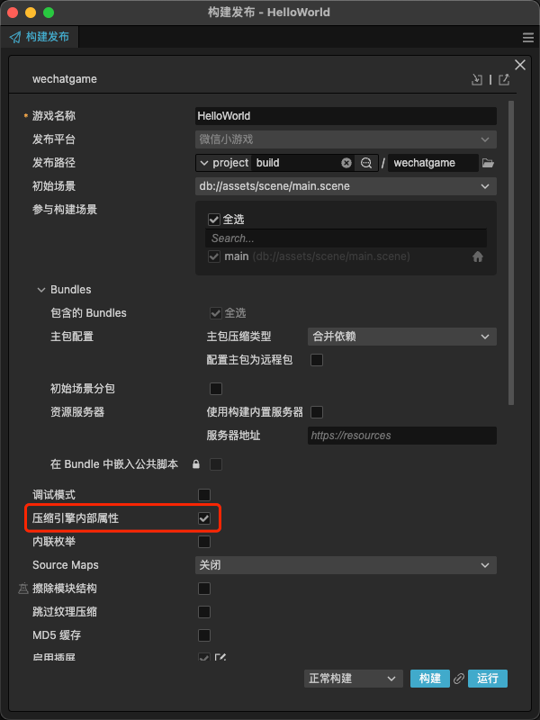

# 压缩引擎内部属性

为了让用户能够进一步减少游戏包体，Cocos 引擎团队在 3.8.6 版本开始提供引擎内部属性压缩功能，该功能可以对引擎 TS 代码中的属性进行压缩，在不损失游戏性能的前提下有效减少游戏包体。

> 注意：目前此功能暂不支持原生平台。

## 构建时开启引擎内部属性压缩



## 生成压缩配置

在构建时会在项目根目录生成 `engine-mangle-config.json` 文件。用户如果想要快速生成此配置文件，可以先进行一次构建，等项目根目录下生成配置文件后再中断构建任务即可。

## 压缩配置字段

此功能默认对引擎 TS 代码中的 private 类型属性进行压缩，如果需要压缩 public 和 protected 类型的属性，需要在配置文件中进行相应设置。

| 字段 |   功能说明
| :-------------- | :----------- |
| mangleProtected | 是否压缩 protected 类型的属性（默认为 false）
| mangleList | 添加需要压缩的引擎属性
| dontMangleList | 添加不需要压缩的引擎属性

### 配置示例

#### "Profiler._meshRenderer" 为自定义添加的属性，其余均为默认压缩配置。

```json
{
    "COMMON": {
        "mangleProtected": false,
        "mangleList": [
            "UITransform._sortSiblings",
            "UITransform._cleanChangeMap",
            "Node._findComponents",
            "Node._findChildComponent",
            "Node._findChildComponents",
            "Node.idGenerator",
            "Node._stacks",
            "Node._stackId",
            "Node._setScene",
            "EffectAsset._layoutValid",
            "EffectAsset._effects",
            "ReflectionProbe.DEFAULT_CUBE_SIZE",
            "ReflectionProbe.DEFAULT_PLANER_SIZE",
            "WebGLDeviceManager.setInstance",
            "WebGL2DeviceManager.setInstance",
            "CanvasPool",
            
        ],
        "dontMangleList": [
            "Component",
            "Profiler._meshRenderer"
        ]
    },
    "MINIGAME": {
        "extends": "COMMON",
        "mangleList": [],
        "dontMangleList": []
    },
    "WECHAT": {
        "extends": "MINIGAME",
        "mangleList": [],
        "dontMangleList": []
    }
}
```

## 注意事项

开启此功能并启用调试模式打包时，会少量增加 debug 包的体积。