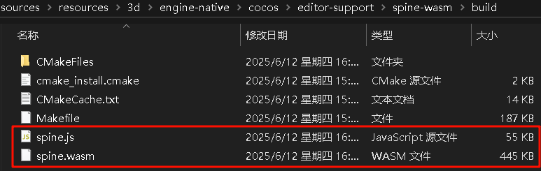

# 使用 Emscripten 将原生代码转化为 Wasm/Asm 文件

## 在 Windows 电脑中安装 Emscripten

1. **下载 emsdk：** 通过在电脑中执行 git 命令: `git clone https://github.com/emscripten-core/emsdk.git` 下载 emsdk 源码。

    > **注意：** 执行 git 命令需要电脑中安装 git 软件，未安装的用户请前往 [git 官网](https://git-scm.com/) 下载并安装。

2. **选择一个 emsdk 版本：** 目前 emsdk 的最新版本为 4.0.10，经过测试存在意外的兼容性问题。建议用户选择使用 3.1.41 版本，此为引擎团队编译 Spine 模块 Wasm 文件时使用的版本。

3. **安装 emsdk 依赖的运行库：** 在 emsdk 源码根目录执行命令行: `./emsdk install 3.1.41`，执行之后将自动安装 emsdk 依赖的运行库。

    > **注意：**
    > * 切换 emsdk 版本时，不仅需要切换源码版本，也需要重新安装 emsdk 依赖的运行库。在 `./emsdk install` 后面加入版本号的字符串即可。
    >
    > * 安装最新版本的 emsdk 依赖运行库则在 `./emsdk install` 后面加入 `latest` 即可。
    >
    > * 安装依赖库的过程中如果出现下载失败的情况，可以尝试打开 VPN 加速。

4. **配置 emsdk 运行库的系统环境变量：** 在 emsdk 源码根目录执行命令行: `./emsdk_env.bat` 将自动配置 emsdk 运行库所需使用的系统环境变量。

5. **检查 emsdk 运行库的系统环境变量：** 在 emsdk 源码目录中打开 upstream/emscripten/.emscripten 文件，检查 LLVM_ROOT 和 BINARYEN_ROOT 是否为如下参考地址：

    ```python
    LLVM_ROOT = 'D:\\git\\emsdk\\upstream\\bin'
    BINARYEN_ROOT = 'D:\\git\\emsdk\\upstream'
    ```

    如果不是，则手动修改为能够读取到本地 llvm 工具和 binaryen 工具的地址

6. **激活 emsdk 运行环境：** 在 emsdk 源码根目录执行命令行: `./emsdk activate --system` 激活 emsdk 运行环境，之后用户可以在命令行窗口使用 `emcc` 命令。

    > **注意：**
    > * 加入 `--system` 可以让 emsdk 的运行环境在所有命令行窗口生效，否则每次打开新的命令行窗口时都需要执行一次 `./emsdk activate`。
    >
    > * 在旧版本中通常使用 `./emsdk activate --global` 进行全局激活

7. **验证 emsdk 安装成功：** 在命令行窗口中执行命令行: `emcc --version`，如果出现信息为 `emcc (Emscripten gcc/clang-like replacement + linker emulating GNU ld) 3.1.41` 则说明安装成功。

## 生成 Wasm 文件

1. **创建 C 语言代码文件：** 在任意文件夹中创建一个 Cocos.c 的 C 语言代码文件，填入以下代码信息：

    ```C
    #include <stdio.h>

    int main() {
        printf("Hello World\n");
    }
    ```

2. **将 C 语言代码文件转化为 Wasm/Asm 文件：** 在 Cocos.c 文件所在根目录（假设 Cocos.c 文件放在 Windows 系统的 D 盘根目录）执行命令行 `emcc D:\Cocos.c -s WASM=1`，执行完成后将在命令行所执行的目录中生成 wasm 文件

    > **注意：**
    >
    > * 命令行中添加 `-s WASM=1` 为指定生成 wasm 文件，如果添加为 `-s WASM=0` 则生成 Asm 文件，用于在不支持 WebAssembly 平台中加载。
    >
    > * 生成 Asm 文件时如果原生语言代码文件中需要初始化的内存数据较大，则还会在目录中生成 .mem 后缀的文件，此文件也需要被加载。
    >
    > * 更多的命令行参数请执行 `emcc --help` 查看，或者到外部网站搜索相关知识。

## 加载 Wasm/Asm 文件

参考 [自定义加载 Wasm/Asm 文件与模块](./wasm-asm-load.md) 中的内容加载 Wasm/Asm 文件。

## 编译 Cocos 引擎的 Spine Wasm

1. **安装 CMake:** 前往 [CMake 官网](https://cmake.org/) 下载并安装

2. **配置 CMake 系统环境变量:** 在系统环境变量中添加 `C:\Program Files\CMake\bin`。

3. **安装 MinGW:** 前往 [MinGW 发布页面](https://github.com/niXman/mingw-builds-binaries/releases)，下载文件名包含 `win32-seh-ucrt` 的包，之后解压到电脑中。

4. **配置 MinGW 系统环境变量:** 在系统环境变量中添加 `C:\mingw64\bin`。

5. **进入 Spine Wasm 的 C++ 代码文件夹:** 打开命令行工具，使用 cd 命令进入 Cocos 引擎中用于生成 Spine Wasm 的 C++ 代码文件夹

    ```cmd
    cd D:\CocosCreator\Creator\3.8.3\resources\resources\3d\engine-native\cocos\editor-support\spine-wasm
    ```

    > **注意：** 此为参考路径，实际使用时请修改为设备中的真实路径

6. **生成 CMakeFiles:** 输入命令行 `emcmake cmake -B ./build` 生成 CMakeFiles 并存放在 build 文件夹中。

7. **进入 build 文件夹:** 使用 cd 命令进入 build 文件夹：`cd ./build`。

8. **生成 Spine Wasm 文件:** 输入命令行 `emmake make`，之后就可以在 build 文件夹中看到 spine.js 和 spine.wasm 生成。

    

9. **修改 CMakeLists.txt 中的 emcc 命令**: CMakeLists.txt 文件位于 spine-wasm 文件夹中，打开它并修改 `emcc` 命令参数即可改变最终生成的产物。

    > **注意：**
    >
    > * 若需编译 Debug 版，将 CMakeLists.txt 中的 CMAKE_BUILD_TYPE 设置为 Debug，取消 emcc 命令中的 -O3 优化选项，增加 -g 编译选项。

10. **更新 Cocos 引擎自带的 Spine Wasm:** 将生成后的 Spine Wasm 拷贝到相对路径 `engine-native/external/emscripten/spine` 所在的文件夹下即可。

    > **注意：** 切换 debug 或 release 模式后需要重启编辑器。

