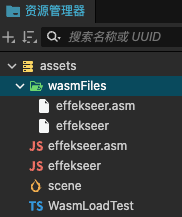
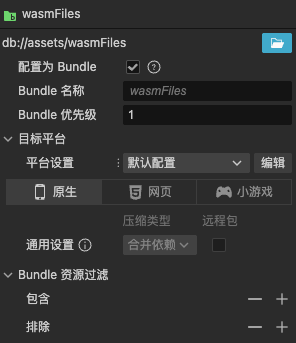
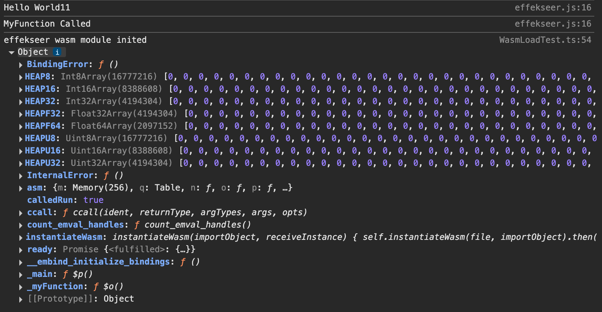
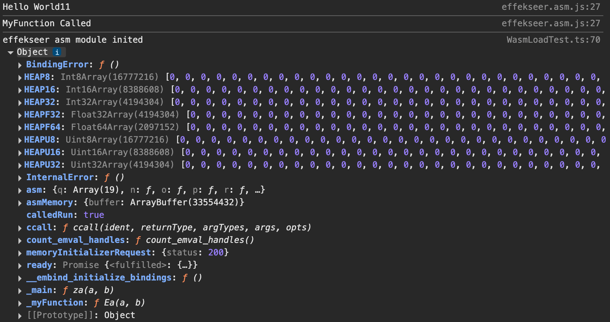

# 自定义加载 Wasm/Asm 文件与模块

CocosCreator 引擎对 Spine、Box2D 等模块提供了手动加载 Wasm/Asm 的接口，但是用户如果想加载自定义的 Wasm/Asm 文件与模块，则需要自己在项目中实现加载逻辑。

> #### 注意：本文不涉及 Wasm/Asm 文件如何创建，仅介绍如何在 CocosCreator 中加载。

1. 在加载器与解析器中添加 Wasm/Asm 文件的支持，请将以下示例代码添加到脚本的 class 类之外，或者翻译为 js 作为 js 插件放到项目中。

    ```js
    //判断当前平台是否支持加载 wasm 文件，Cocos 引擎目前暂不支持在 iOS 平台加载 wasm 文件。
    if (sys.hasFeature(sys.Feature.WASM) || (sys.isNative && sys.os !== sys.OS.IOS)) {
        if (sys.isNative) {
            //@ts-ignore
            assetManager.downloader.register('.wasm', assetManager.downloader._downloaders[".bin"]);
            //@ts-ignore
            assetManager.parser.register('.wasm', assetManager.parser._parsers[".bin"]);
        }
        else if (sys.isBrowser || sys.platform === sys.Platform.WECHAT_GAME) {
            //@ts-ignore
            assetManager.downloader.register('.wasm', assetManager.downloader._downloadArrayBuffer);
            //@ts-ignore
            assetManager.downloader.register('.mem', assetManager.downloader._downloadArrayBuffer);
        }
    } else {
        if (sys.isNative) {
            //@ts-ignore
            assetManager.downloader.register('.mem', assetManager.downloader._downloaders[".bin"]);
            //@ts-ignore
            assetManager.parser.register('.mem', assetManager.parser._parsers[".bin"]);
        }
    }
    ```

* wasm、mem 文件都是二进制文件，所以将引擎内置的二进制文件加载函数作为这两个格式资源的下载与解析函数。

2. 修改项目中的 tsconfig.json 文件，添加 `CommonJS` 模块支持，以便动态 import js 脚本。

    ```json
    {
        /* Base configuration. Do not edit this field. */
        "extends": "./temp/tsconfig.cocos.json",

        /* Add your custom configuration here. */
        "compilerOptions": {
            "strict": false,
            "module": "CommonJS"
        }
    }
    ```

3. 将 Wasm/Asm 文件导入到 CocosCreator 编辑器的资源管理器中，并将 .wasm 文件与 .mem 文件放到同一个 bundle 文件夹中。加载示例的文件分布结构如下，供开发者参考：

    

    

4. 添加 wasmOrAsmLoadTest 函数，导入 Wasm/Asm 模块脚本。添加成功与失败回调，在成功回调里加载 Wasm/Asm 二进制文件。

    > #### 注意：这里 loadWasmOrAsm 函数接收的第三个参数是 Wasm/Asm 文件在编辑器内的资源 Uuid，请开发者更换为自己项目内的资源 Uuid。

    ```js
    wasmOrAsmLoadTest () {
        if (sys.hasFeature(sys.Feature.WASM) || (sys.isNative && sys.os !== sys.OS.IOS)) {
            import('./effekseer.js').then(({ default: wasmFactory })=> {
                this.loadWasmOrAsm("wasmFiles", "effekseer", "44cacb3c-e901-455d-b3e1-1c38a69718e1").then((wasmFile)=>{
                    //TODO: 初始化 wasm 文件
                    
                }, (err)=> {
                    console.error("wasm load failed", err);
                })
            });
        } else {
            import('./effekseer.asm.js').then(({ default: asmFactory })=> {
                this.loadWasmOrAsm("wasmFiles", "effekseer.asm", "3400003e-dc3c-43c1-8757-3e082429125a").then((asmFile)=> {
                    //TODO: 初始化 asm 文件

                }, (err)=> {
                    console.error("asm load failed", err);
                });
            });
        }
    }
    ```

5. 添加 loadWasmOrAsm 方法，该方法用于加载 Wasm/Asm 二进制文件。

    ```js
    loadWasmOrAsm (bundleName, fileName, editorWasmOrAsmUuid): Promise<void> {
        return new Promise<void>((resolve, reject) => {
            if (EDITOR) {
                //编辑器内通过 uuid 加载资源比较便捷，无法通过 bundle 加载
                if (editorWasmOrAsmUuid) {
                    assetManager.loadAny(editorWasmOrAsmUuid, (err, file: Asset)=> {
                        if (!err) {
                            //@ts-ignore
                            resolve(file);
                        } else {
                            reject(err);
                        }
                    })
                }
            } else {
                if (bundleName && fileName) {
                    assetManager.loadBundle(bundleName, (err, bundle)=>{
                        if (!err) {
                            bundle.load(fileName, Asset, (err2: any, file: Asset) => {
                                if (!err2) {
                                    //@ts-ignore
                                    resolve(file);
                                } else {
                                    reject(err2);
                                }
                            })
                        } else {
                            reject(err);
                        }
                    })
                }
            }
        })
    }
    ```

6. 编写 Wasm 初始化代码，在 Wasm 二进制文件加载完成后，调用 instantiateWasm 函数完成初始化。

    ```js
    initWasm (wasmFactory, file): Promise<void> {
        var self = this;
        return new Promise<void>((resolve, reject) => {
            wasmFactory({
                instantiateWasm (importObject, receiveInstance) {
                    self.instantiateWasm(file, importObject).then((result) => {
                        receiveInstance(result.instance, result.module);
                    }).catch((err) => reject(err));
                }
            }).then((instance: any)=>{
                resolve(instance);
            }).catch((err) => reject(err));
        });
    }

    instantiateWasm (wasmFile: Asset, importObject: WebAssembly.Imports): Promise<any> {
        if (sys.isBrowser || sys.isNative) {
            //@ts-ignore
            return WebAssembly.instantiate(wasmFile._file, importObject);
        } else if (sys.platform === sys.Platform.WECHAT_GAME){
            //@ts-ignore
            return CCWebAssembly.instantiate(wasmFile.nativeUrl, importObject)
        }
    }
    ```

7. 在 wasmOrAsmLoadTest 函数中添加 initWasm 函数的调用，完成 Wasm 的加载。

    ```js
    wasmOrAsmLoadTest () {
        if (sys.hasFeature(sys.Feature.WASM) || (sys.isNative && sys.os !== sys.OS.IOS)) {
            import('./effekseer.js').then(({ default: wasmFactory })=> {
                this.loadWasmOrAsm("wasmFiles", "effekseer", "44cacb3c-e901-455d-b3e1-1c38a69718e1").then((wasmFile)=>{
                    this.initWasm(wasmFactory, wasmFile).then((instance: any)=> {
                        Effekseer = instance;
                        Effekseer._myFunction();
                        console.log("effekseer wasm module inited", Effekseer);
                    }, (err) => {
                        console.error("effekseer wasm module init failed", err);
                    });
                    
                }, (err)=> {
                    console.error("wasm load failed", err);
                })
            });
        } else {
            import('./effekseer.asm.js').then(({ default: asmFactory })=> {
                this.loadWasmOrAsm("wasmFiles", "effekseer.asm", "3400003e-dc3c-43c1-8757-3e082429125a").then((asmFile)=> {
                    //TODO: 初始化 asm 文件

                }, (err)=> {
                    console.error("asm load failed", err);
                });
            });
        }
    }
    ```

* Wasm 加载完成后，在本示例中应该在浏览器控制台看到如下输出：

    

    8.编写 asm 初始化代码。首先添加 asm 模块的内存大小常量，之后添加 initAsm 函数用于初始化 Asm 模块。

    ```js
    //添加 asm 模块的内存大小常量，在初始化 asm 模块时使用。
    const PAGESIZE = 65536; // 64KiB

    // How many pages of the wasm memory
    // TODO: let this can be canfiguable by user.
    const PAGECOUNT = 32 * 16;

    // How mush memory size of the wasm memory
    const MEMORYSIZE = PAGESIZE * PAGECOUNT; // 32 MiB
    ```

    ```js
    initAsm (asmFactory, file): Promise<any> {
        const asmMemory: any = {};
        asmMemory.buffer = new ArrayBuffer(MEMORYSIZE);
        const module = {
            asmMemory,
            memoryInitializerRequest: {
                //@ts-ignore
                response: file._file,
                status: 200,
            } as Partial<XMLHttpRequest>,
        };
        return asmFactory(module);
    }
    ```

9. 在 wasmOrAsmLoadTest 函数中添加 initAsm 函数的调用，完成 Asm 的加载。

    ```js
    wasmOrAsmLoadTest () {
        if (sys.hasFeature(sys.Feature.WASM) || (sys.isNative && sys.os !== sys.OS.IOS)) {
            import('./effekseer.js').then(({ default: wasmFactory })=> {
                this.loadWasmOrAsm("wasmFiles", "effekseer", "44cacb3c-e901-455d-b3e1-1c38a69718e1").then((wasmFile)=>{
                    this.initWasm(wasmFactory, wasmFile).then((instance: any)=> {
                        Effekseer = instance;
                        Effekseer._myFunction();
                        console.log("effekseer wasm module inited", Effekseer);
                    }, (err) => {
                        console.error("effekseer wasm module init failed", err);
                    });
                    
                }, (err)=> {
                    console.error("wasm load failed", err);
                })
            });
        } else {
            import('./effekseer.asm.js').then(({ default: asmFactory })=> {

                this.loadWasmOrAsm("wasmFiles", "effekseer.asm", "3400003e-dc3c-43c1-8757-3e082429125a").then((asmFile)=> {
                    this.initAsm(asmFactory, asmFile).then((instance: any)=>{
                        Effekseer = instance;
                        Effekseer._myFunction();
                        console.log("effekseer asm module inited", Effekseer);
                    }, (err) => {
                        console.error("effekseer asm module init failed", err);
                    });

                }, (err)=> {
                    console.error("asm load failed", err);
                });
            });
        }
    }
    ```

* Asm 加载完成后，在本示例中应该在浏览器控制台看到如下输出：

    

### 示例工程仓库地址

[GitHub 仓库地址](https://github.com/cocos/cocos-awesome-tech-solutions/tree/3.8.x-release/demo/Creator3.8.6_WasmOrAsmLoad)

[Gitee 国内仓库地址](https://gitee.com/zzf2019/cocos-awesome-tech-solutions/tree/3.8.x-release/demo/Creator3.8.6_WasmOrAsmLoad)