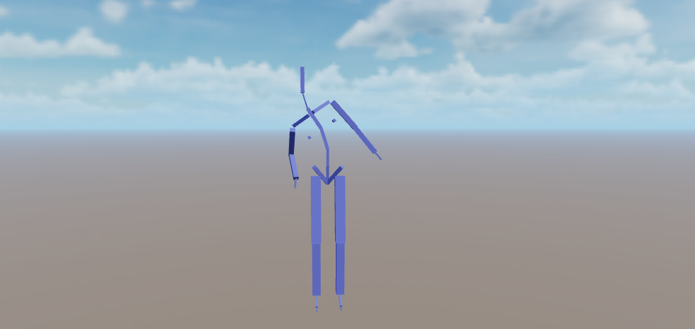

# 叠加动画

叠加动画是一种复用动画效果的方式。

试想你的角色有两种基本姿态：站立和蹲伏：

在站立状态下，你为角色制作了一个上半身向右倾斜一定角度的姿态：

如果希望角色在蹲伏状态下也有类似的倾斜姿态，一种方法当然是再为蹲伏状态制作一个单独的姿态，但这样不免属于一种重复性工作。

既然从站立到站立倾斜，以及从蹲伏到蹲伏倾斜的“变化”类似，那么可以通过将倾斜姿态“减去”站立姿态，从而得到一个差量姿态。将这样的差量姿态叠加到蹲伏姿态，就可以得到蹲伏倾斜的姿态：

示意图如下：

倾斜姿态“减去”站立姿态得到的姿态称为 **叠加姿态**，将其应用到蹲伏姿态从而产生的动画效果称为 **叠加动画** （Additive Animation）。

正式来讲，叠加动画是一个动画相对于一个参考姿态的差量，这个差量可以被叠加到其它的动画上。使用叠加动画的底层逻辑是可以给不同的动画，添加相同类型的变化，例如人物不同动作时的前倾、后倾、左倾、右倾，如果使用叠加动画，就可以给走、跑、跳、站立等添加相同的效果，而不需要为每种状态制作一套类似动画，这样就减少了每种状态所需的动画资产。

## 产生叠加动画

目前，叠加动画仅能由动画剪辑产生。

在动画导入配置面板中，勾选“导入为叠加动画” 后，所选的动画剪辑在动画图中使用时将产生叠加动画：

> 注意，一个动画要么被导入为叠加动画，要么导入为非叠加动画。
> 如果希望一个动画同时作为叠加和非叠加动画，可以在导入面板中复制此动画并分别配置。

## 应用叠加动画

动画图通过两种方式来应用叠加动画，分别是：

- 配置层级为叠加层级。

- 在姿态图中使用 [叠加混合结点](../procedural-animation/pose-graph/pose-nodes/blend-poses.md#叠加混合)。

> 注意，叠加层级中使用的动画必须产生叠加姿态。
> 例如，若叠加层级最终输出了非叠加姿态，将导致动画效果异常——往往会发现模型“变大”。
> 反之，若非叠加层级最终输出了叠加动画，也将导致动画效果异常——往往会发现模型“消失”或变小。

## 叠加层级

在动画图层级属性面板，可以将所选层级设置为 **叠加** ：

勾选后，当此层级所产生的动画效果（姿态）将以叠加形式混合至前序层级。

## 姿态图：叠加混合结点

见：[叠加混合结点](../procedural-animation/pose-graph/pose-nodes/blend-poses.md#叠加混合)。