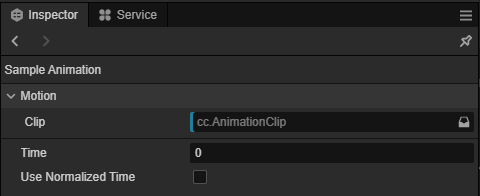

# 播放或采样动画

姿态图提供了两种从动画中读取姿态的结点：播放动画结点和采样动画结点。

在下文，“动作”是指动画剪辑或动画混合。

## 播放动画

**播放动画结点** 播放指定动作，每一帧对其进行更新，并获取动画当帧的姿态作为输出。

| 输入       | 含义                                             |
|------------|--------------------------------------------------|
| `起始时间` | 每当重入此结点时，从何时开始播放动作。单位为秒。 |
| `速度乘数` | 动作的播放速率。                                 |

| 对象属性 | 含义                 |
|----------|----------------------|
| `动作`   | 要采样的动作。       |
| `同步`   | 动画同步选项。见下。 |

### 同步

在有些情形下，我们可能希望多个动作的播放是同步的。所谓同步，即是指当多个动画都需要播放时，它们在某些时间点上是对齐的。例如，当同时混合走、跑动作时，角色的步态应该一致——两个动作的四肢应该有相同的动画趋势。

动画图目前仅支持时间上的同步。也即，被同步的动作永远会处在相同的百分比进度。

如果仅使用了状态机中的动画混合，那么无需考虑同步。因为动画混合中的每一项动作都是同步的——它们会一直处于相同的百分比进度。然而在姿态图中情况变得不大一样。

想象两个动作 _A_、_B_，我们希望它们总是同步播放的。但如果 _A_ 和 _B_ 分别处于状态机的两个状态中。当 _A_ 播放了一段时间后，_B_ 所属状态才进入，然后 _B_ 开始从 0 播放。这就导致了它们时间上的不同步。

为了解决这个问题，我们可以将需要同步的动作指定为为同一个 **同步组**。而后，同一同步组中的所有动作都将得到同步。具体地，**播放动作结点** 的 `同步` 属性下，有如下选项：

| 对象属性 | 含义               |
|----------|--------------------|
| `组`     | 动作所属的同步组。 |

## 采样动画

**采样动画结点** 采样指定动作某一时刻的姿态作为输出。

|输入|含义|
|--|--|
|`时刻`|要采样的时刻。|

|对象属性|含义|
|--|--|
|`动作`|要采样的动作。|
|`使用标准化时间`|结点输入`时刻`是否指定的是标准化时间。标准化时间是指在 [0, 1] 范围内的动作进度。例如 1 表示动作的最后一帧， 0.5 表示 50% 的动作进度。|
